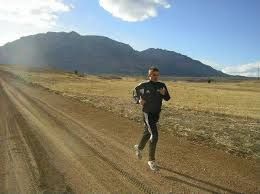

After the [ignominious end](http://www.ulaar.com/2010/07/14/an-asthmatics-ignominious-first-running-stor/) to my debut cross country run, the rest of the day was a daze. An unpleasant cocktail of emotions enveloped me.. Shame, defeat, dejection, inadequacy, self-pity dominated what would eventually be sufficed with hope.

Moodily and half-heartedly I cheered the track and field participants. The outcome of no event mattered to me anymore.

It was getting close to dusk when I found myself at the north-east corner of the field. The high jumpers and long jumpers were putting in their final series of practice jumps for the finals the next day.

I reflected on the morning debacle for the Nth time. The first half of the race was unadulterated misery (as my lungs struggled to come to terms) but the back half (except the last 200 meters) wasn’t too bad. My breathing had settled into a certain rhythm and the cardio distress had receded.

Hmm..

I wasn’t ready to head home yet because something just clicked inside of me.

\*\*\*\*\*\*\*

I started to run. Probably at an ambling pace even slower than the morning.

Finished a round, then the second,… And before I knew it I was finishing the eighth. Could I do ten?

Round ten was completed soon enough and I started wondering when I should (or needed) to stop.

I completed 16 rounds and stopped. To this date, I don’t know why I stopped when I did. Running 6.4km (all time run #2) on the same day as a 5km run (all time run #1) should have felt exhausting but it didn’t. Taking into account my age, it was my first ever LSD (**L**ong **S**low Distance) but it would take me two more decades before I learned that term.

\*\*\*\*\*\*\*

*Closing note*: *this post was originally written using the Notes app on an iPhone 5 while on a late night return flight from Mumbai 2 months ago. Having completed it in record time, I was rather pleased and couldn’t wait to reach home and post to WordPress. Imagine my shock the next day when the note up and ‘disappeared’ into the Apple ether. The contents of another note mockingly appeared (duplicated) with the same subject. I spent an hour frantically looking for recovery options before finally giving up. That (first) version wasn’t meant to be. Oh well! So you, dear readers, have to settle for this – version 2 typed on the supremely reliable Samsung Galaxy S2 using the delightful WordPress app. I’m sitting on a comfortable settee inside the Begumpet Landmark bookstore.*