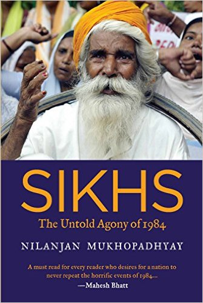

A reunion in Dallas (circa 2006).

An email to a Yahoo alumni group on March 10, 2010 that triggered an outpouring of memories. Memories of grief, sadness, bravery and an innocence lost.

Two and a half years later (on the 28th anniversary of the riots), I posted the first-person accounts of [Jasbinder](http://www.ulaar.com/2012/11/01/remembering-1984-sikh-riots-in-bokaro-jasbinders-tale/), [Sunil](http://www.ulaar.com/2012/11/01/remembering-1984-sikh-riots-in-bokaro-a-heroic-tale/) and [Priti](http://www.ulaar.com/2012/11/03/remembering-1984-sikh-riots-in-bokaro-pritis-story/) on this blog.

Last year brought a different inflection point. Journalist and author Nilanjan Mukhopadhyay, who was researching his book on the 1984 riots, stumbled upon my blog and contacted me. We spoke. I connected him to Jasbinder and Priti. Nilanjan made a trip to Bokaro and met, among a host of Sikhs to connect the dots, another classmate (Chandrima).

Last week, Nilanjan’s book ([Sikhs: The Untold Agony of 1984](http://www.amazon.in/Sikhs-Untold-Agony-Nilanjan-Mukhopadhyay/dp/9385152513/ref=sr_1_1?s=books&ie=UTF8&qid=1446228529&sr=1-1&keywords=nilanjan+mukhopadhyay)) was released. Postcards from Bokaro (which is Chapter 7) features a few blurbs on my efforts to get the stories out and, of course, Sunil/Jasbinder/Priti’s tales.

Excerpts from the book..

*Since Harmeet had had no direct links with the violence of 1984, she was drawn to public protests as a form of “atonement” for her parents’ escape. Her parents also looked the other way because they had borne the burden of being safe for three decades whenever there were discussions within the community. Their daughter’s act, they felt, would finally enable them to become part of the collective.*

…

*To my sister and me (and possibly thousands of Bokaro kids), it was a Stephen King’s It moment (a peaceful Derry shattered by an ugliness and brutality we couldn’t imagine was present in our idyllic town).*

…

*I followed by dad scared about his life and thinking I have the strength to save him. Thinking back, I would say it was god’s will and strength that we never looked back and thought twice about what would happen to us.*