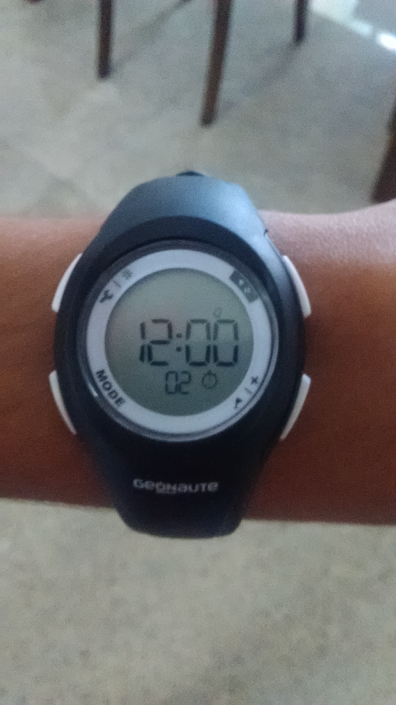

*\[Editor’s note: The prequel to this post is [Softly, as in a spiritual sunrise](http://www.ulaar.com/2015/11/16/softly-as-in-a-spiritual-sunrise/) (a low-key announcement of a personal ultra run on Nov 27, 2015. This post was written in 4 sessions: Part 1 (on Jan 2) written at the Landmark bookstore in Forum Mall on a 3 year old Samsung Galaxy S2 (yeah – WordPress for Android rocks!); Part 2 on Feb 7 at the Sapna Bookstore in Koramangala on a OnePlusX device; Part 3 on Feb 14 in Gopalan Mall Kengeri, again on the go. Part 4 on March 6 at home.\]*

A long preamble or a mid-post digression? Do you have a preference? Not that your preference will have *any* bearing on this post.

If you’ve been reading my posts for a while, you might have noticed my predilection to ellipsis. From blog titles to paragraph endings I use (overuse?) them at will. I like them for a few reasons. It conveys a certain suspense.. A certain incompleteness… A certain “there is so much more I would like to communicate on this topic but…”

For a running related post (like this one), the ellipsis assumes extra significance. Sure… a race gets *over* and there are always learnings to be internalized but runners are always looking forward to the start of the next run/training plan/race.

When I launched the WordPress app 10 min ago, I knew which post I wanted to write but I had no idea that I’d wax eloquent on ellipsis. Provided another data point for an old theory – *we* don’t choose a story/narrative – *it* chooses us. Just like books *choose* to be read by us and fruits choose to be picked by us.

\*\*\*\*\*\*\*

**Nov 27, 2015**  
I had shared my plans with a handful of friends. I wasn’t expecting any pacing help but boy, was I glad Rinaz and Shilpi enthusiastically volunteered!

I reached the venue at 4:50 am and encountered my first surprise – parking difficulties! I intented to park the e2o (my aid station) very near the park entrance for obvious reasons but I was compelled to squeeze in between two Tempo Travelers. As challenges go, this was a tiny one.

There was not a soul at the park and I was so glad Rinaz would join me shortly. The front and back seats were suitably stocked with meals/hydration/dry tees and i packed a portable bag with a few bottles of water and some snacks.

We started at 5:20am. I was using my son’s digital watch because it had a stop watch (all I needed that day). If Rinaz hadn’t brought his Garmin, I’d have been one demoralized man after a few hours.

A few days earlier, I had asked another friend (Runner B in this story) to measure the NGV park circumference using his Garmin. He reported the distance as 300 meters which shocked me especially because “my estimates couldn’t have been *sooo* off”.

After the first few rounds, was relieved to learn that the loop length was in fact 450 meters. Clearly Bharath had measured something else.

**Shod or not**  
I had three footwear options to consider:

- Barefoot
- 4mm basic huaraches
- 4mm Amuri Cloud huaraches
- Brooks Adrenaline GTS 11

GTS 11 had over 2000km running mileage (last race in Auroville – Feb 2011) and progressively-reducing occasional use as sneakers in the past 4.5 years. I did a 2 hour run at the NGV Park last weekend as part of my assessment. Shoes+socks felt *ok* considering the long gap though I had lingering concerns since they were the opppsite of ‘zero drop’ shoes.

Logically the huaraches should have been my first choice – ran multiple 50k+ races with the basics and last year’s 75k was powered by the Amuri Cloud. The slap-slap sound of the huaraches can be annoying in any setting but they seemed to be particularly incongruous in the tranquil ambience cast by the NGV Park.

Barefoot? After all I *am* the barefoot guy et al. The paving blocks terrain was about 90% barefoot friendly. There were a few trail stretches, one broken patch and the surface just stopped short of smooth. I was confident that i could run barefoot for 6-7 hours but the callus under my right foot was still around and the prospect of being distracted for half the duration was not appealing. In Rumsfeld’s existentialism, this was a ‘known unknown’ I was hoping to avoid.

After suitable deliberation, I settled on the GTS11 as my goto footwear. A flicker of premonition led me to pack a spare pair of socks. With a clear “let’s burn the bridges” intent, the hearaches were left at home.

**Counting conundrum solved**  
Number of rounds X loop length = distance covered  
My son’s digital watch has a lap counter but doesn’t display the lap count. I needed a low-tech solution. The decimal system came to my rescue. Using my thumbs as ‘lap bookmarks’, I intended to count laps 1 through 10 at lap *start*. Each set of 10 loops were a *hyperloop*. I would count hyperloops using pista shells. I had stuffed about 30 shells in my right pocket. At the start of the 10th loop, I would extract one of them, hold in my right palm and transfer to my left pocket at the end of the loop.

\*\*\*\*\*\*\*\*\*\*\*\*\*\*\*\*\*\*\*\*\*\*\*\*\*\*\*\*

**First three hours**

Not surprisingly the first few hours went by soon enough. 8:30am and it was time for Rinaz to leave. The Garmin informed us that over 24k had been covered. That sobered me down in a jiffy – there was no way in hell I should/could hold that pace for another 9 hours.

**Nearly run over by a dog**

The weather needs a mention here. Bangalore’s weather is rarely beyond reproach but it presented its most runner-friendly self that day. Cloudy and cool all day. Threatened to rain all day but only two playful drizzles emerged and lasted maybe two minutes each time.

Every park in Bangalore has a unique dog personality and dog foliage (I’d like to propose the word doggage to Webster). As is widely know, the manginess of a stray dog is directly proportional to the roughness of the Indian neighborhood. The NGV community is fairly gentrified and it showed in the park’s doggage. The usual smattering of brown and white strays were present in droves but they largely moved around in predictable fashion. A black dog with a ‘pedigreed parent’s tryst with a roadside Romeo’ appearance stood out among the droves.

This black dog crossed our path a few times, once nearly cutting Rinaz off at the 2 hour mark. That would turn out to be a prelude to what I’d witness later.

I had seen this ‘dog whisperer’ man a few times earlier at the park. His son goes to the same school as my kids but I’d never spoken to him. He would run a few rounds.. At times I noticed him carrying a thin reed in his hand while he ran. Two to three dogs would always be at his heel – a veritable dog convoy it seemed. An hour after Rinaz left, as I turned the south-west corner for the Nth time, I nearly froze at the ‘drag racing drama’ that was unfolding in front of me. The dog whisperer and two dogs (or was it three?) were sprinting towards me. The path isn’t very wide.. I was in the leftmost lane and the black dog was right in front. I was obviously running much slower than the dogalcade so I could have stopped but I was too much in shock to react. A split second before the collision, the dog deftly scampered to its left and I heaved a sigh of relief. 

Sadly I didn’t turn around to see who won that race. 

\*\*\*\*\*\*\*\*\*\*\*\*\*\*\*\*\*\*\*\*\*\*\*\*\*\*\*\*

**Despair at hour 5.. And redemption**

Sometime after the 5 hour duration, I could no longer ignore my knee pain (in both the legs). Damn it!

After my struggles in 2009-11 (when ITB reared its annoying head), I’ve seldom had any knee pain. I became a minimalist runner in 2011 and even that occasional post-30k knee soreness disappeared for good.

Why today?

Because I was running with 6 year old non-zero-heel-drop shoes (Brooks Adrenaline GTS 11)?

Because I had not run more than 3 hours in shoes in nearly 5 years?

Because my form had gradually regressed to a heel strike on an old shoe that no longer provided heel cushioning?

Probably a combination of the above?

My mood turned sour for the first time.

I knew that ‘walking’ would be part of this ultra but since I didn’t have a training plan nor a mileage target I figured to just wing it and listen to my body.

My body was telling me that it was time to incorporate walking into the plan. As it fortuitously turned out I was running the 9th lap so I quickly settled on a 9+1 plan.

It still ‘felt’ like a setback so when pacer #2 (Shilpi) found me in the middle of my 1st walking loop, I was feeling grumpy.

But pacers lift your spirits. Always.

After examining the terrain in her first loop, Shilpi declared “Hey, this is barefoot friendly” and kicked off her shoes.

That was just the cue for me. I jettisoned my shoes and, for the first time, experienced the before-after joy on the same run. Redemption arrived sometime in the next 30 minutes – my knee pain in both legs had vamoosed!

**Of pettiness and petty thieves**

After redemption, the next 2 hours were negotiated rather uneventfully (good thing in ultras!) I vaguely recall we runversed on running injuries, Chi Running(?), BBMP’s apathy and activism in Bangalore. Hours six through eight were probably the sunniest. Cloudy and seriously ultra-friendly for majority of the day with two bouts of drizzling. Paradoxically I needed a pit stop when it was sunny. Rinaz and Neil (R &amp; S’s son) arrived and it was time for Shilpi’s lunch. Before her last lap pacing me, an officious sounding gentleman yelled out to us “you are not supposed to be running in the park! You don’t live here”. I ignored that initial admonishing while Shilpi placated him.

Rinaz had joined me for a bonus segment of pacing. The gentleman was still looking sternly at me every time we crossed so I finally stopped for a chat. Told him that “*yes – we don’t live in NGV but our kids go to school in the same campus, they play basketball here every weekend, and we have a lot of friends here, and isn’t this a public park? After all, I do live in Koramangala”*. He grumbled and mumbled and wasn’t convinced but since I had a conciliatory tone and I only had 4 more hours, he acquiesced. 

And we resumed running.

Trouble hunts in pairs apparently. 15 min later, my aid station bag disappeared. One loop it was there, the next it was gone – all it took was an out-of-sight duration of 3-odd minutes. It was a bright purple bag.. Rinaz and I ran around trying to catch sight of the speeding thief. No luck.

One Gatorade, one Cocojal, a few bottles of water and a box of cookies. Not a major mishap since i had more supplies inside the car.

News was relayed to my final pacing crew to bring extra water.

I literally had to force Rinaz and Shilpi to leave else they’d have cheerfully continued for longer. I had them count the pista shells and recall the mileage being close to 57km.

**A few hours of solitude**

As I indicated earlier, I couldn’t have picked a better course for a good old-fashioned solitary reaper run. Din of the city not to be heard. Residents (mostly walkers) entering and leaving every 30min or so. A few residents occupying their favorite park bench, gamboling kids and their families. And the dogs scurrying around. There was a gentle rhythm to it all.

And my thoughts? All I recall was how I felt. Really really good. Blessed (an overused word I normally avoid but seemed to capture the emotion).

**The family arrives**

I was expecting them an hour before finish so imagine my pleasant surprise when they strolled into view a good 2.5 hours still remaining. My anchor pacing trio had arrived. And took charge. Questions were asked. Requests were made. The e2o key was handed over and the squad swung into action. It started off with S running two consecutive loops with me and then A did his two loops and.. this cycle was repeated for close to an hour. Poonam stationed herself at the gazebo and the non-running boy would ask me (after \*every\* loop) – “Do you need anything?”

Before the family arrived, I had finished my last “big meal” (a sizable serving of lemon rice) so it was just snacks and hydration for the final stretch.

With 90 min remaining, the pacing rhythm changed to switching partners every loop. It coincided with Poonam moving her station to a park bench closer to the track. She came up with a most ingenious method to ratchet up the interestingness quotient for the already motivated pacing duo – a chocolate square after completion of each lap. It was a fascinating ritual to watch.

**Bait and switch – aka “*For a few hyperloops more”***

One of the boys was given the task of counting the shells and, not satisfied after hearing the verdict, I demanded a recount. A quick round of calculations brought a factoid to the fore — if I continued at the current pace I was in real danger of not breaching 80km.

Considering that this ultra was about lasting 12 hours with no distance goal, that factoid should not have bothered me. But the mind is greedy. The inner tendril murmured *“Well.. your worst 75km time was 9 hours 45 min so you’d have just 5 extra km in TWO hours?”*

Eminently unfair characterization but the goading thought had delivered its bait and switch message.

I took stock of the situation.

Five hours of barefooting meant my fore feet were no longer feeling “happy”. I certainly had a lot of juice inside of me. No sign of cramping from the usual suspects (thank you Cocojal and thank you Bangalore weather!). So where was my excuse for NOT increasing my pace for the remaining time?

I just needed a physical change-of-pace trigger. The shoes needed to come on again – that was it! The second pair of socks I had packed seemed like a prescient move. I made another change for the final 90 minutes – the 9+1 rhythm got upgraded to 10+0. The boys played their part in this transition. Whereas, earlier they would mostly alongside me.. now they (especially S) stayed a few strides ahead of me.

With 30 min left to go, I knew I was in safe territory but there would be no letting up on pace. For the final two loops, both S and A joined me and we sprinted to the finish. Finish line was an unmarked spot about 100 meters after I completed 17.9 hyperloops. Taking into account the extra distance for my two pit stops and multiple trips to the squad car, I *awarded* myself a final distance of 82km.

No drama at the end. Not even a picture. Just pure joy and satisfaction. And hugs with the family. Followed by a drive to our favorite chat place where we celebrated with *samosas* and hot *jilebis*.

Below is the only picture that I took after we reached home.

<figure aria-describedby="caption-attachment-3123" class="wp-caption alignleft" id="attachment_3123" style="width: 169px">

<figcaption class="wp-caption-text" id="caption-attachment-3123">That moment when I stopped!</figcaption></figure>

