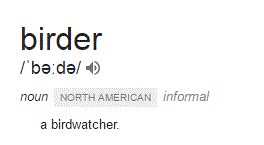

*A thing of beauty is a joy forever*.

Decades ago this was the topic for a school essay. It required the utmost imagination and sleight of hand to cobble together a few paragraphs.

If one were to write on the same topic, words would flow better. Beholding flora, fauna and mother nature up close and personal — isn’t that what eternal beauty is made up of?

Birders are that rare species who spend practically all their vacation time (and then some) on birding trips. You probably see beautiful pictures of exotic birds on your Facebook timeline after they return from their expeditions.

Against the backdrop of a media loaded timeline, words still manage to be more evocative (to me i.e.) A birder friend returned from a trip to the Nicobar Islands and shared the below on Facebook.

And I finally *got* what it is to be a birder. The money paragraph is the 4th one (in *italics*).

> Back from an unforgettable trip to Nicobars. I’ve left the island but the islands refuse to leave me…
> 
> We spent 12 days between Great Nicobar and Central Nicobar enjoying the pristine, untouched beauty of the islands (a selfish thank you to Govt of India for not allowing tourists into this paradise). Amazing birding with many new birds (18 for me), great birding company, beautiful forests and beaches (mostly inaccessible with hardly any roads).
> 
> Camped out in the forest for 3 nights – 9 of us sleeping like sardines on a hard undulating wooden platform (tip: ear plugs and sleeping pills are useful!), got bitten by hundreds of mosquitoes and sand flies (not to mention a leech bite that left a large red patch on my leg for several days), hiked up and down slippery slopes to finally see a Nicobar Megapode at its nest while sitting in a hide drenched from head to toe in pouring rain (3rd attempt for me – a total of 10 hours of waiting), got lashed by a choppy sea while attempting to navigate around a rocky outcrop to board our dunghi (as a result of which my camera took a salt water bath and stopped working). Whoever said birding was easy?!  
> *It was all worth it in the end though, but more than the birds, the high point of the trip for me was the sighting of 3 leatherback turtles (+ 1 green turtle) that landed at Galatyea beach (Great Nicobar) in the middle of the night to lay their eggs. We were woken by the forest guards who were patrolling the beach (kudos to them!) and rushed there to spend 2 hours watching the turtles go through the herculean effort to crawl through the sand, dig holes to lay eggs, cover up the eggs, make fake tracks (to confuse predators) and crawl back to return to their ocean home. The experience left us humbled, awed and weak in the knees, and am not ashamed to say that I just sat down on the beach and cried copiously, it was such an intensely emotional moment.*
> 
> The only regret – I forgot my trusty filter bottle in Delhi and had to drink bottled water while camping out. Managed to crush and carry back around 30 bottles back with me (which I disposed off at Chennai airport where it will hopefully be recycled) but had to leave some in the forest at Galatyea to be burnt. Have made a New Year’s resolution to myself already – I will not drink any beverage that comes out of a disposable plastic or tetrapak container (water, soda, juice). I wish more people would think about the impact of their actions on this one and only planet we call home, or else be prepared to be haunted by the sight of plastic trash washed up on uninhabited pristine beaches (we found bottles from Thailand and Malaysia at Galatyea beach) and studies like the one shown in <http://midwayfilm.com/>.

Jan 10 (Shashank Dalvi)
> 
> Observing Flying Fish do their usual business is a spectacular phenomenon. You just have to position yourself at the front of a boat and wait for them to jump out of water and glide effortlessly in front of the boat. They can glide from 50-400 meters in one stretch with speeds matching up to 70km/hr. Then you marvel – how do they do it?
> 
> How they manage something as spectacular as this can only be explained by the millions of years of evolution to outsmart their predators underwater (With the result that Tropicbirds have specialized in feeding on them). So how do they do it? They have fully broadened neural arches (Vertebral column within which is the spinal cord), which acts as the perfect base for muscles and ligaments through connective tissues. Due to this they can make their body rigid during flight. They also have a caudal fin which is much stronger than most of the other species of fishes. They can also open and close their pectoral fin when they exit and re-enter the water. Added to this, the tail helps modify their flight paths.

> Watching these tiny beauties in flight was exciting but easy. However photographing them with a 400 mm lens was a different game all together. These fishes can jump out of water anytime, anywhere, and without warning. We had to follow them up with the lens (with all the twist and turn they muster) and then focus on their backs – and eventually click.

(Closing note: The 3 pictures in this post are all from her Nicobar trip though they don’t match with the above narrative).

