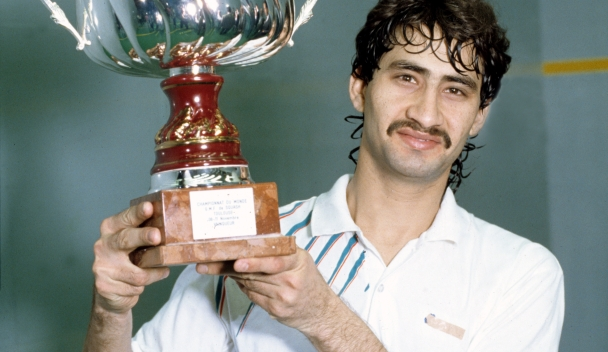

Serious runners are crazy people.

Serious squash players are no less crazy.

The crazy squash player I am thinking about is my friend. Sanjay (now a Princeton, NJ resident) was my senior at BIT Mesra and we became close friends during our years in Jamshedpur. Unlike my sporadic dalliance (2 years of squash initiation in ’90-’92 followed by a year in Chicago playing racquetball circa ’95 before hitting my ‘serious’ but disjointed stints between 1998 and 2005), Sanjay was far more devoted to squash.

As he moved from Jamshedpur to Clearwater, FL before settling down in the NY/NJ area, he managed to find a squash court and kept at it. I mean ***really*** kept at it.

When we visited the NY/NJ area in Christmas 2002, we stayed with Sanjay’s family in Princeton. His squashing had reached a level where he was beginning to challenge young bucks on the Princeton University club ladder. Coming finally to the crazy bit. His ‘local’ squash court was a whopping 75 min drive away – across state lines. And he would make it there at least twice a week.

Imran Khan was probably one of the reasons Sanjay squashed regularly at that remote club in Pennsylvania. Imran (from that land that produced two amazing squash champions with the same last name) was the club’s squash pro and Sanjay’s good friend.

During that trip I managed to catch a game with Sanjay. Predictably I got whipped. Later that evening Imran visited Sanjay’s home and the bulk of the conversation was on squash (obviously).

I’m sure I grilled him a lot but there was ONE insight that overshadowed everything else that came up. An insight that could catapult a struggling C player on to the right path.

> “At any point in the squash court, there’s only ONE right stroke to hit.’

Wow. You mean to say I shouldn’t debate between a rail vs boast vs lob in real-time as I approached the ball? And NOT change my mind last-minute?

Hmm..

So every grid position on the court is pre-computed for the ideal stroke?

More like a classical music score and less like jazzy improvisation?

As i reflected on it, it made sense. If you’ve seen professionals play those long rallies point after point, you’ll know this to be true too.

A ballet being played out between players seemingly in a preordained fashion. Rail-rail-rail-drop-rail or rail-rail-rail-rail-cross-cross-boast-rail-rail.

The script and patterns don’t vary much. What separates the very good player from the truly exceptional are things like: how quickly he recovers the T, how deep her rails are, how judiciously she uses the cross/boast/lob, how patient he is in going for the killer smash (or boast) only when the odds are just right. Of course having a few different serve variations and possessing the replicable ability to hit the edge can be key weapons in your arsenal but those come \*after\* you’ve taken care of the basics.

An uncluttered mind. A body dynamic trained to unleash the right stroke at every grid point. Ballet like a pro. Wait for the other guy to make a mistake or keep watching him until the positional odds tilt in your favor to go for the kill.

I finally understood how to play the game of squash. Too bad I would step into a court only once more.. 10 years later.

But lessons in sports carry over to life. Playing to a script, seeing the patterns, waiting for your chance, putting in those long hours of disciplined drills, automaticity… These are all portable skills.

Thank you Imran Khan.

Stories related to this topic of training to a pattern:

- [Experiments in tiny habits](https://www.ulaar.com/2014/08/14/experiments-in-tiny-habits/) \[Aug 14, 2014\]
- [The Amygdala made me do it](http://www.nytimes.com/2012/05/13/opinion/sunday/the-amygdala-made-me-do-it.html?ref=oembed&_r=0) \[NYTimes, May 12, 2012\]

*\[Closing note: this post had a gestation period of 3 yrs 10 months. I guess there is hope for the remaining 99 posts in my Drafts folder.\]*

