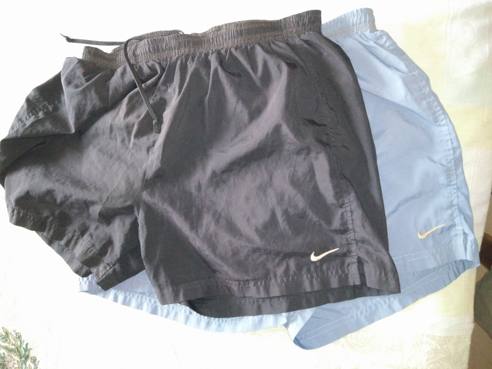
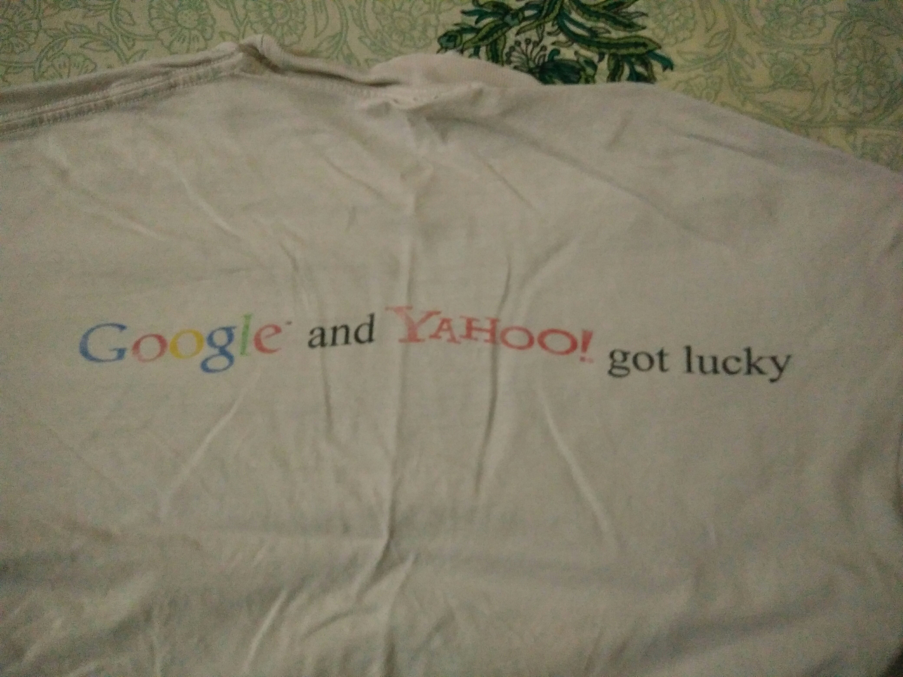

When I bought the Palm Pilot 5000, I could legitimately call myself one of the “early adopters”. I still remember the excitement with which I drove to the Circuit City (somewhere near Park Ridge, Illinois). And I couldn’t wait to return to the office and lay my hands on the beauty.

Some years later, I was buying a new device every year. And I was probably in the bottom half of the Silicon Valley early adopters.

But that was a long time ago.

I resisted the wiles of a slew of sexy iPhone models.

My first Android phone (Samsung Galaxy S2) was bought in late 2012. And I only upgraded to my second Android (OnePlusX) 3.5 years later.

But this post wasn’t meant to be about devices 🙂

Some of my accouterments have approached (or approaching) end-of-life and I wanted to grant them emeritus status with fond memories on my blog. I present to you six exhibits, in reverse chronological order.

**\#1 Nike running shorts** (two pairs): Acquired within a week of each other in 2002 (most likely in May) after a decision to train for my first ever marathon in Oct 2002. The shorts saw four months of intense use over all manners of tempo, interval, treadmill, and long run workouts. They unexpectedly got a six year reprieve – until our move to Bangalore. Where, things really started to happen for me as a runner. After a steadily escalating running volume (circa 2009 to 2011), the shorts conveyed sufficient warnings that they be excused from long run deployments (yeah! those inner elastics do have a finite life) so they eventually became my workhorse shorts for tempo and interval runs. A few years ago, seams started to give way but the neighborhood tailor fixed them alright. I looked at them again recently and realized that it was finally time.

**\#2 Ultimax running socks** (two pairs): Acquired a few weeks after the aforementioned Nike shorts, these were bought from Ryan’s Sports Shop – the same Santa Clara running store where I got my first running shoes (Brooks Adrenaline GTS6). The socks were heavily used for 4 months in 2002. After the six year hiatus, they experienced heavy usage again for 3.5 years in Bangalore.. until I discovered barefoot running. After a four year hiatus, I used them again for an ultra race and, I must admit, they are still good as new.

\#3 **Rockport shoes**: My previous pair of Rockport shoes was a lot more interesting. This one is as boring and vanilla as dress shoes get. I probably bought them in 2001. The insole needed to be replaced a few years ago but at 15+ years, this pair is as close to indistructible as I know. A few days ago, I finally bought my first pair of vegan shoes so the Rockports shall be dispatched to a Goonj location real soon.

\#4 **Company Swag** **Tee** (Jun 26, 2000): Larry Page came to Yahoo to give a tech talk about Google’s fault tolerant infrastructure.. in conjunction with the Google-Yahoo partnership party. The first 200 Yahoos who made it to URLs (name for our cafeteria) got the tee shirt.

\#5 **Healdsburg Jazz Festival** (May 31 – Jun 3, 2000):  What an incredible lineup of jazz musicians we were SO fortunate to hear over two days – Charles Lloyd, Pharaoh Sanders, Billy Higgins, Von and Chico Freeman. So when I saw this tank top shwag (see right), I grabbed it instantly. My favorite night time wear. At least for a few more years.

\#6 **Tank top from Mervyns** (1993-94): How can I Carbon-14-date this faded blue tank top? Well, watching your home team winning its first NBA Championship sorta etched things in. The seams are giving way in a few places but it (and I) aren’t giving up without a fight.

