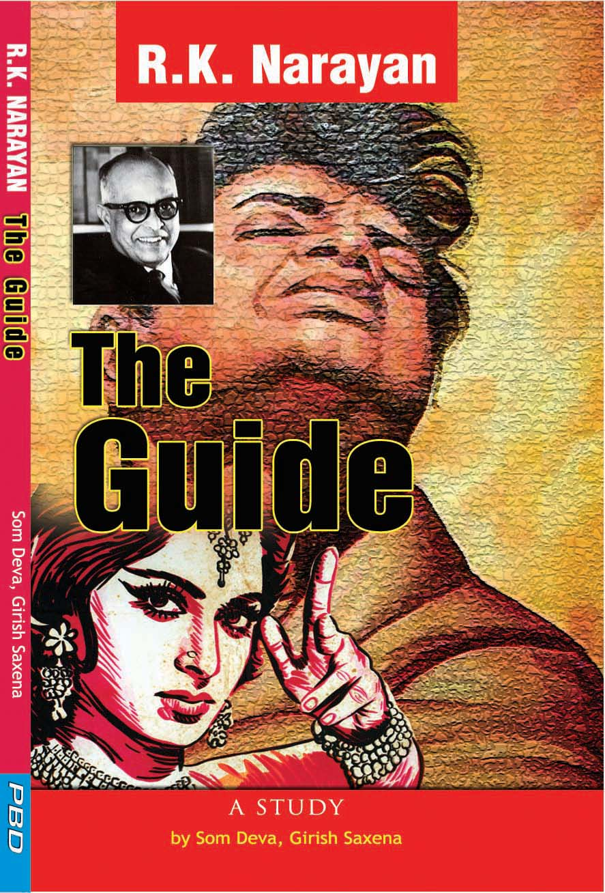

If you thought Bollywood’s troubles with the Censor Board are a recent phenomenon, think again. R.K. Narayan recounts, in [The Writerly Life](http://www.penguinbooksindia.com/en/content/writerly-life%3Frate=40uHLZjc8JuMiiwICQUMRu_5M8X7GTBMNDj3QwbplhM.html), his experience with the movie making process of The Guide. He appropriately titles that episode in his book as The ‘Misguided’ Guide. He devotes 13 pages to that episode, fine Narayan reading of course. I have transcribed the extract pertaining to the interactions to the Censor Board ‘Ministry’.

> Next: trouble at the governmental level. A representation was made to the Ministry dealing with films, by an influential group, that The Guide glorified adultery, and hence was not fit to be presented as a film, since it might degrade Indian womanhood. The dancer in my story, to hear the arguments, has no justification for preferring Raju the Guide to her legally-wedded husband. The Ministry summoned the movie principals to Delhi and asked them to explain how they proposed to meet the situation. They promised to revise the film script to the Ministry’s satisfaction.
> 
> In my story the dancer’s husband is a preoccupied archaeologist who has no time or inclination for marital life and is not interested in her artistic aspirations. Raju the Guide exploits the situation and weans her away from her husband. That is all there is to it — in my story. But now a justification had to be found for adultery.
> 
> So the archaeological husband was converted into a drunkard and womanizer who kicks out his wife when he discovers that another man has watched her dance in her room and has spoken encouragingly to her. I knew nothing about this drastic change of my characters until i saw the ‘rushes’ some months later. This was the point at which I lamented most over my naivete: the contract that I had signed in blind faith, in the intoxication of cheques, bonhomie, and back-slapping, empowered them to do whatever they pleased with my story, and I had no recourse.