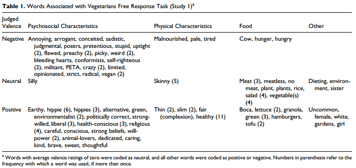

Why do vegetarians annoy people who eat meat?

A 2012 psychology research study, it turns out, has the answer.  
But before I get to the study (bulk of this post anyway), I want to give some background.

I wrote [this post](http://www.ulaar.com/2016/09/11/witness-to-a-slaughter/) a few days before Eid 2016, a rather unremarkable piece recounting my witnessing the slaughter of a goat in clinical detail. I’m on a quest to understand vegans, vegetarians, and meat eaters and this post was a crucial prelude to my journey to veganism.

Shortly after I shared the post on Facebook, a good friend H (whom I’ll describe as a verbal carnivore and a gastronomic omnivore) commented with “It’s just food” (fair enough perspective) and proceeded to post a rant on his timeline that started thus:

> Eid is coming up and these glum-looking goats will soon become delicious food. And on cue the insufferably preachy will lecture us about the horrors of killing animals for food. Pretending of course they aren’t doing this just to feel smugly superior and/or to feed their casteist bigotry over the lower meat-eating orders.

As a direct response to my post, the rant struck me as extreme and unfair. I’m sure there are insufferably preachy vegans out there (I see a few on a Vegan group I’m part of) but I haven’t met any in the flesh or on Facebook. But I allowed for the possibility of more than their fair share infesting H’s timeline.

As I returned to H’s thread 12 hours later, imagine my pleasant surprise to read a comment from one of his friends (N):

> But on the first point of preachy vegetarians…Is that really common (i.e. people lecturing)? I haven’t met a single person in the last 10 yrs that lectured on this subject in a private or social gathering. What is confusing to me personally is people asking me “why are you a vegetarian? Why did you give up meat?” or even better “you don’t look like a vegetarian!”. I avoid answering that question because the immediate reaction to an honest answer is “oh! you’re preaching” or “oh, you are one of those who thinks you’re better than the rest”. No! I’m just answering a question that you asked me to answer 😳. For example, I have never asked anyone “why are you a meat eater?” – imagine how preachy that would sound! But I get the opposite question all the time and no one bats an eyelid. So I wonder, who actually considers themselves smugly superior. I find it to be the opposite; I avoid disclosing my food preferences (or killing preferences) because there is immediate judgment and ridicule. The irony is that I can post and express liberal opinions about being against Trump’s ideology, against Burkini bans, against the RSS, against Modi etc etc – but none of those expressions are considered preachy. However, one post on animal rights gets flagged as preachy. This is very asymmetric. I’m primarily speaking for the non-judgmental vegetarians/vegans who claim no superiority externally or internally in their headspace. I find it paradoxical that when I’m asked the question “why are u a vegetarian?”, my honest answer is labelled preachy. The consequence is that I lie and say “I’m a vegetarian because I’m allergic to meat”. That seems to be non-threatening and socially acceptable these days – sad. So while I completely understand your peev with the RSS and Hindutva types, I’m sadly peeved by my fellow liberals who won’t let me eat my food without passing condescending comments like “you don’t look like a vegetarian”! What does that even mean 😂. At the end of the day, we’re all trying to figure out our local maxima on the moral landscape. Multiple mutually exclusive non-judgmental Maximas are possible. Happy Eid and enjoy that Mutton Biriyani for I know what it tastes like – just thank the goat for a few seconds!

Knock me down with a feather. I could NOT describe the behavior more eloquently if I had hours at my disposal.

Now let’s look at the study in question because it totally explains H’s (and their ilk’s) overreactions and N’s/my observations.

**Do-Gooder Derogation: Disparaging Morally Motivated Minorities to Defuse Anticipated Reproach** (Wharton’s Julia Minson and Stanford’s Benoit Monin)

If the title was a mouthful, don’t click on the [PDF link](http://citeseerx.ist.psu.edu/viewdoc/download?doi=10.1.1.407.9294&rep=rep1&type=pdf) just yet. I’m going to excerpt some relevant points below.

> “Do-Gooder Derogation” is our tendency to put down others if we feel they are morally-motivated. When someone’s behavior is overtly moral, we often feel annoyed and resentful, rather than impressed or inspired. The study authors see this as a result of “a knee-jerk defensive reaction to the threat of being morally judged and found wanting.” In other words, when we see someone riding on their moral high horse, we assume that they’re accusing us of being immoral by comparison. No one wants to think of themselves as a bad person, so we naturally respond defensively with resentment and derogation.

You might recall the announcement of the Zuckerberg Chan Initiative (ZCI). The unique thing about ZCI was that it was setup as a limited liability company instead of the traditional philanthropic construct (the non-profit). Critics conjured all kinds of conspiracy theories. *“Oh! Zuck is not satisfied with the billions he’s made from Facebook. Now he’s going to don the garb of philanthropy and make even more billions under the pretext of “saving the world”!*

Eventually a critic of the critics article appeared which referenced the Minson Monin research.

First the abstract:

> In Study 1, 47% of participants freely associated negative terms with vegetarians and the valence of the words was negatively related to how much participants expected vegetarians to see themselves as morally superior to non-vegetarians. In Study 2, we manipulated the salience of anticipated moral reproach by varying whether participants reported these expectations before or after rating vegetarians. As predicted, participants rated vegetarians less positively after imagining their moral judgment of meat eaters. These studies empirically document the backlash reported by moral minorities and trace it back to resentment by the mainstream against feeling morally judged.

If that sounded too research’y, then this succinct summary from [Dan Ariely’s blog](http://danariely.com/2014/05/08/1964-2/) is sure to help you out:

> The authors asked meat-eaters to generate a few words they associated with vegetarians. Unsurprisingly, 47% of participants came up with at least one negative word (like “malnourished” or “self-righteous” or “preachy”). When asked, participants also felt that most vegetarians would view themselves to be more moral than the average meat-eater.
> 
> The most interesting part of Minson and Monin’s findings, though, was that the more morally superior participants judged vegetarians to be, the more negative words they attributed towards them. For this reason we might be more accepting of the vegetarian that sighs, “I’d love to eat meat, but right now doctor’s orders say no,” than the one in a PETA shirt.

If you are still reading and want to know how the two studies were constructed, below are details on Study 1 (a correlation study) and Study 2 (which establishes causality).

> Study 1 shows that when they think about vegetarians and morality, nearly half of meat eaters generate negative associations. Giving us a first empirical insight into the causes of this derogation, our meat-eating sample also exhibited anticipated moral reproach, reporting that they thought vegetarians would look down on the morality of meat eaters generally, and their own specifically. Furthermore, the more participants expected vegetarians to exhibit such moral superiority, the more negative were the associations they generated. The personal nature of the threat was evident in some comments that respondents spontaneously added at the end of the questionnaire. One participant proudly wrote, ‘‘I’m the antithesis of vegetarian’’; and another, ‘‘Vegetarians, eat whatever you want to eat; no one cares. But don’t give other people \[expletive\] for what they choose to eat.’’ The traits generated by participants confirm our prediction that many meat eaters harbor negative perceptions of vegetarians. The statistical association with anticipated moral reproach also provides support for the hypothesized relationship. Although supporting our predictions, these findings suffer the limitations of correlational data. Furthermore, the richness of open-ended responses generated in Study 1 is offset by the loss of homogeneity in the responses provided, forcing us to rely on post hoc judgments of valence.
> 
> In Study 2, we manipulate the salience of anticipated moral reproach to test its causal role in do-gooder derogation. In this study, some participants considered how vegetarians would judge their morality as well as that of other nonvegetarians before evaluating vegetarians, whereas others started by evaluating vegetarians first. We predicted that when participants first contemplated being morally judged, they would be more likely to derogate vegetarians (as in Study 1) than if they evaluated vegetarians with no explicit consideration of threat.
> 
> Whereas Study 1 showed a correlational link between anticipated moral reproach and do-gooder derogation, Study 2 shows that merely thinking about how vegetarians see the morality of non-vegetarians can trigger this effect. When that threat was present, vegetarians were rated less positively on a composite of evaluative traits than when participants were not prompted to imagine being morally appraised. Our threat manipulation did not introduce any new information about vegetarians but simply asked participants to answer four items about perceptions and meta-perceptions of moral standing. The fact that we observed a significant shift in ratings of vegetarians as a result of such a subtle manipulation demonstrates just how sensitive individuals are to moral threat.

Once again, here’s that [PDF research link](http://citeseerx.ist.psu.edu/viewdoc/download?doi=10.1.1.407.9294&rep=rep1&type=pdf).

N shared the research study on the same FB thread but H wasn’t buying yet. “The West coast / Californians are the most insufferable and sanctimonious among the veganistas” (not exact words). So the fair critique is this “would the findings be the same if the study were conducted in other geographies?”

Closing note: Last month I saw an Oprah Winfrey interview with Michael Pollan where the latter arguably gave the most plausible answer to this post’s question: “It’s like these vegans are insulting your mother.” That sharp observation warrants a new post.
