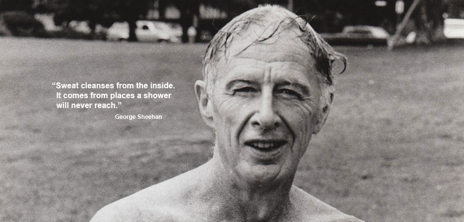

*I will not last forever, but I am damn well going to know I have been there. – Dr. George Sheehan*

Roger Bannister is etched in my memory since at least 1982. My correct answer in a quiz qualifier test would turn out to be decisive enough to beat out 3 senior grades to make it to the school team. A weekly diet of Sportstar magazines would have certainly come in handy.

“George,” he said, “you are avoiding the truth. Interval work is the only answer.”

Words of wisdom from Sir Roger Bannister to Dr. Sheehan when the latter asked him about “racing a few more 5- and 10-milers or doing stadium steps, or perhaps some real long runs.”

Sir Bannister knows a thing or two about ‘[interval work](http://www.humankinetics.com/excerpts/excerpts/training-regimens-from-racing-greats)‘.

Sheehan writes about the need for (and the virtues of) interval training in his 1980 book [This running life](https://www.amazon.com/This-Running-Life-George-Sheehan/dp/0671256084).

> I needed the long, slow distance to build up my endurance. But I also needed training of the anaerobic kind for speed and for stamina. This is energy produced in the absence of oxygen. It is the ability to go into oxygen debt and not develop too much lactic acid. The best way to teach my body that ability is to do interval 440s or 880s at the pace I set as my goal.

Practically every marathon training plan stresses the importance of interval (aka “speed”) work and there’s little doubt about its preeminent spot in the training plan. Most plans follow a steady progression in the number of intervals. Some mix things up between shorter and longer intervals.

But Sheehan’s approach is rather unique. And extreme. Maybe I find his description of it ‘extreme’ because I’ve never pushed myself to that extent. Here he is, comparing swimming intervals of 50 yards with 200 yards of track running.

> The sensations are much the same. With each one there is a gradual buildup of pain. Discomfort first, then the leaden ache in the arms and legs, finally the whole body screaming. And each successive interval raises the base line of that pain a notch or two higher.

In Sheehan’s world, there are reasons beyond physiological that compel him to pursue the final two (or three) intervals.

> As I see it, interval training is as much for the will as it is for the body. I am getting my will ready for the race. I am, in fact, running the race in advance. I am trying to reach that interval quarter that will feel exactly the same as the last lap of a race. And then be able to deal with it mentally as well as physically.
> 
> In interval quarters the will is paramount. The will makes me finish one interval. It calls up the energy to do another.
> 
> William James (one of Sheehan’s heroes) says “Effort is the one strictly underived and original contribution we make to this world. He alone is happy who has will. The rest are zeroes. He uses, they are used.”
> 
> I know of few better ways to reach this primitive level where will and effort combine than interval quarters. The answer to life’s question becomes simply, yes or no. There is no place for explanations, qualifications, excuses. Will I or will I not continue until I know that this is truly the last lap?

The day I start doing these kinds of intervals is when I can truly say “am doing my very best”. I’ve dubbed that state of mind as *intervaly*. I’d like to get intervaly. Sometime this year. Pretty please.

