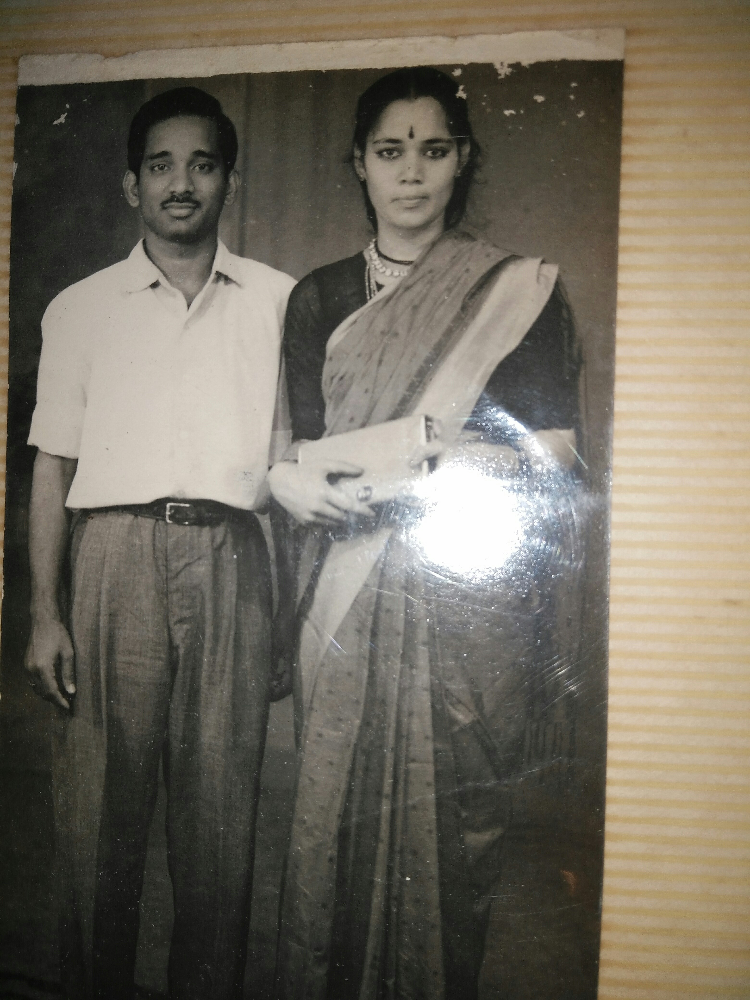

*\[Editor’s Note: My mother is a late adopter of the Internet. In the pre-Internet era, she used to write the loveliest of long letters to her children. The letters stopped after I returned to India. In the past year, after she got comfortable with connectivity and gmail, the letters resumed as emails to her children. She’s harvesting from the oldest tendrils of her memory which is making the reading so so enjoyable. In this email (Aug 4), she’s relating the story of her marriage in the winter of 1962. If I were to design the wedding brochure, I’d title it as Ooty ki kali weds a Guntur boy. The email has gone through a minor editing lens without changing my mom’s tone and voice. I’ve italicized all the Telugu names (and there are MANY). My mom’s sub-text/commentary is “italicized within quotes.” Editor’s comments are within “\[ \]”. The bare boned Telugu cheat sheet is here: Tatayya (grandfather), ammumma (maternal grandmother), mamma (paternal grandmother), Kakki (mom’s younger sister), pellichoopulu (seeing the bride), akkaya (elder sister), Nanna (father – my father in this case), guruvagaru (my father’s spiritual guru), mavayya (uncle). Rest of the glossary is at the end.\]*

My dear loving ones,

Some interesting flashback. I just finished my final B.A. exams. My *ammakkayya*, her daughter (Satyavati *akkayya*), and her family visited us for vacation in Jun 1962. *Ammakkayya* stayed back and others went back to Guntur. Satyavati *akkayya* sent Nanna’s match on Savitri *ammumma’s* suggestion. Communication went on between both the *tatayyas*. It was decided that *pellichoopulu* will take place in Tenali where my grandfather was staying with Viswapati *babai*. The three of us (*Tatayya*, Ammumma &amp; I) along with *ammakkayya* started for Tenali. Kakki had to stay back with our neighbours as her 11th standard classes had started.

<figure aria-describedby="caption-attachment-3300" class="wp-caption alignleft" id="attachment_3300" style="width: 225px">

<figcaption class="wp-caption-text" id="caption-attachment-3300">Post-marriage studio pic in Guntur</figcaption></figure>

We halted in Madras at my *mavayya’s* house. All five elders discussed the match. My father was not that happy about *Nanna’s* complexion. My *athayya* expressed her view that if both the couple are short, children also will be short. My *mavayya* and *ammakkayya* had made the final decision: All the other things (raised by people) are petty, the boy is qualified and *buddhimantudu,* family is well known etc etc. I think my mind was set without knowing myself. We three proceeded to Tenali.

The day came. Ambu *kakki* and Satyam *kakka* came from Kolluru on my father’s request. They made me wear *pinni’s* blue *pattu* sari with big border (*“I don’t like big borders*”). Ambu *kakki* made my *jada* – I was not satisfied that much. I was used to *ammumma’s* *jada* (I used to take *papidi* and hold the hair and she would braid). Moreover I missed *Kakki* very much. On top of it there was no big mirror. \[mirror in the Ooty house is a story for a different day\]

*Mamma* and *Nanna* arrived. *Tatayya* suddenly called me to come out. I didn’t know what to do next so I went to my grandfather, bowed down and touched his feet. He made me sit by his side. This gesture made a great impression on Nanna. I liked his face (“*if you like somebody’s face other things will not come in the way”*). Neither of the two (*Nanna* or *Mamma*) asked me any questions. Ambu *kakki* sat near *Nanna* and conversed comfortably. We were just listening. I don’t remember about the snacks but something was given. Finally I went inside. The event was over.

Next day myself and *tatayya* had planned to go to Guntur. On finding out *Nanna* requested tatayya to drop *mamma* in Savitri ammumma’s house so that he could proceed to his work place (Rourkela). I travelled with mamma to Guntur. I was comfortable in my checked sari. Most of the time she spoke about the time spent with her cousins in her childhood, what songs she learnt from ammumma (Ammumma and she were cousins).

She asked me 2 personal questions. First one was very funny, second one not exactly.

- “Do you eat rice thrice daily?” I nodded.
- “Do you have 2 pairs of gold bangles?” I nodded this way and that way. \[The great Indian head shake\]

We didn’t have gold bangles till then. On the previous day drama, either *pinni* or Ambu kakki had given me 2 pairs of bangles, which meant that she had noticed them.

We came back to Ooty. It took quite some time to say “yes” because Nanna had to show my horoscope to *guruvugaru* and get his consent. The two tatayyas were not particular about *jatakams*. *Ammakkayya* expressed her doubt about *guruvugaru* but my father okayed it saying *“what is wrong? I too have Baba (Sathya Sai Baba) as guru.”* So marriage day was fixed for 18th Oct with a *muhurtam* time of 4 am. Two months time for preparations – it was quite a tough time for my father as he had not made any plans till then. He had to gather 10,000 Rupees – a very big amount in those days – somehow he managed with my grandfather’s help whose chief complaint against my father was how much money he spent on travels.

Our marriage shopping was very simple – one *pattu sari* (parrot green) for *ammumma*, one *pattu sari* (sky blue) for me, *parikini onis* (not *pattu*) for *Kakki*. We usually bought our clothes from a brahmin’s shop called Seed Depot. His main business was selling seeds. Because of my foolish criss-cross nodding \[aka “Great Indian head shake”\], my parents had to make two pairs of bangles (instead of one). *<u>One should be very careful before nodding.</u>*

I was chosen by Kuruganti family 70% on account of *ammumma.*  I was Ratnamala’s \[same as *ammumma*\] daughter! Nobody thought much about her eyesight \[Ratnamala was nearly blind when she got married\]. My mother-in-law gave points to my complexion and roundness (*“I was not this fat then”*). My father-in-law was impressed by our lineage – my grandfather and great grandfather were both great scholars in their times. The latter was called *yerra panditudu* \[red complexioned pandit\] in Bandar. Moreover, he was impressed by my B.A. degree. My husband was happy because my *jatakam* was approved by his *guruvugaru*. \[The stars had all aligned.\]

<figure aria-describedby="caption-attachment-3301" class="wp-caption alignright" id="attachment_3301" style="width: 300px">

<figcaption class="wp-caption-text" id="caption-attachment-3301">Sometime after the muhurtam</figcaption></figure>

Marriage was to take place in my grandfather’s house in Guntur. We four (*Tatayya*, *Ammumma*, Kakki, self) started with Tirupati visit – there was heavy rush due to *brahmotsavams*. Our next halt was at Puttaparti – due to *dasara* there was a large crowd. Luckily (and because of Tatayya’s strong will and faith), we got interview and blessings \[interview refers to personal audience\]. Sai Baba (Baba) asked us to come after marriage. We reached Guntur where my *ammakkayya* had already arrived (having travelled from Kolluru). In those days there were neither *kalyanamandapams* (marriage halls) nor catering services so everything had to be arranged on our own. *Ammakkayya* brought *gongura*, *kandipodi*, *appadalu*, *odiyalu*, and other pickles prepared by her with Ambu *Kakki*‘s help. My *tatayya* was the local support. Anantalaxmi *pinni* and Nagalakshmi were the other people. We have to really appreciate our *pinni* – she believed it was her duty and responsibility to help her *bavagaru* so she left (Viswapati) babai and her two children to manage by themselves for 15 days. My *ammakkayya* and *pinni* were two strong pillars who supported my father. Marriage took place in front of the house. *Pandiri* was laid out, a raised stage was also constructed, and all the decorations were done by aunties and cousins. Cooking was done in the back of the house. My Vishwapati babai’s childhood friend and all-round reliable person took charge of the storeroom.

Our house was in the 18th Cross road. Savitri *ammumma* fixed an accommodation in the 14th Cross road for Kurugantis. They had planned for *Satyanarayana vratam* in Guntur itself. Cook also was arranged as they stayed for 10 days.

Baba’s big portrait was kept on a decorated chair. Guests started coming from 16th onwards. There was 100% attendance on both sides of the family. After the *muhurtam* was over we went inside. *Ammumma* broke down all of a sudden. We had never seen this before. All these years she never complained or grumbled about her defect \[she was fully blind within a few years after her marriage to *Tatayya*\]. She held my husband’s hand and cried like anything. She said *“I can’t see anything. I don’t know anything. Look after my daughter.”* It was too heavy a scene for everybody.

I changed my sari &amp; wore the white sari for *mangalyadharanam*. I came out and saw my father standing under the bogada tree in our compound. Now that *kanyadanam* was over he was quite relaxed. On seeing me he was SO happy! Till today I remember those sparkling eyes full of contentment and appreciation. <u>He was my mother too.</u>

Our *guruvugaru* purposely didn’t attend the marriage. He was staying in a nearby *peetham*. Instead Guruprasad (his elder son) represented him and was well taken care of by Bhaskar *babai* (my brother-in-law). Later, with my father’s permission, Nanna took me to the *peetham*. We got his blessings. (Laughing) he said *“Kurugantis don’t need tube-light anymore.”* \[referring to her white complexion\]

By god’s grace everything went off well. We started for Puttaparthi. My *ammakkayya* and Sudheer *babai* accompanied us. We got interview with Baba – he materialized a locket and gave to *Nanna* and asked us to return with the baby child \[the one who would be my older brother\]. We proceeded to Secunderabad. Guntur Tatayya (Nanna’s father) was still in service (with Central bank). The house was near general bazaar. We celebrated first diwali amidst *athayyas*, *babais*, *pedananna*, and *doddamma*. *Mamma* very happily took us to Kali temple, to her brother’s place, sister’s place, and other relatives.

Our marriage was given good report, notable quote being “bride’s sister is more good looking than the bride!” Proposals came for *Kakki* but *Tatayya* brushed them aside. Our next destination was *guruvugarus* place – it was a very small village Narendrapuram in East Godavari district. *Mamma* came with us. After getting down at Rajahmundry we had a dip in the Godavari river on mamma’s wish. We crossed the river by boat, then took a bus and finally reached their house on a bullock cart via a *kacha* muddy road. We were given a warm welcome. Since it was a village, all the people gathered. Next day was 16th day so they prepared special items (*kandabachali koora* was a must for newly married couple it seems). Seetamma (*guruvagaru*’s eldest daughter) was very friendly and lively, others were too young.

By the end of Nov 1962 we were in Rourkela. I was impressed by neat well laid roads and similar looking houses. *Mamma* used to cook for us. *Nanna* took us to his friends’ houses. *Mamma* knew a friend’s daughter in Rourkela. *Mamma* and I used to go to the nearby market – it was so strange walking without holding her hand. \[Context: my mother or her sister would always hold their mother’s hand while walking since she was blind\]

On receiving first letter from *Tatayya* I read it out to *Mamma* and immediately cried. She consoled me by stroking my back – those were the innocent days.

Three of us went to Calcutta where Ramudu *babai* was staying in shared accommodation. He took us to Ramakrishna Mutt, Birla Planetarium, New market, and other well-known places. *Babai* found it very funny when I started crying on M*amma’s* return journey. She also advised *Nanna* on so many things.

That’s it. \[See note below\]

Marriages are made in heaven it is already planned by HIM. Happiness and success depends on one’s partner. It is one’s own luck and destiny. I thank GOD for everything.

<figure aria-describedby="caption-attachment-3302" class="wp-caption alignleft" id="attachment_3302" style="width: 225px">

<figcaption class="wp-caption-text" id="caption-attachment-3302">A gift to my parents on their 28th marriage anniversary</figcaption></figure>

\[Note on “That’s it”\]: this is my mom’s signature two words to indicate that the long story just related has finally come to an end. When we were young (before we had started reading classics), I have memories of her storytelling Victor Hugo’s Les Miserables. Every night she would relate the content of whatever she had read that day. She’d always end those episodes with “That’s it!” On my parents’ 28th wedding anniversary, I presented them with a copy of the same book.

Dear Amma and Nanna, HAPPY 54th Anniversary from your dear loving ones (Srinivas, Janaki &amp; Vishwanath)!!!!

**Glossary of Telugu words**

- Buddhimantudu – intelligent
- pedananna – father’s elder brother
- dodamma – father’s elder brother’s wife
- attaya – father’s sister
- pinni – father’s brother’s wife
- Pattu sari – fancy brocaded sari
- parikini oni – aka “half sari” worn by young unmarried girls
- jatakam – horoscope
- jada – braided hair; papidi – hair partition and a key preparatory step before braiding
- pandiri – trellis structure used for marriage ceremonies
- Satyanarayana vratam – an important religious puja in conjunction with most life change Hindu events
- mangalyadharanam – tying of the sacred mangala sutra around bride’s neck
- kanyadanam – marriage ritual (donating the bride to the groom)
- peetham – ashram
- gongura, kandipodi, appadalu, odiyalu – yummy Telugu savories