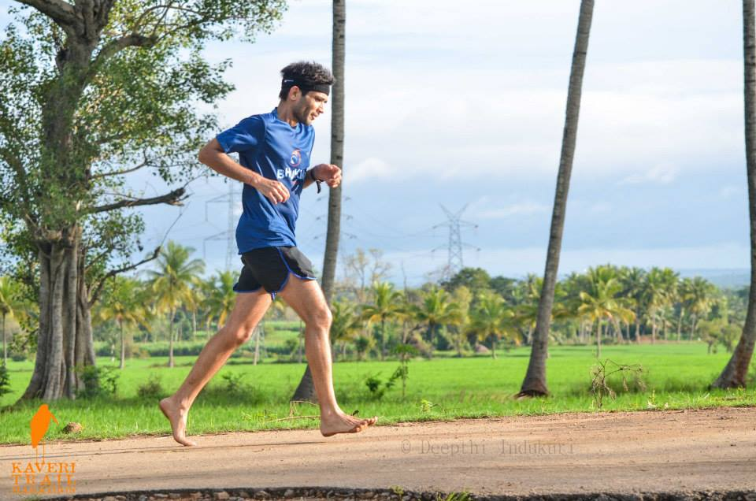
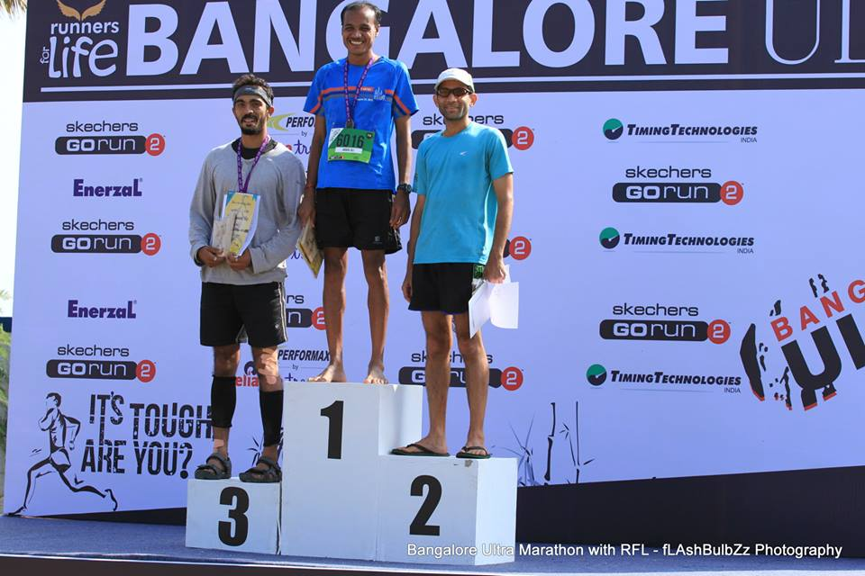

*Progress is linearly proportional to one’s efforts but results often come in cycles. – several wise men*

Coming off a 22-month [streak](http://www.ulaar.com/2016/08/13/breaking-a-streak-liberating/), the 2013-14 season was looking rather normal. KTM in Sep followed by 75k Ultra in Nov and finish off with SCMM in Jan.

I had come within flirting distance of sub-4 times in a few training FMs and finally did a 3:55 (or thereabouts) in Apr so was flush with confidence, optimismghg and expectation.

**KTM 2013**

Came really close to a DNS (Did Not Start) thanks to a judgement lapse on the preceding Friday – carbo-loading at a non-regular eating joint (Rajasthani Rajdhani at that) was not a smart thing after all. Curd with jeera powder until Sat evening brought parity to proceedings. It was a trail run and I had prepared myself mentally and logistically to dart into the bushes. Fortunately, a final pre-race checkin to the loo brought glad tidings and I was mentally &amp; physiologically re-centered.

In 5 years at KTM (and 2nd time barefoot), a first half of 1:55 was easily my most aggressive start. My ‘two Cocojals per FM’ strategy seemed to be working – for a change, cramps wouldn’t be the culprit this time around. The payback for my unsustainable first half pace was an undramatic and inexorable slowing down. I finished in 4 hrs 9 min. A highly respectable time for KTM but I was gunning for a lot faster. I’d be back (I promised myself).

**Ultra 2013**

The urge to run my second 75k ultra started immediately after I finished the [2012 edition](http://www.ulaar.com/2013/11/10/chappal-mein-pachattar-first-75k-ultra/). I was mentally a lot stronger. Physically too, with a lot of consistently high mileage weeks, weekends and months. Thanks to [Sir Gaunker](http://www.ulaar.com/2013/03/12/meet-sir-gaunker-modern-era-ekalavya-happy-ending/)‘s tried and tested nutrition strategy for ultras, ragi was going to be my primary fuel. What’s more, Rajaram’s wife very kindly agreed to prepare the [ragi pudding](http://rakshaskitchen.blogspot.com/2011/12/ragi-pudding-nachnyache-satva.html) for my race. Meanwhile Rajaram was registered for the 100k and in the deepest vein of purple form that season.

The Bangalore Ultra’s starts are always magical. 5am with darting flashlights and a jumbled formation of runners tentatively making their way forward. The conditions ensure that no one takes off at 10k pace.

The usual banter with Nari and Vasu (who deserve a post on what makes them uniquely crazy) continued till the 6.5k hydration point. As I exited, something clicked in my head. An inner voice said “I’m racing, not running!” and I instantly knew what to do. If this scene needed to be picturized (and I was the director), I’d show the protagonist’s eyes narrowing, focusing in a William Tell manner seeing \*just\* the apple on his son’s head and set off in a copybook stance of an elite Kenyan runner.

Nari and Vasu dissolved into the gray and off I went. To run my race. It was the first time I had turned on my ‘game face’. A face, a mode, an attitude that stayed with me for the remainder of the race.

I completed the first (25k) loop in 2.5 hours. I knew it was too fast so (after briefly feeling good about it) I consciously slowed down a tad bit. I finished the 2nd loop in 2 hrs 45 min. My Bhukmp compatriots noted my in-the-zone running with a range of comments. Nari said “Man! You are going fast” (with a tone tinged with concern). I passed Chandra at the 18k mark. I had not seen him because he was on a bio break. He yelled out to me “Hey, you want to break Sunil Menon’s course record?” There was no danger of that of course. Sunil’s (last year’s winner) time was 7.5 hours. Chandra (who finished 2nd behind Sunil in 8 hrs 15min) was probably afraid I might better his Bhukmp record 🙂 Until the start of the 3rd loop I actually thought I had a shot at it.

Hari observed “Did you realize you just had your best FM time?” He was right! I had crossed the 42k mark in 4hrs 5min.

The 3rd loop pulled back proceedings thanks to my tactical error in the first loop. I had forgotten that my Cocojal stash was only at the starting point aid station (and not at the midpoint) so my first Cocojal dose came at the 32k mark (thanks to Rajaram’s generosity). At the start of the 3rd loop, I traded my 4mm huaraches with 10mm Puma slippers. The footwear change was by design but things started going awry soon thereafter. With the spectre of cramps looming in my mind, it was only a matter of time before my calves obliged. I had my best stroke of luck that day – this happened 100m from the medical/physio van. Chandra, who had amazingly caught up despite a painful bout of plantar, helped me to the physio. A 5min massage by Physio Peter changed the game again. I felt good as new so off I went again. A bit more circumspect this time. On my final turnaround (with a mere 6k to go), I got a 2nd massage from Peter (for proactive good measure) and finished in 8 hrs 38 min. In 2nd place. Winner that year was Mumbai’s talented ultra runner Abbas Sheikh (in 7.5 hrs).

**SCMM 2014**

After landing in Mumbai airport, I recall Nari asking me about my target time and my reply was “I don’t know but I was definitely going for it”. What was \*it\*? I would find out on race day. I took the “racing, not running” mantra to my final race too. At Azad Maidan (about 10 min before the gun), broke away from my group after exchanging some pleasantries and made my way to the starting line. Time to picturize again people… that same purposeful narrowing of the eyes. No William Tell but a killer this time. A killer moving through the crowd with each step taking him inexorably towards his victim. I was slotted in the B corral but I didn’t stop when I reached the front rows of B. The absence of any policing merely confirmed what was already in my head. I kept walking until I reached the first few rows of the starting line. I was probably rubbing shoulders with runners who would finish in the Top 10 but I didn’t care. I was running \*my\* race and I was expressing intent (to myself) in the most aggressive way possible.

To end proceedings, here’s a brief race report I shared with my gang after returning to Bangalore.

*Dear friends,*  
*Had a fantastic race. Ravi made the mistake of asking for my story at the airport last evening and he got the VERY detailed account. Here’s the short version:*  
*Two words: very satisfied.*

*I didn’t want to squeak in for a sub-4 finish but blow past it – goal largely achieved. First race where I didn’t cramp – 2 cocojals did the trick. I had visualized them as my two six-shooters. Emptied the empty one at the 7k mark, second one was downed soon after the halfway mark. Strategy to go close to 5:00 pace for \*as long as possible\* paid off.*

*Decision to run barefoot (as opposed to huaraches) was vindicated and the only time I gazed balefully at the asphalt was on the final few kms of Marine Drive. Great BF-friendly course barring 3 stretches where asphalt was very coarse – the last Marine Drive stretch (where Jugy/Sunil cheered us) and the only time I wished I had the huaraches. Did “catch-back” with Pankaj and Bahuja at 3 different points – I surged ahead each time – Pankaj ko motivation diya hoga since he surged past me in the last 700m 🙂*

*Played cat-and-mouse game with Vaishali between 21k and 39k. She was super-focused but I couldn’t resist a very brief conversation. I was not sure how to tackle the Peddar hill (apparently I had forgotten Nandi Hills) so I asked her. Pat came the reply – “Don’t walk, increase arm swing, drop stride”. I followed the good lady’s advice and remained untroubled.*

*First race as “Veteran”, first FM race with the analog Titan Edge (glanced at it maybe 4-5 times). 5:11 in the 1st quarter, 5:12 in the 2nd, 5:21 in the 3rd and 6:00 in the 4th.*

*Overall rank: 159, category rank: 23. Can’t really complain. Thank you – oh running gods! It finally all fell into place. The sub-4 monkey off my back.*

Closing note: This post entered my Drafts folder on Nov 4, 2014 so a gestational stay of 23 months 🙂

