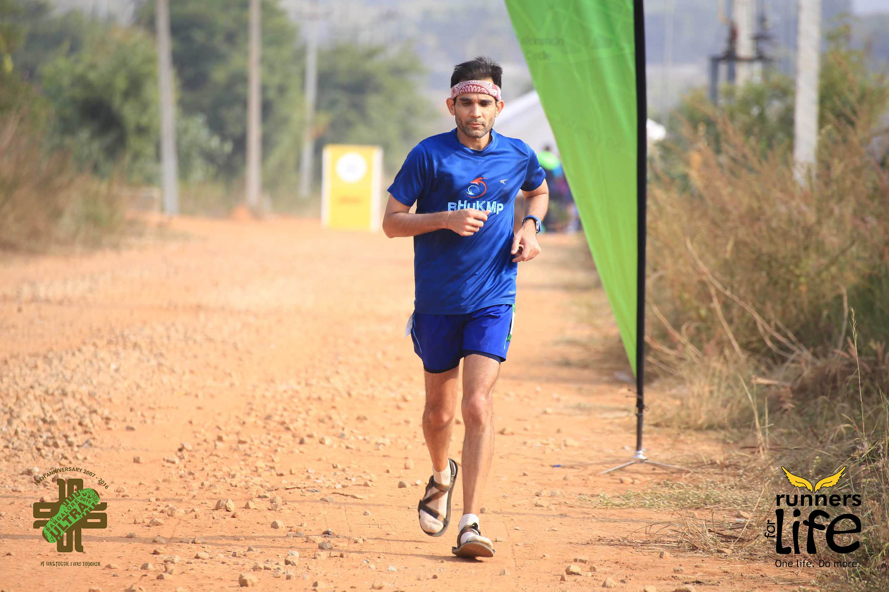
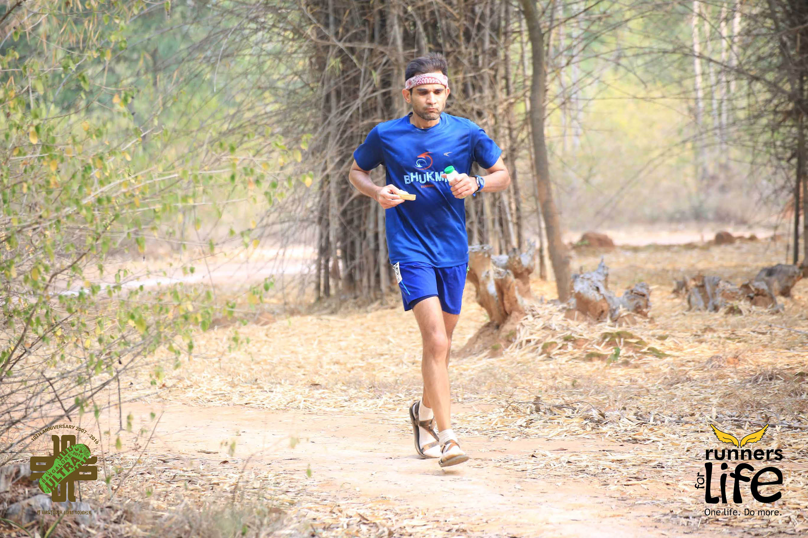
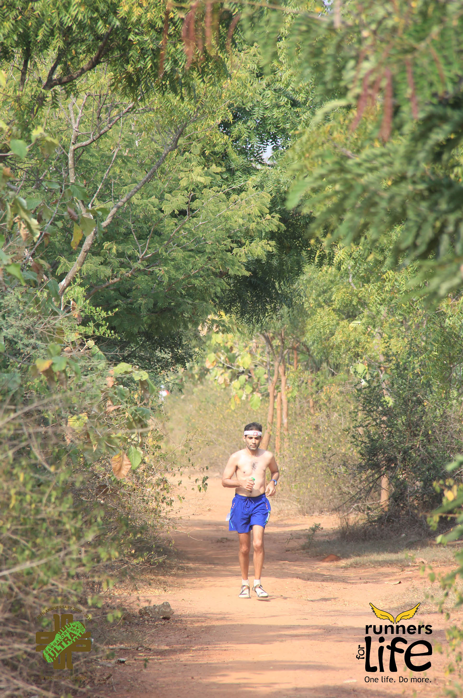

*“The human being, by and large, is a very bad companion for himself; where he has to face himself for any length of time, he acquires a deep disgust and a restless anxiety which makes him seek almost any escape.” – Victor F Nelson*

\[Editor’s Note: Started this post the Monday following Bangalore Ultra 2016 but I finished it on Nov 25, courtesy a 2 hour flight and WordPress for Android. By my usual gestational standards, this baby came out super fast.\]

Yesterday marked a first of sorts – watching a play with my teenage son. “Perfect Nonsense”, PG Wodehouse’s adaptation by The Goodale Brothers was thoroughly enjoyable. Judging by my son’s reactions, I believe he’ll give Plum a try soon. The play capped off an eventful and satisfying weekend.

A weekend that started on Saturday at 6am with a different three act play.

It was the 10th edition of the Bangalore Ultra and I was running the 75km distance. Each loop (out and back) = 25k so 3 loops in total.

**Pre-race prep and target setting**

My lungs were in better shape (albeit Symbicort aided) than last year but nothing close to the 2013-14 season.

Having run this race 3 of the last 4 years, the distance/terrain/heat weren’t daunting. I wanted to push myself though. Specifically, I wanted to improve on my previous best time of 8:38. Feeling strong after a 52k training run at 6:10 pace made me greedy. Was a time between 8 and 8:15 possible? A question I would keep asking myself until race day.

When Bhasker posed the same an hour before start, my answer was “will run first loop in 2:40 and see” which is a cagey way of saying “8 hrs but…”

The silly organizers (in their infinite wisdom) had moved the start time from 5am to 6am. Why fix something that wasn’t broken? Grr…

My target time was allegedly adjusted for this extra hour in the sun.

Didn’t mess with my nutrition and hydration plans from previous two years (ragi pudding + coconut/PB sandwiches, Cocojal and water, and salt tablets).

Quite satisfied with my mental preparation in the week leading to the race. I even visualized the race a few times – something I’ve never done before.

After my [less than stellar performance in 2014](http://www.ulaar.com/2014/11/17/bangalore-ultra-2014-race-report/), one thing I swore to change was my choice of footwear which turned out to be the [Umara Z-Trail sandals](https://xeroshoes.com/shop/ready-to-wear-barefoot-sandals/ztrail-men/) (acquired in March). Since a ball-of-foot callus had returned to torment me for the nth time, I decided to add socks to the mix – it would turn out to be a smart decision.

**Act I**

<figure aria-describedby="caption-attachment-3339" class="wp-caption alignleft" id="attachment_3339" style="width: 300px">

<figcaption class="wp-caption-text" id="caption-attachment-3339">Nearing the end of act I</figcaption></figure>

Considering how much I abhor arriving late to a race, was unable to avoid a mad scramble to get my stuff to baggage claim, etc. Mild rumblings from the nether regions with 10min to the gun so I needed to make my first decision.

I called my gut’s bluff. It was a trail after all and I had TP tucked away. Would turn out to be the right call.

I set off strong and (since I was wearing a watch, not Garmin) realized at Km 2 that it was too fast. A progressive slowing down in the next 7 km brought it down to an average pace of 6:00. The return 12.5k (with a few inclines) would get me back on target I figured.

I finished Act I four minutes faster than plan. You’d think 4 min over 25 km isn’t significant, right? I’m sure my running geek friends will tell me how significant it was. Discipline in “holding back” in ultras is key (especially since I had a target, an aggressive one at that) and i had failed the test. I would learn my lesson in acts II and III.

Looking at a runner as a celestial object revolving around the sun, an aggressive push to a higher orbit carries the risk of careening downward to a lower orbit.

**Act II**

<figure aria-describedby="caption-attachment-3340" class="wp-caption alignright" id="attachment_3340" style="width: 300px">

<figcaption class="wp-caption-text" id="caption-attachment-3340">Eat and run.. in the middle of Act I</figcaption></figure>

Normally I’d go half-monty in act III but the 6am start messed with that plan. At the 2 hour mark, I was already feeling straitjacketed with a soaking tee and a playful sun. So I decided it was going to be a 50k shirtless race. Game on.

One of the fringe benefits of going shirtless is that it’s a photograph repellent. While I have nothing against photographers and viewing a rare runner-in-repose picture *can* lift the ego, seeing them in the middle of the trail strikes me as unfair. It breaks the meditative spell, I get conscious, and I just can’t wait to cross the range of the lens. (having said all that, I’ve attached 3 pictures from the race)

Unsurprisingly, I slowed down in the second loop, completing it in about 3 hours. I kept comparing my performance with how I felt during and after my bolstering 52k training run. Why WAS I not feeling as strong as that run? Especially when I was running at least 20 min slower over that distance.

I had started my training run at 4am – a whopping 2 hours before race start conditions. Bleddy aggressive optimist me was also el stupido!

As I approached the end of the second loop, here’s how I assessed my 3-act play:

- (utterly) foolish first act
- steady as it goes second act
- gear up for survival act!

**Act III**

<figure aria-describedby="caption-attachment-3342" class="wp-caption alignleft" id="attachment_3342" style="width: 199px">

<figcaption class="wp-caption-text" id="caption-attachment-3342">They managed to snag the half-monty</figcaption></figure>

At the turnaround it was evident that a spectacular third act was the only way I could come close to my previous best. ‘Spectacular’ entailed not cramping AND maintaining the pace from my second loop.

A heightened state of proprioception would ensure I wouldn’t cramp. I was regimental in my intake of Cocojal and salt tablets. I was able to detect the mildest pre-cramp tremors and take evasive measures (salt or electrolytes). The fact that I finished my 10th (and last) salt tablet between 55k and 62k told a tale of treacherous heat. Fortunately all aid stations were abundantly stocked with salt.

About that second dimension of spectacular? Ha.

Survival it had to be.

Once you’ve run enough, you know that the sublime races are but a few. The non-sublime races are wonderful opportunities for self-learning and experimentation.

My personal favorite is the experimentation with mantras. Different mantras for different situations.

The [racing, not running](http://www.ulaar.com/2016/10/23/racing-not-running/) mantra worked great for my sublime 2013 season but it was a non-starter for this race.

In the middle miles of trail races, I’ve found [this](https://en.wikipedia.org/wiki/Gayatri_Mantra) to be very effective in re-centering my mind and bringing my focus inwards. It also helps in regaining my breathing rhythm. Time stands still while the miles are eaten.

A new addition to my mantra arsenal was an Indian army war cry that one of my fauji friends had elucidated on our WhatsApp group sometime ago.

No external enemy to contend with, no hill to be taken but a lot of inner demons to be vanquished.

I employed this mantra twice, somewhere between 58k and 65k. It seemed to work, though it’s effect was short lived. Me thinks I haven’t really internalized the import of the fauji mantra.

I walked three times in act III. The longest walk duration was probably 3-4 minutes but I hated every second of it. I hated it because I wasn’t remotely in distress. My nutrition was working – no exhaustion or bonking. No cramping. Just plain old misery of having slowed down, being unable to speed up, the prospect of additional 15/14/13 to go, absence of a good reason to DNF. Yes you fool – km markers take longer to traverse at an ambling pace.

The best news from the third act was that I got my proverbial “second wind” several times. They’d only last a kilometer but gave me great hope. Without these bursts I would have had an utterly miserable finish.

If my mind was the rider and my body the horse, I needed a few more mantras in my arsenal.

At the 62.5 k mark, met Lawrence (who was running 100 k) and we got chatting. He was running at a blistering pace, but his lower body was killing him and he wondered if he could finish in under 10 hours. My lower body, on the other hand, was doing just fine. My lungs however felt as though somebody had compressed them down to 50℅. We bantered for half a kilometer before Lawrence found his groove again. He would finish in an amazing 9:50 to take 2nd place.

While Lawrence was computing his sub-10 hr pacing misery, I was calculating my sub-9 hr chances. Things weren’t looking good so I blanked those thoughts and concentrated on just *running* the remaining 12.5 km. I had walked thrice in the preceding 6 k and I’d be damned if I did that again.

Amazingly (and seemingly suddenly), the 69 k marker was sighted and a quick calculation told me that a sub-9 hour finish was in the realm of possibility \*without requiring a superhuman effort\*. If I was a whistler, I would have whistled till the end.

Finished in 8:58. 4th place overall. Apparently I was the only oldie running 75k so they gave me a trophy too.