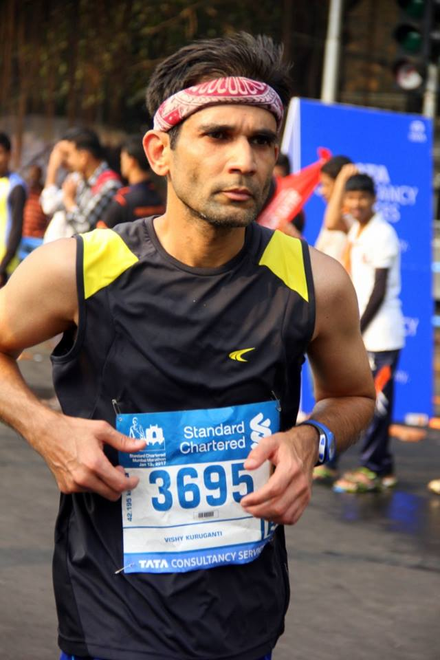

*If the race wasn’t worth writing about, you didn’t give it your all. – A donkey*

\[Editor’s Note: This is my Mumbai Marathon 2017 race report masquerading as a three-part cricket metaphor laced narrative. Any self-aggrandizement percolating through is purely accidental. Really.\]

**Part 1: The week after**

*Jan 17-19, 2017*

I laced up my shoes and went for a 30 min run. By run, I mean a slow walk turning into a shuffle which eventually became an amble and, with 5 min remaining, I finally trotted.

The last time I wore my (now 7 year old) shoes was [14 months ago](http://www.ulaar.com/2016/03/06/for-a-few-hyperloops-more/). The previous time I laced up was for the last 25k in my [1st 75k ultra](http://www.ulaar.com/2013/11/10/chappal-mein-pachattar-first-75k-ultra/).

It’s not like I wasn’t running in the interim. Barring these 2 shod episodes, I’ve been mostly running barefoot or with [minimalist sandals](http://www.ulaar.com/2013/07/13/say-hello-to-huaraches/) since Feb 2012.

For the first time (after running scores of marathons and ultras), my quads were OK but my calves and glutes were not. The morning after I felt like I had been gored in my right buttock. And the knives buried in my calves were just not retreating.

The buttock thing had to be a glute strain, a self-diagnosis that I accepted with mixed feelings. I was forewarned. For the preceding two months, a low intensity strain had been coming up every few weeks but I adopted corrective measures that seemed to work.

No runner likes an injury but if it had to happen, this wasn’t a bad time – next race was at least 6 months away. For the [mafiosi runner’s body](http://www.ulaar.com/2013/05/27/made-men-mafiosi-runners-body/), was it finally the butt’s turn?

Miraculously, the glute strain relented 36 hours later but the calves did not. They would require 3 sessions of aggressive stretching by a physiotherapist to restore normalcy. Certainly another first.

Somewhere on the course, my right heel got punctured by a sharp object. Not all sharp pokes on the soles are significant so it’s hard to recall where this might have happened. For the record, Mumbai roads are WAY better than Bangalore roads (a fellow barefoot runner had this to say “Thanks to Karnataka Government for the terrible roads.. which makes Mumbai roads feel smooth as butter”). The combination of punctured heel and knifed calves made the post-race barely-a-kilometer walk to the hotel excruciatingly painful and impossibly long. \[Link to the day#4 barefoot pics\]

There’s a reason why I’m dwelling so much on the post-race pain. Part 2 of the story will shed light on the why.

Sandals or naked feet?

About half my races have been run with shoes. The rest are probably an even split between huaraches and barefoot. If you’ve been following my blog closely, you’d know that I’ve been vacillating on this footwear business. Maybe there was no “one right way” as the purists have been opining. Perhaps Dr. Rajat Chauhan is right in admonishing runners that jettisoning shoes doesn’t have to be a [“losing my religion”](http://www.forbesindia.com/blog/health/running-losing-my-religion/) decision.

My interval training workouts were all run barefoot but the longest barefoot run in the preceding weeks was a measly 16k. Physically, I was a far cry from my peak form in 2013-14. Lungs have required daily inhaler assistance for past two years. The nagging pain in the sacro-ileo zone (first manifested 5 years ago) has bothered me on more long runs than usual. And there was Senor Maximus reminding me that my right flank was doing more work than the left. Against this backdrop, sandals would have been the prudent defensive choice.

So why did I decide to run barefoot?

It was an expression of intent. An aggressive front-foot meet-the-ball-early intent.

As always, my team *and* the opposing team would be simultaneously occupying the crease. By ‘crease’, of course I mean my body and my mind. The various parts of my body represent ‘my team’, the conditions were the opposition and how the shared resource (the mind) performed would determine the victor.

\*\*\*\*\*\*\*\*\*\*\*\*\*\*\*\*\*\*\*\*\*\*\*\*\*\*\*

**Part 2: The target before the target**

I’m part of a [running cult](http://www.ulaar.com/2014/02/24/the-cult-of-bhukmp/) where devout members make their flights reservations for SCMM six months before race start. They \*assume\* (rightly in most cases) that their registrations will be accepted and complete the formalities within 24 hours of registration opening and obsessively follow-up until the Procam folks are like “Ok ok! you are in! Sorry we kept you waiting!”

But I was going to give SCMM 2017 a miss. I had run two ultras recently and not in the best form to challenge my personal best from 2014 so why bother?

Then I got this message from my friend Charulekha in mid-Oct: *“Hey V, are you running Mumbai Marathon? Because if you are.. we’d love for you &amp; your runner friends to fundraise for AADI”*.

One thing led to another. I registered in late Oct, the acceptance came in soon enough but it would take me till Nov-end to put up this [fundraising page](https://www.unitedwaymumbai.org/scmm-fundraiser-6974).

As I would write in my fundraising emails to friends, this is the *first* time I registered for a race at the suggestion of a friend. In hind sight, the target (25 Lakhs) was several shades beyond unrealistic. Raising $10,000 in my first fundraising run (circa 2002 in Bay Area) was a “beginner’s luck ” data point that I probably should have tempered.

In any case, I wholeheartedly embraced the pre-race target. In my emails, I would invoke BHAG, suffix it with “Gulp!” and allowed my unbridled optimism to suffuse through. AADI’s mission became my mission and I emoted this in every single email/Whatsapp/Facebook Message. **188** messages to be precise. My ‘constituency’ included folks who had contributed in 2002 (all in US), Charu’s (and my) classmates from school, my college mates, ex-colleagues at Yahoo and Adobe, and runner friends in Bangalore.

The end result? **66** unique contributors helped raise a total of **3.5 lakhs**. **37.2%** is a pretty darn good conversion rate!!! Thanks again dear contributors (you WILL hear from me soon with a link to this blog post).

I considered gamifying the fundraising pitch. Would donors double their contribution if I ran the race faster thany previous best? A friend rightly assessed that non-runners would not be moved by this. What if I made a spectacle of myself during the entire race? A few promising ideas emerged on this theme but were eventually laid to rest.

Years ago, a friend had honestly asked “Why should I contribute just because ***you*** are running?” Back then, I was running my first ever marathon (a special moment in itself). This time I was in a certain life zone where running and racing marathons was immensely pleasurable (even considering that all races involved pain to some degree).

I haven’t quite researched the history of fundraising on the back of endurance events but I’m guessing it’s an attenuated version of Christ and suffering. I care for this cause \*so much\* that I’m willing to cycle from San Francisco to Los Angeles.. or hike/run the Appalachian Trail or run from Srinagar to Kanyakumari. And, learning from the Pheidippides saga, not die in the process.

So I was running a mere marathon (without adding any levels of difficulty or attach performance goals) and expecting people to buy into my cause in a BHAG way?

I wasn’t suffering enough, I told myself. I indulged in some programmatic scenarios. If I don’t shave off 3 min from my personal best, I would run another marathon the next weekend. Heck, I’d make it a 50k if my race performance sucked.

But the only use of these suffering scenarios were if I put them into my fundraising emails to f&amp;f. Occurring as the idea did at the 11th hour and considering that I signed up for a major work deadline on the eve of the race, this fundraising premise was never tested.

The universe was however listening to my chatter.

A certain chump who was running a *mere* marathon wanted suffering. The word went around.

Oh yes sir, word spread nicely indeed. I suffered during the race (par for the course) but the week long post-run suffering is a personal landmark of sorts. As they say, be careful what you ask for. Even in the private recesses of your mind.

\*\*\*\*\*\*\*\*\*\*\*\*\*\*\*\*\*\*\*\*\*\*\*\*\*\*\*

**Part 3: The race**

Finally I get to write about the race!

There aren’t many things one can control 10 days prior to the race but adequate sleep and nutrition are certainly two of them. I did reasonably well in that department. But that was about it.

Developed body ache and mild fever over the penultimate weekend. Ditched the taper run and compensated with extra sleep and stay-at-home-vegging-out. An important 3-day business trip to Delhi was unavoidable. The crisp cold Gurgaon air fortunately didn’t do any damage. Well, not much anyway.

The evening before the race, felt early symptoms of body ache and a mild fever. Without panicking, I started imposing my famed positive thinking will on the *problem*. “It’s just psychosomatic jitters,” I told myself, “about a race I wasn’t 100% ready for and a target pace that I hadn’t mentally set.” Tea with a friend followed by sumptuous dinner with my BHUKMP gang didn’t alleviate the physical symptoms.

Desperate times called for drastic measures – a 400 mg Ibubrofen tablet was downed before bedtime. After a few hours of fitful sleep, I sweated away the &lt;whatever&gt;. Woke up fresh with positive thoughts.

I’ve never woken up on race day feeling “I’ll take it easy today.. won’t push myself.. just finish the distance yaar.” This time was no different.

I had to shave 3 min so I needed to be close to the 3:45 bus. The sketchy plan was to start the race with Shilpi (who had done a 3:42 a few months earlier) and Krishna (also targeting a 3:45).

The 3 of us were together for probably the first two minutes of the race 🙂

Shilpi took off like a rabbit and (while I wasn’t sporting a Garmin) I knew it was faster than 3:45. Kept checking my watch for the first few km’s and ensured I was on target pace. Krishna had fallen back by then and we were running our own races. As it almost always is.

Sighted Pankaj Rai about 50m ahead of me. We would be in this holding pattern for a few km’s until I passed him on the first up hill. That was also when Nirupma and Rajesh passed me. They would eventually finish in 3:41 and 3:51.

At some point between 8 and 10km, I sighted and caught the 3:45 bus. There were 10-12 runners. My initial urge was to not linger but stay just a little ahead. After a few km, the bus caught up and my mind-body sent a clear signal that I should stay with the bus.

This staying with the bus I had never done before but *stay* I did. Like a bloody leech. The bus surged, I surged. The bus fell back, I fell back (though I don’t really recall this part!)

At dinner, Krishna had told me that the 3:45 pacer’s personal best was 4:10 but that “he was confident” of bringing the bus home on time. These are some of the consistently bone-headed decisions that SCMM seems to be making year after year on the choice of pacers. Simple thumb rule: if you are driving the 3:45 bus, you should have run 3:30 a few times at least.

I’m getting ahead of myself. The pacer did a pretty decent job, at least until 26k. He indulged in some mild chatter with a few runners.. kept calling out in advance of hydration stops.. there was good camaraderie in the bus around sharing drinks.

Reaching the halfway mark felt like a major accomplishment. At 1:51, it was technically a minute faster. I wasn’t complaining then but even an aggressive minute can hurt you in the second half.

Caught up with Satish (another Bangalore runner friend) at the halfway mark. He pulled ahead soon thereafter and I would not see him until the end.

*Where eagles dare*

After the euphoria of cresting 21.1k settled down, I hit a soft wall. I didn’t think I had slowed down but the bus was suddenly 30 meters ahead. To my horror, it became 40m, then 50m.

An epochal scene from Alistair McLean’s war thriller (Burton hanging perilously atop an enemy house while stretching out his hand to a slipping comrade) is the best way to describe what was happening.

The bus was extending a hand but I had to stretch and clasp it.

It was a pivotal point in my race and I knew it. I dug the spurs into my side, sped up and pulled myself into the gravitational field of the bus.

Safe. Little did I know that the safety net would unravel 4km later.

There are two Barnabas Sacketts in my running group and one of them (Bhasker) passed me at 26k and uttered the magical words “Great effortless form, V. Keep it going.”

I managed to mumble “Really? But I’m beginning to struggle.”

Soon after I noticed a few young bucks pulling ahead of the bus.. I passed the pacer and he seemed to be noticeably flagging. I caught up with one of the bucks who confirmed that the bus was officially behind schedule.

I spared a thought for the pacer. It was not his fault they picked him for the wrong bus. I was thankful. He had brought us/me to this point and now it was up to me, myself and Irene. Scratch that, no Irene either.

A recent research study found that runners who were told that their running form was good (or great).. their form actually improved. I’m not making this up. This should not surprise anyone who swears by Homeopathy or has been following the experiments of education innovator Sugato Dutta (or Roy?)

Bhasker’s magical words worked like a magic potion and I was able to retain my rhythm and momentum. I could tell that I was steadily losing pace but I was in that “damned if I’m going to walk even for 10 seconds” zone.

*Of plant talkers, horse whisperers and yoga instructors*

Do you know any ladies with a green thumb who insist that their plants and flowers bloom better because of their daily monologue? Or yoga instructors that soothingly murmur “now breathe through your lower body all the way to your toes and relax every muscle along the way..”

If you crack up incredulously at these flower children, I’ll give you something new to laugh at.

Somewhere near 15k, my right glute pressed the panic button. It was not a full blown strain but the throbbing was steady and ominous. I took a deep breath and in my most reasonable yet firm yoga-instructor-meets-drill-sergeant voice told my butt “I *know* you are hurting but we have a job to do here. Please PLEASE deactivate those pain sensors until we finish this race and I *promise* to take good care of you after we are done.”

It worked! It bleddy WORKED! A few minutes later, the pain receptors had called off their panic alert.

This sequence happened a second time between 30 and 35k. My new exhortation addendum was “we are almost home!”

*Those pious Pedder road people*

There’s a special place in marathon heaven reserved for the folk who cheer or offer salted oranges on the Pedder Road hill.

Vaishali’s egging on at this stage really cheered me up and I was ready for the final assault.

I think when you are pissed, your vision gets affected. In the final 5-8k, when one frantically needs to compute finish time scenarios to goad oneself, I just could not spot those godforsaken km markers. It soured my mood even more.

With 4km to go, a runner passed me with a high decibel hoo-hoo-ha-ha breathing rhythm. What a great idea, I thought. With my own rendition of the same, I attempted to stay with him. It worked for 500m.

With 2-3km remaining, Santhosh (of Runners High fame) very helpfully goaded me with “Still on track V.. finish strong.”

I knew I was not on track but I latched on to the latter sentiment. Strong, at this stage of the race, is a relative term anyway.

Upto this point, for Bangalore barefoot runners, the SCMM terrain was like a first world city’s road just beginning to slip into disrepute. The final left turn towards Azad Maidan greeted us with an abrupt and rude “Fooled you suckers! You were probably missing Bangalore roads – ha ha!”

Finished in 3 hrs 57 min.

Missed my target by 12 minutes but I was plenty satisfied with my overall performance. Like those batsmen who frequently rate their match saving knocks higher than their personal best (or match winning) scores, I will treasure this more than my 2014 effort.

It doesn’t mean I don’t want to hit a purple patch and effortlessly coast to a new personal best.

I will be back.

With a better preparation – for both the fundraising and the race.

<figure aria-describedby="caption-attachment-3381" class="wp-caption alignleft" id="attachment_3381" style="width: 200px">

<figcaption class="wp-caption-text" id="caption-attachment-3381">Mathew Hayden once said “If you really want to see aggression, look into Rahul Dravid’s eyes.” Channeling my inner Dravid.</figcaption></figure>