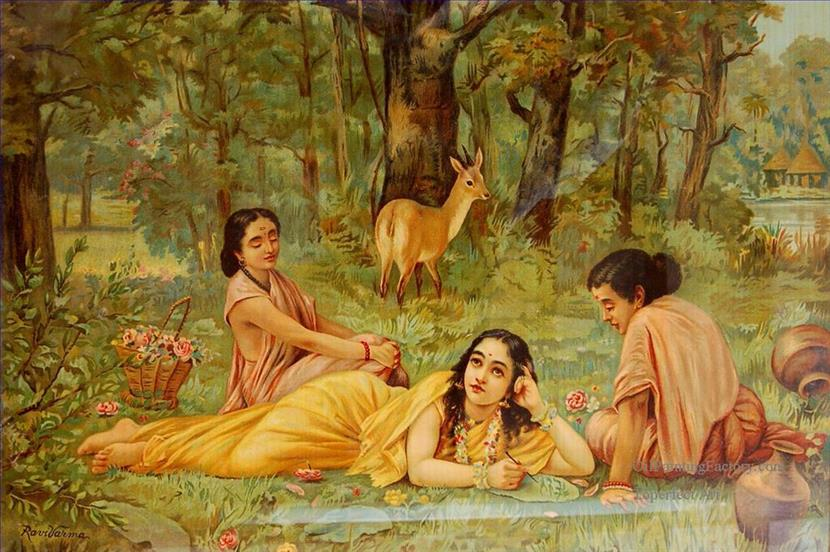
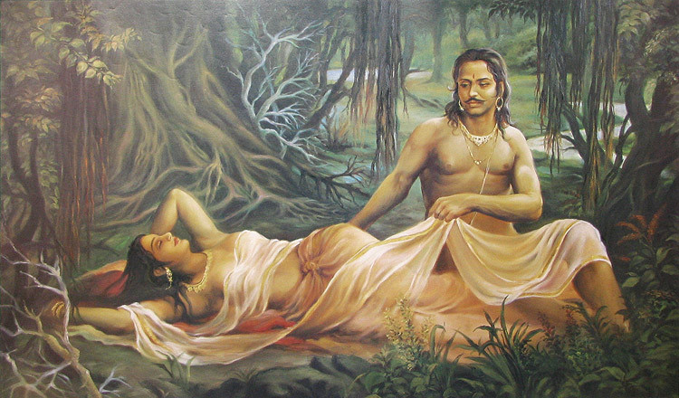

*{Editor’s Note: My mother is a late adopter of the Internet. In the pre-Internet era, she used to write the loveliest of long letters to her children. The letters stopped after I returned to India. In the past year, after she got comfortable with connectivity and gmail, the letters resumed as emails to her children. She’s harvesting from the oldest tendrils of her memory which is making the reading so so enjoyable. In this email (Sep 29, 2016), she’s relating a chance encounter with an art connoisseur rich lady during her Vijayawada walking years. The email has gone through a minor editing lens without changing my mom’s tone and voice. I’ve italicized the Telugu names – fewer references compared to the first story – [A marriage in the winter of 1962](http://www.ulaar.com/2016/10/18/a-marriage-in-the-winter-of-1962/). My mom’s sub-text/commentary is “italicized within quotes.” My comments are within “\[ \]”}*

Dear ones,

 Some time back I saw portraits of famous painters on TV. I thought about Ravi Varma’s paintings. By now you know that I take a long time to come to the actual point. I don’t do Précis writing.

 I started walking as a mere excercise, probably in 1992. Slowly it became enjoyable, a habit, and part of my daily routine. I needed no other entertainment or company. Walking along the Vizag beach from from our Kirlampudi house, 6 am to 7 am, was the best. It was continued in Vijayawada. In those days *Nannagaru* [dad] was not tensed up, he started worrying after Lakshmi’s accident. [Years ago, my dad’s sister (Lakshmi *attaya*) died on her way to a neighborhood store when a rash auto rickshaw driver ran her over in Hyderabad.]

 Walking was like eating *gulab jamuns* (an Indian dessert). I surveyed ***all*** the places. Once I walked to Kanakadurga temple [a distance of 5km that undertaken as a *mokku* (aka *mannat* in Hindi) – a sacred pledge]. Anandamayee and Siah garu moved to Abhilash in 1999 [retired couple who became our parents’ neighbor]. Both Anandamayee and I started walked together. She was not in favour of freelance walking [freelance as in, changing the route every day at will]. So Siddhartha college ground became our new walking venue. She was a good conversationist. They had lived in many places like us – Calcutta, Bombay, Jamshedpur and and even Srilanka. We knew a lot of common people – Seeta *pinni*, Rama of Calcutta Kasturi garu (Anand’s *attaya)* and KCP Reddy garu. Very strangely she knew my *mavayya* [uncle] when he was in Samalakota [a town in East Godavari district in Andhra Pradesh] many years ago. Moreover their Susarla [a Telugu surname] family was very big and she had enough material to share with me [my marathon friends will relate to *material*]. It went on smoothly for quite some time. One day we decided to wear *salwar kameez* [North Indian dress that rivals the sari in popularity] as our new walking dress code. A latent desire previously expressed meant I already had Prashanti’s [mom’s niece] dress. Anandamayee had to buy.

<figure aria-describedby="caption-attachment-3407" class="wp-caption alignleft" id="attachment_3407" style="width: 300px">

<figcaption class="wp-caption-text" id="caption-attachment-3407">Shakuntala in the forest – a famous Ravi Varma painting</figcaption></figure>

We stepped out in our new attire \[you’ve got to imagine how big a deal this is for two South Indian women in their 50’s wearing a new outfit for the first time in their lives *in public*\]. For the first 100 feet I concentrated on the road only. After crossing 2-3 buildings I could notice raised eye brows and slight smiles. We reached the ground. Some walked away without any expression \[Indians can rival Jeeves’ stiff upper lip\]. Lolla Sarma (my cousin) opened his mouth but immediately closed and walked away. We finished our walk, re-entered our building with a sigh of relief – first day was over. Next time when we visited Lolla Sarma’s house he told his wife “Mythily Akkayya \[i.e. the protagonist\] and her friend *vesham vesukuni* \[translates to costume or disguise\] walking *ki osthunaru*.” \[translates to coming.\]

 Somehow our relationship got spoiled and we stopped walking together. She started walked on the terrace and I walked in the colony [back to freelance walking]. I walked up and down the street parallel to ours. It was a *chukki walk* – just like a bull goes round and round a *chukki* (*ganuga*) to crush *til* into oil, so was I walking. Now the topic story starts.

 A woman of my age stepped out from a palatial house. She was in walking shoes and all. She said she will join me in walking. [Note the use of “said she will join” as opposed to “may I join”] She introduced herself as Siris Rajugaru’s daughter, Annapurna. Siris Raju was one of the richest men of Vijayawada – sucessful industrialist, owner of Siris pharma company, Raju of Bhimavaram (which is the most fertile land of West Godavari). So my new walking companion was seriously rich lady.

<figure aria-describedby="caption-attachment-3408" class="wp-caption alignright" id="attachment_3408" style="width: 300px">

<figcaption class="wp-caption-text" id="caption-attachment-3408">Shakuntala and Dushyanta in the forest – another Ravi Varma painting</figcaption></figure>

In the first round of our walking, she told everything about herself and her family, then she narrated stories of the other bungalow owners. She suddenly stopped in front of a new apartment and said “I will show you something.” It was a 3 bedroom apartment on the 5th floor. When she opened the front door, I can’t express the sight that beheld me. An apartment with very minimal furniture but otherwise it was an absolute feast to my eyes. Room after room was filled with paintings – some original Ravi Varmas paintings bought by her from different places and exhibitions, portraits of Rama, Krishna, Yashoda Krishna, Nala Damayanti, Shakuntala Dushyant bought in various auctions. There were some statues as well. I was so happy, so happy, I wanted to share with others — Anandamayee, Udaka \[my mother’s sister\], and Seenu \[my older brother\]. She said I can bring anybody – to give them a similar tour. She gave me her phone number. I was so much thrilled. I took 2-3 rounds. She showed me the difference between original and others (as if I understood\]. It was like drinking *rasagulla* juice \[can you tell my mother has a sweet tooth?\] It was an unplanned trip.. *Nanna* \[my father\] would be anxious as it was past my usual walking duration.. so I returned home. I thought to myself “will come again and do detailed survey” but *opportunity comes only once*.

 Next day she was waiting for me near her house. After one round of walking she invited to her house. She showed her well decorated and well kept house – turned out to be one more museum. However, I was not that much impressed… it was *ok* with all crystal and marble things, the kind one sees in airports and malls in USA. She had a separate studio where she paints and employs others to paint for her. After a cup of tea I left.

 Next day onwards she was not to be seen. When I asked her maid servant, she said she was sleeping. Later, when I happened to meet her she refused to recognize me. Anyway my childhood desire to see original Ravi Varma paintings was fulfilled.

 *Rasagulla* freelance walking came down to walking in the school ground then to *chakki* walk and finally to corridor and drawng room walking. Eventually I stopped it completely after I started and became regular with the Art of Living routine. Thank you for reading my thoughts.

 Yours loving Amma

*\[Closing note: the apparent amnesia displayed by the lady reminded me of a Vikramaditya/Raja Bhoja story. If your childhood reading involved a healthy diet of Amar Chitra Katha, you probably recall that story too?\]*
