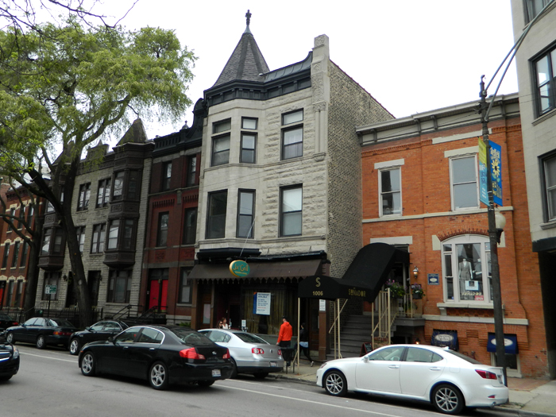

*I really don’t see anything romantic in proposing. It is very romantic to be in love. But there is nothing romantic about a definite proposal. Why, one may be accepted. One usually is, I believe. Then the excitement is all over. The very essence of romance is uncertainty. – Algernon: The importance of being earnest*

My friend Vikrant shared this on Facebook and it triggered a 20 year old memory.

First of all, I don’t entirely agree with Algernon. I’m in vehement agreement with his last sentence for sure. Nothing romantic about proposing? Now that’s a bit unfair.

American men have a fine tradition of proposing to (and often surprising the living daylights outta) their better halves. I happen to know two such proposals.

My ex-colleague and friend Laurie was ambushed at the finish line of her first marathon. Soon after her fiancé hugged and congratulated her, he quietly muttered “Are you ready?” to his buddy and, upon getting confirmation, went down on his knees and proposed. Laurie, already flush with post-race endorphins, would have one more memory attached to an already momentous day. And there was no need for a payment to Marathon Photos.

Our friends Jason and Julie had a long relationship before they tied the knot. Along the way, Jason did a 6-month teaching-English-in-China gig. Along the way, they did TWO around-the-world backpacking vacations. During their second soirée (chronicled beautifully here), against a picturesque backdrop in some exotic island, Jason proposed to Julie. There were no selfie sticks back then and no friend in tow but I’m sure that moment is forever etched in their memories.

My story is a bit different.

<figure aria-describedby="caption-attachment-3423" class="wp-caption alignleft" id="attachment_3423" style="width: 300px">

<figcaption class="wp-caption-text" id="caption-attachment-3423">How I recall Lincoln Park ‘hood</figcaption></figure>

Met this gorgeous girl on Jun 15 at a networking event in an art gallery in Chicago. I was deeply smitten. By the end of the evening I had made enough of an impression for her to acquiesce when I casually closed with “Hey, I enjoyed talking to you. Could you share your email address so we can catch up sometime?”

Six weeks later we were on our first date. Later that month (after date #10 or so), I was announcing to my Evanston friend “she is the ONE and I would propose to her one of these days”.

My friend predictably responded with “What’s the hurry? Take some time before you pop the question.”

Of course I ignored him. Which is not to say I proposed to her on date #11.

Dinner at Copper Chimney. Nicholas Payton concert at the Jazz Showcase. Dinner at Shrees in Downers Grove. Nusrat Fateh Ali Khan concert in Downtown. Dinner at the Indian Monsoon. Fareed Haq and Rudresh Mahattappa concerts at the Green Mill. Bike rides down Lake Shore Drive on the GS-700ES. Walk from Grant Park to Field Museum of Natural History to catch R. Carlos Nakai in action. Chicago city orchestra. Dave Brubeck with Bobby Militello. An all-night road trip to Wisconsin punctuated by a 4 am stop at Denny’s.

At some point the biweekly trysts turned into daily sojourns. We couldn’t spend enough time with each other apparently.

Having a 700cc Suzuki bike as the sole form of transportation added to my courtship cool quotient (I reckon). My Evanston friend’s Saturn and my Park Ridge friend’s Accord came in handy for some planned dates. Chicago’s public transit network bailed us out rest of the time.

But winter was approaching and I wanted 4 wheels.

Oct 11 dawned. I bought a Saturn SL2.

That was the evening I would propose to my girlfriend but even I didn’t know it until the precise moment.

It was a Friday evening and we were watching an 80’s era Hindi movie in my apartment.

I wish I remembered at which point in the movie it happened. All I recall was that there was some kind of whitespace (it was a VHS tape so couldn’t have been a commercial). A rare flash of deep certitude overcame me and I knew it was time.

I popped the question.

The beautiful face with perfect eyes and exquisite nose became suffused with incredulity and spoke.

“Oh my God! Are you sure?”

“Yes”

“Can you give me some time to think about it?”

“Of course. Take your time.”

…

…

(A few minutes later)

“Yes!”

Bingo Little had found his Rosie M Banks.

P.S. For the next few days, she’d keep asking me “Are you sure you meant it? Because if you aren’t.. or have any second thoughts, I won’t hold it against you.”

To which I’d keep replying “I couldn’t be surer.”

P.S (2). So there you have it Vikrant.