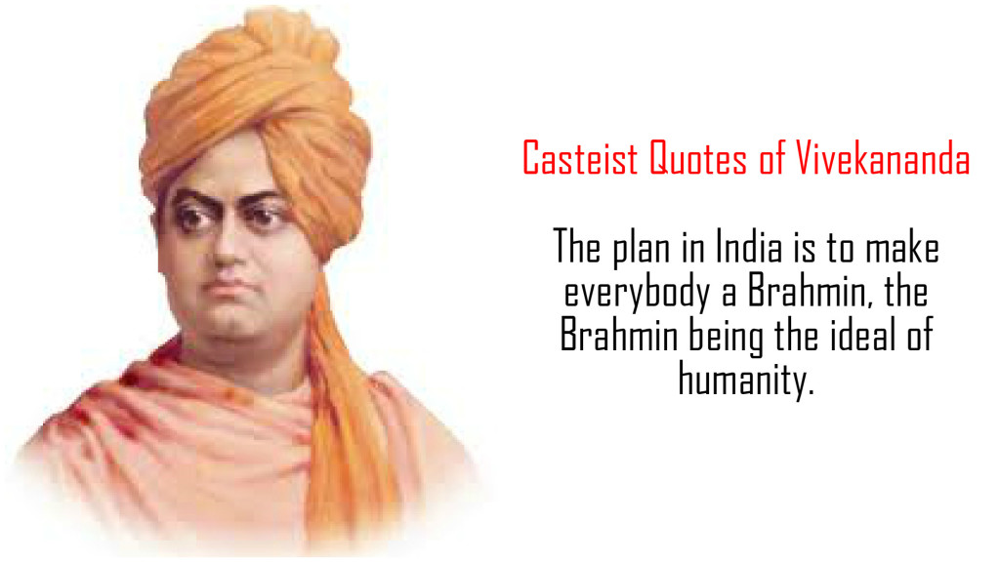

*\[Editor’s Note: I don’t recall from which of his books I found this extract. It’s been sitting in my Drafts folder for 4.5 years and is eminently worth a read.\]*

A man from the highest caste and a man from the lowest may become a monk in India and the two castes become equal. The caste system is opposed to the religion of Vedanta.

In spite of all the ravings of the priests, caste is simply a crystallized social institution, which after doing its service is now filling the atmosphere of India with its stench, and it can only be removed by giving back to people their lost social individuality. Caste is simply the outgrowth of the political institutions of India; it is a hereditary trade guild. Trade competition with Europe has broken caste more than any teaching.

There is no country in the world without caste. Caste is based throughout on that principle. The plan in India is to make everybody Brahmana, the Brahmana being the ideal of humanity. If you read the history of India you will find that attempts have always been made to raise the lower classes. Many are the classes that have been raised. Many more will follow till the whole will become Brahmana. That is the plan.

Take a man in his different pursuits, for example : when he is engaged in serving another for pay, he is in Shudra-hood; when he is busy transacting some some piece of business for profit, on his account, he is a Vaishya; when he fights to right wrongs then the qualities of a Kshatriya come out in him; and when he meditates on God, or passes his time in conversation about Him, then he is a Brahmana. Naturally, it is quite possible for one to be changed from one caste into another. Otherwise, how did Viswamitra become a Brahmana and Parashurama a Kshatriya?

If you teach Vedanta to the fisherman, he will say, “I am as good a man as you, I am a fisherman, you are a philosopher, but I have the same God in me, as you have in you.” And that is what we want, no privilege for anyone, equal chances for all; let everyone be taught that the Divine is within, and everyone will work out his own salvation. The days of exclusive privileges and exclusive claims are gone, gone for ever from the soil of India.

The Brahmana-hood is the ideal of humanity in India as wonderfully put forward by Shankaracharya at the beginning of his commentary on the Gita, where he speaks about the reason for Krishna’s coming as a preacher for the preservation of Brahmana- hood, of Brahmana-ness. That was the great end. This Brahmana, the man of God, he who has known Brahman, the ideal man, the perfect man, must remain, he must not go. And with all the defects of the caste now, we know that we must all be ready to give to the Brahmanas this credit, that from them have come more men with real Brahmana-ness in them than from all the other castes. We must be bold enough, must be brave enough to speak their defects, but at the same time we must give credit that is due to them.

***The duty of every aristocracy is to dig its own grave, and the sooner it does so, the better. The more he delays, the more it will fester and the worse death it will die. It is the duty of the Brahmana, therefore, to work for the salvation of the rest of mankind, in India. If he does that and so long as he does that, he is a Brahmana.***

It seems that most of the Brahmanas are only nursing a false pride of birth; and any schemer, native or foreign, who can pander to this vanity and inherent laziness, by fulsome sophistry, appears to satisfy more. Beware Brahmanas, this is the sign of death! Arise and show your manhood, your Brahmana-hood, by raising the non-Brahmanas around you – not in the spirit of a master – not with the rotten canker of egoism crawling with superstitions and charlatanry of East and West – but in the spirit of a servant. As Manu says, all these privileges and honors are given to the Brahmana because, “with him is the treasury of virtue”. He must open that treasury and distribute to the world.

It is true that he was the earliest preacher to the Indian races, he was the first to renounce everything in order to attain to the higher realization of life, before others could reach to the idea. It was not his fault that he marched ahead of the other castes. Why did not the other castes so understand and do as they did? Why did they sit down and be lazy, and let the Brahmanas win the race?

To the non-Brahmana castes I say, wait, be not in a hurry. Do not seize every opportunity of fighting the Brahmana, because as I have shown; you are suffering from your own fault. Who told you to neglect spirituality and Sanskrit learning? What have you been doing all this time? Why have you been indifferent? Why do you now fret and fume because somebody else had more brains, more energy, more pluck and go than you? Instead of wasting your energies in vain discussions and quarrels in the newspapers, instead of fighting and quarreling in your own homes – which is sinful – use all your energies in acquiring the culture which the Brahmana has, and the thing is done. Why do you not become Sanskrit scholars? Why do you not spend millions to bring Sanskrit education to all the castes of India? That is the question. The moment you do these things, you are equal to the Brahmana! That is the secret power in India.

The only safety, I tell you men who belong to the lower castes, the only way to raise your condition is to study Sanskrit, and this fighting and writing and frothing against the higher castes is in vain, it does no good, and it creates fight and quarrel, and this race, unfortunately already divided, is going to be divided more and more. The only way to bring about the leveling of castes is to appropriate the culture, the education which is the strength of the higher castes.