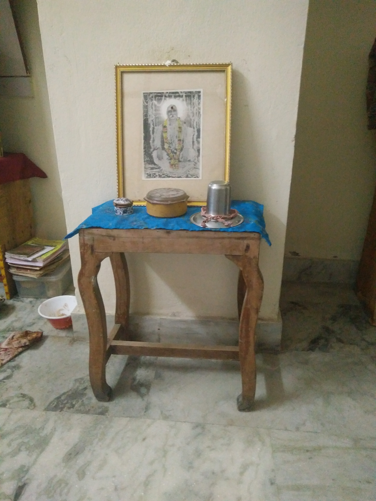

Editor’s Note: There were middle class values in the 60’s/70’s/80’s and there are middle class values now. Big big difference. The old adage used to be “if it’s not broken, why fix it”. And if something does break, well.. repair (don’t replace) it. My parents have taken these adages to heart.. for 50 something years. I present to you an important subset of the Real Indistructibles from my parents’ home. If you are wondering about the blog title, it’s sorta related to [this one](http://www.ulaar.com/2016/09/03/the-indistructibles/).\]

<figure aria-describedby="caption-attachment-3439" class="wp-caption alignleft" id="attachment_3439" style="width: 300px">

<figcaption class="wp-caption-text" id="caption-attachment-3439">Center table (circa 1971-72). It earned a fresh lamination top sometime in the late 90’s</figcaption></figure>

*  
*

<figure aria-describedby="caption-attachment-3433" class="wp-caption alignleft" id="attachment_3433" style="width: 300px">

<figcaption class="wp-caption-text" id="caption-attachment-3433">1968 vintage. Black spot at 4’o clock? A candle left unextinguished when the family went for a post-prandial walk.</figcaption></figure>

<figure aria-describedby="caption-attachment-3434" class="wp-caption alignleft" id="attachment_3434" style="width: 300px">

<figcaption class="wp-caption-text" id="caption-attachment-3434">1964 vintage. Upholstery probably changed once and multiple seat cover changes but the timber stands proud. I recall one coat of varnishing that we kids fought over.</figcaption></figure>

<figure aria-describedby="caption-attachment-3435" class="wp-caption alignleft" id="attachment_3435" style="width: 300px">

<figcaption class="wp-caption-text" id="caption-attachment-3435">Usha sewing machine purchased for Rs. 300 in 1971. Mom wanted the foot operated model (which would release later) but that didn’t stop her from churning out masterpieces over the ages. Delightful designs for infants &amp; toddlers her specialty. Still going strong.</figcaption></figure>

<figure aria-describedby="caption-attachment-3436" class="wp-caption alignleft" id="attachment_3436" style="width: 225px">

<figcaption class="wp-caption-text" id="caption-attachment-3436">Purchased in 1964. This stool’s twin (click omission) required some props.</figcaption></figure>

<figure aria-describedby="caption-attachment-3438" class="wp-caption alignleft" id="attachment_3438" style="width: 225px">

<figcaption class="wp-caption-text" id="caption-attachment-3438">Godrej almirah (1975). Did anyone from that era NOT own this?</figcaption></figure>
