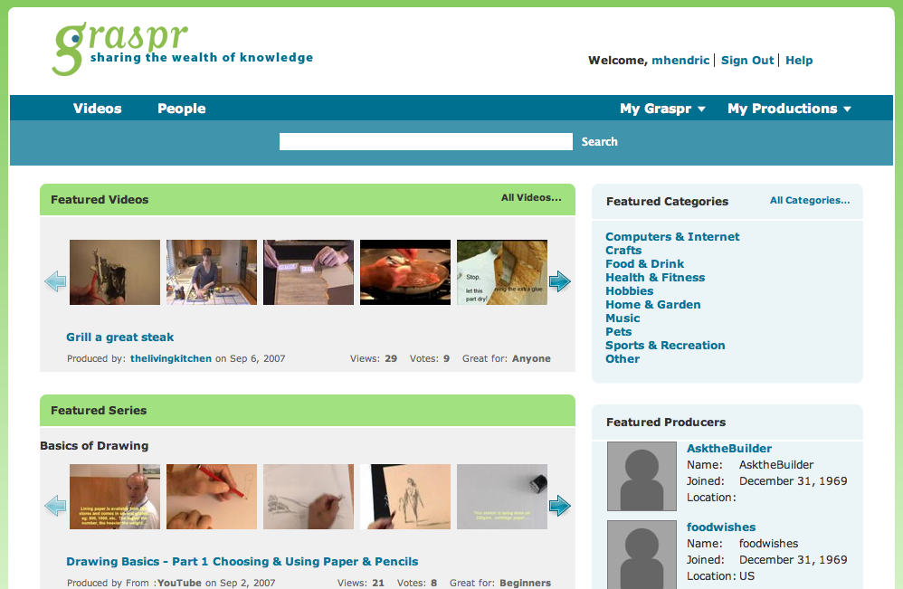

What is it about startup life that makes it seem way longer than it was? My recent mGaadi journey lasted 3 yrs 8 months but it felt like 5 years. My previous journey (Graspr) lasted an intense 13 months but felt like 2 years.

In my first stint as entrepreneur (2007-08), I had a healthy respect for VC’s. When it came to pedigreed angels, the respect was tinged with awe. Against this backdrop, perhaps it’s not surprising that I can recall a few positive investor interactions. I’ve cherry-picked three insights from meetings with angels/entrepreneurs during the Graspr fundraising process.

1. **Mike Maples**: We first met him for a pre-pitch exploratory meeting at a diner in Palo Alto followed by a formal meeting at his office a few weeks later. He said many things but the story of startup X (that he presumably invested in) left an impression. X was a premium services play (at a time when that breed was quite rare). Maples described the disciplined stewardship of X by its founder like this *“First we spread the word among our network and got our initial sales… Once we exhausted that channel, we started spending on Google AdWords. Once we mastered that channel, we started looking for partnerships.”*
2. **Aydin Senkut****:** An early Google employee who started Felicis Ventures, what was then a boutique seed fund and would eventually become a wildly successful fund. The story he shared was that of 5min. We were quite familiar with 5min as they were a competitor with a headstart. They were also in the news because their seed funding cap table was leaked (capricious angels who had gobbled a lot more equity than they should have.. if my memory serves me right and I’m NOT going to Google!) What Senkut found beautiful about 5min was their “5 minute constraint” – all their how-to videos HAD to be no more than 5 minutes long. Some 6 months later my pal and colleague from Yahoo (David Beach) would espouse a similar love as he talked about his creation – 12seconds.tv (video shares under 12 seconds).
3. **Max Levchin**: I’ll skip the intro since who doesn’t know Max? We were hoping to get his raw unfiltered feedback (seasoned serial entrepreneur to rookie entrepreneurs). And we sure hit pay dirt. My partner (T) walked him through our here-now to 18-months-later story. He had very useful advice on a range of issues but he delivered the punchline at the end: *“We are a 60-person startup with 10’s of millions of monthly active users and are ‘nearly legit’ but I still don’t know what we will be doing **6 months** from now and you are telling me your **18-month plan**?”* He continued, on a sober note, *“We’ve got really talented engineers, we’ve cracked images but we are not touching video. Video is hard.”*

Perhaps I cherry-picked these stories because it’s the short version of why Graspr failed? Our product was not anchored on a constraint. We didn’t have a monetization model. We were doing *video*. *And* we didn’t have a video czar on our team.

But yeah.. it’s the *short* version. 