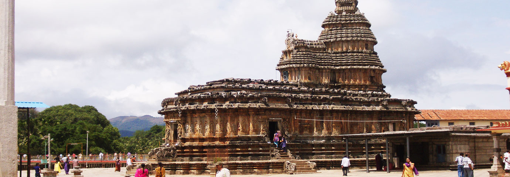

*\[Editor’s Note: My mother is a late adopter of the Internet. In the pre-Internet era, she used to write the loveliest of letters to her children. The letters stopped after I returned to India. In the past year, after she got comfortable with connectivity and gmail, the letters resumed as emails to her children. This is email #3, the earlier ones were [A marriage in the winter of 1962](http://www.ulaar.com/2016/10/18/a-marriage-in-the-winter-of-1962/) and [Ravi Varma in a Vijayawada home](http://www.ulaar.com/2017/02/20/ravi-varma-vijayawada-home/).\]*

Foreword

A good friend and ex-colleague is a certified atheist with a problem. What is his problem, pray? When he travels to places involving religious excursions, he’s utterly fascinated by the devoutness of pilgrims. I suppose he’s not unique in his fascination (or curiosity) about what goes on in the mind and heart of a true believer on a pilgrimage. Since none of us are blessed with the powers of Asimov’s *mentalists* (circa Foundation Trilogy), all we have is a pilgrim’s body language and the look of piety and peace on her face. My mother’s letter below, where she writes in some detail about her pilgrimage to Sringeri and beyond, is the closest I’ve come to understanding that which I have not experienced. My comments/translations are within “\[ \]” and her comments are within traditional “( )”. All Telugu/Sanskrit words are italicized.

—————————————————————————————————————

Dear ones,

This is about our Sringeri yatra. It was either in 2003 or 2006 \[the year was confirmed to be 2003 because my parents only got a cell phone in 2004\]. We originally planned to go to Srisailam and Mantralayam and return to Vijayawada in the month of September. On our way back we wanted to visit my cousin (Sarma *bava*) at Vinukonda.

<figure aria-describedby="caption-attachment-3524" class="wp-caption alignleft" id="attachment_3524" style="width: 300px">

<figcaption class="wp-caption-text" id="caption-attachment-3524">Temple in Sringeri</figcaption></figure>

Srisailam is 5-6 hours bus journey from Vijayawada. Also known as *dakshina Kashi* (Kashi of the South), Srisailam is famous for the ancient temple of Siva (Bramarambha, Mallickarjuna) which is situated on a hill amidst Nallamalai forest. We started at 8 am and reached around 2 pm. We got decent accommodation. People are not permitted to travel in the night hours. All the vehicles are stopped at the foot of the hills for several reasons – the *ghat* road makes it unsafe, the dense Nallamalai forest is the abode of naxalites and wild animals.

We had a brief evening darshan the day we landed. Next morning we did *abhishekam* \[a devotional activity/special worship usually performed by a priest\] to the Lord and *kumkum pooja* \[special worship\] to the goddess. In the evening we went around to see important places. Near *devasthanam* bus stand we visited *Sakshi Ganapati* who (as the legend goes) will take note of the devotees and report to his parents. We climbed up the tall *sikharam* (tower). The faithful believe that once you are there you will not have *punarjanma* \[no more rebirths\]. We climbed down the steep steps to see the *patalaganga*, the waterfall, and finally the Srisailam dam – the main water source to Andhra Pradesh and Telangana.

Adi Sankaracharya did penance on this hill. They say even now saints perform *tapas* \[penance\] in the area. We of course didn’t come across any such saints.

Next morning we started for Mantralaya, home to the famous *madhwa* saint \[saints from the sect started by Swami Madhwacharya who started one of three dominant Hindu belief systems – *Visishta Advaita*\] Sri Raghavendra Swamy in the 15th-16th century. His *samadhi* \[in Yoga, state of intense concentration achieved through meditation at which union with the divine is reached before/at death; tomb of Hindu saints\] is on the bank of river Tungabhadra bordering Andhra and Karnataka. Annual birthday celebrations for the Swamy were underway and we stayed in Mantralaya that night. It is believed that one who stays there overnight will be blessed with good and positive vibrations.

It proved to be very true in our case. The long cherished desire to visit Sringeri was fulfilled by HIS grace – we were almost pushed to our dream place. It happened this way. We were waiting at the bus stand to return to Vijayawada as per our original plan. *Nanna* \[my dad\] was walking up and down and he learned that there was a direct bus to Sringeri at the same time. We were **so** happy. We checked for 2 M’s (money and medicines). They were sufficient so we called Srinivas \[my older brother\] and informed him about our changed programme. We got into the bus to Sringeri. It was a 16 hour journey but we never thought about the strain.

As usual I occupied the window seat. The landscape was not interesting – dry land with no greenery. I remember a few places that we passed through – Bellary, Chikmagaluru, and Shimoga. I was still wondering about our present trip – why this much urge and desire to visit this place?

*Nanna* wanted to go there since 1993 when Srinivas was in Bangalore. Since his health didn’t permit, we just went to Nandi hills and Mysore. His bent of mind is different. Frankly speaking I didn’t know anything about Sringeri till 1998. Some of my Chinmaya Mission friends had been there for 10 days *sadhana* camp \[penance/devotional camp\]. When I heard their experiences I was very much impressed and developed a strong desire.

Let me tell you some things about Sringeri which I know. Adi Sankaracharya established 4 spiritual *peetams* \[spiritual seats\] for the spiritual welfare of mankind. Four *peetams* in four directions: Badrinath in the north, Puri in the east, Dwaraka in the west, and Sringeri in the south. Adi Shankara chose suitable gurus to head each *peetam*. The guru *parampara* \[tradition\] is continuing without any break till now.

Sri Bharati Tirtha *maha swamiji* is the present guru and head of the *peetam* which covers four south Indian states.

We reached Sringeri early in the morning. After much difficulty we could get accommodation. After taking bath etc, we went to the temple (Sharada devi is the goddess). After that we went to see the Swamiji. His *ashram* is on the other side of Tungabhadra river and we crossed by a small bridge. The place was simply beautiful; we passed through an arbor of *paan* \[betel leaf\] creepers and finally we met guruji. Nanna introduced himself as Narasimha Yogi garu’s disciple \[Narasimha Yogi was my father’s spiritual guru for over 30 years\] and also mentioned his maternal uncle’s name. Since it was *ekadasi*, Swamiji was observing *mounavratam* \[maintaining silence\]. \[*Ekadasi* is the 11th day after the full moon and is widely believed by Hindus to be cosmically favorable for spiritual rejuvenation. Fasting on that day is supposed to help spiritual seekers. Advanced souls like the *swamiji* apparently raise the penance a few notches higher.\]

The temple area was reverberating with *lalita sahsranamam* \[considered as one of the more powerful hymns to the feminine principle\]. *Homams* \[rituals involving offering to fire\] were being performed by Vedic pundits on one side and *suwasini poojas* \[special prayers\] were being done on the other side. We both were feeling very good.

We came out of the temple to have lunch. Surprisingly all the hotels were closed – as it was *ekadasi* most of them were keeping fast. One couple in a house agreed to cook for us. They served simple delicious food on a banana leaf. After lunch we proceeded towards Udupi. It is an unique experience to travel in the Western Ghats. We had *darshan* \[seeing God and.. God seeing you\] of cute Udipi Krishna through a window. I very much wanted to taste udipi food… unfortunately it was an odd time. We saw the big Geeta Bhavan where all the 700 *slokas* \[verses\] of Bhagawat Geeta were engraved with pictures. Our next halt was Kollur Mookambika. We passed through Manipal (little did we know that our grandson would be studying in that prestigious institute a decade later).

We stayed in Kollur (the town borders Kerala) that night. The water was cold! Sooo cold! It was ok for nanna though. I couldn’t get hot water – no amount of begging or bribing worked. Finally I closed my eyes and jumped with a cry “*Jai mookambica*!” I took bath. Till today I pour the first mug of water with *jai mookambica*’s name.

Dharmastala is the Siva temple. It was very peaceful and quiet. We were travelling towards Hornad (our last place in the list). It was the best! The landscape was *so* beautiful. Each one of you should visit. If you are not interested in temples you can devote less time to temples and more time to sightseeing. Nature also is God.

We passed through coffee plantations and *paan* \[betel nut\] creepers. I could see bunch of coffee seeds hanging. I enjoyed to the brim. We had comfortable and happy time in the temples. We could get decent accommodation for just 100 rupees per day with attached bath room, two beds and a fan. Actually they serve free food to all the pilgrims; there were big dining halls with marble floors and all well maintained. We didn’t take food because the timings were not suitable to us. We never used to have breakfast before temple *darshan* so by the time we were done we were too hungry to wait for temple food. Wherever we halted for the night we tied a rope to 2 windows and dried our clothes. There was no pushing in the temples. On the whole Karnataka people were soft, friendly and polite.

Let me conclude by relating the best and last experience – Annapoorna temple of Hornadu. The temple housed a beautiful four feet tall idol and we spent 6 hours from 4 pm to 10 pm. I wanted to eat dinner in the temple at any cost. Nanna waited outside. The food was simple yet it was such a thrilling experience I almost cried. I felt as if I was directly being fed by goddess *Annapoorna*. The concluding item for the day was lighting the lamps followed by *arati* \[Hindu worship in which light from wicks soaked in ghee or camphor is offered to deities\]. The entire premises were full of lights. We were also allowed to light lamps. The whole town was present – shopkeepers, drivers and others. A lifetime memory.

We got into the Bangalore bus and were back to Vijayawada. Our Sringeri trip was memorable. That’s it.

Your loving amma,
