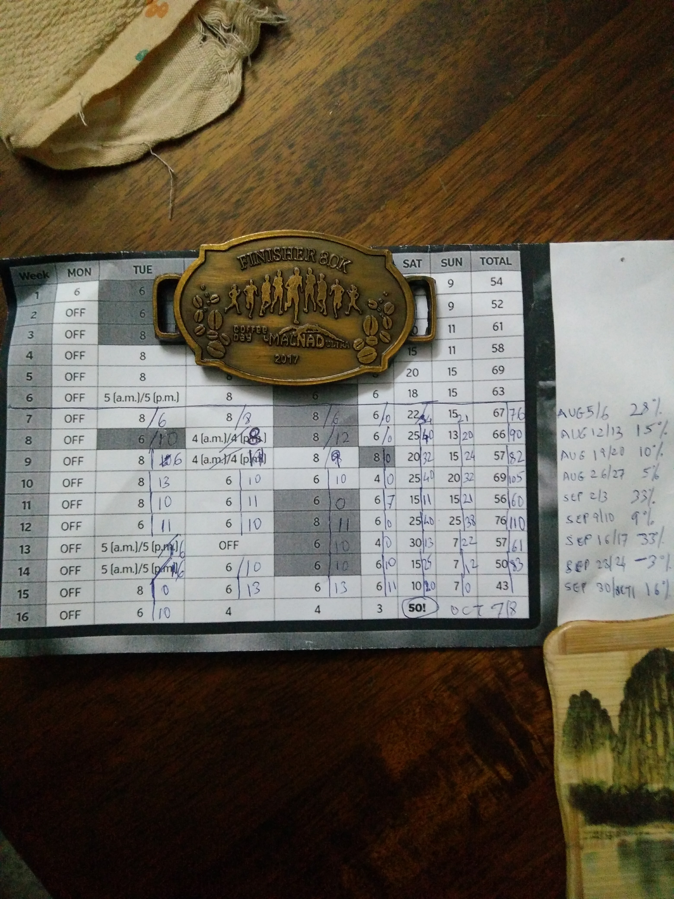
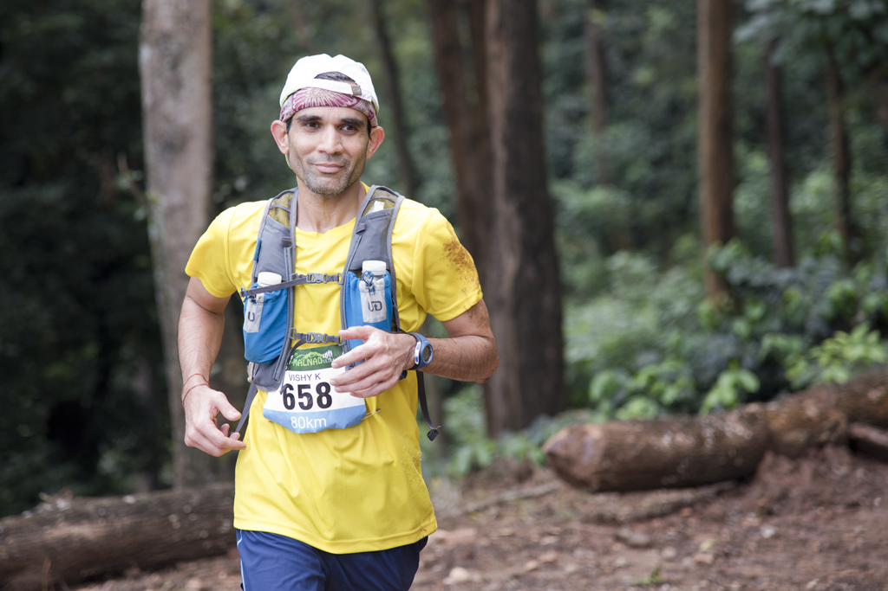

The great runner philosopher George Sheehan talks about a certain *staleness* that can afflict the seasoned runner. In my 9 years of running, I’m relieved to admit that I’ve been spared. From peaks of 12 FM+ runs a year to lows of 2 races a year, the weekly enjoyment hasn’t changed much – thank God for that! However the excitement of a new *racing* experience has been missing for a while.

My heart seems to gravitate more towards trail races than city races so I was intrigued when I heard about the inaugural Malnad Ultra last year. Intrigue however didn’t convert to registration because

- 24-hour stadium run (Aug 2016)
- A cardiovascular assessment that a net elevation gain of 2km was beyond my comfort zone

Several friends ran the inaugural race (3 categories: 50k, 80k, and 110k) and returned with glowing reports. However, it was a tweet from a fellow vegan runner (Vijay Pandey) that provided the clinching endorsement. It went something like this *What an amazing trail! Can’t wait for registrations to open for Malnad Ultra 2017!*

\*\*\*\*\*\*\*\*\*\*\*\*\*\*

**Preparation**

<figure aria-describedby="caption-attachment-3558" class="wp-caption alignleft" id="attachment_3558" style="width: 225px">

<figcaption class="wp-caption-text" id="caption-attachment-3558">Koehner plan redefined. Plan #s in miles, actuals in km, delta on right</figcaption></figure>

About 10 weeks before race day (Oct 8), I decided that I wasn’t just going to ‘wing’ it. Considering the race venue, the beautiful trail, scary elevation, and only two race sign ups this year, I wanted to put my best feet/lungs/heart forward.

A few Google searches later, I had settled on [Hal Koehner’s 50 mile training plan.](http://running.competitor.com/2016/01/training/hal-koerners-50-mile-training-plan_142860) Of course I was going to tweak it to suit my *gettable* reality.

- 16 week plan and 10 weeks to race day so I hit the ground running with week #7 🙂
- A 6-day running regimen was a non-starter so Friday run was going to be nixed. A 5-day plan was \*way less scary\* than a 6-day plan.
- As you can see, the only 3 running Fridays were weeks where I had missed a run or was making up mileage.
- If you’ve looked up the [original plan PDF](http://running.competitor.com/files/2016/01/50-Mile-Training-Plan.pdf), the precise guidance of fartleks (blue), tempos (green), and hill repeats (yellow) was ignored. But thanks to my regular running partners (diligent as they are), I ended up doing tempo or hill repeat on one of my weekday runs.

Considering the above tweaks, I was quite pleased with two 100k+ weeks, one 90k+ week, two 70k+ weekends, and kept the \[plan – actual\] delta ‘within limits’. The longest run (a 48k) had to be aborted but it was not because of lack of effort. Running in a gentle drizzle for 3 hours is one thing (been there, done that) but running in soaking rain (without slickers) is quite another.

**Kamal &amp; the Colonel’s son**

The dark art of choosing a goal pace continues to elude me. Ha ha. I just fooled you into thinking that I approach my races with a data-driven mindset, right?

Manoj, last year’s 110k co-winner and friend, wrote an informative post with the express purpose of helping folks like me set a goal pace. His model spit out 11 hrs 30 min based on my ‘comfortable’ FM time.

Enter BKUMP friend Sampath. 1st runner-up in the 50k inaugural Malnad edition, multiple FM times under 3:30, but graduating to the 80k posed a mental block to him. Having run 75k a few times and with a 24-hour stadium run under my belt, he asked if he could hitch his wagon to mine. I agreed. My first outing at Malnad meant I didn’t have a rigid time goal, and hey, it really helps when you have company in ultras. A bonus when it’s one of your running buddies. As it would turn out, Navin (our group’s ultra conquistador) made it a trio for the first 67k. But I’m getting ahead of myself.

*East is east and west is west and never the Twain shall meet.*

*Till earth and sky stand presently at God’s great judgement seat.*

If you’ve been schooled in the Indian ICSE board, you’d recognize the opening lines from Kipling’s [The Ballad of East and West](http://www.bartleby.com/246/1129.html). If you’ve not clicked on the aforementioned link, here’s the synopsis: Kamal (a bandit gang leader) steals the Colonel’s horse and the Colonel’s son sets off hotly in pursuit with nary a thought to potentially fatal consequences. Matched in bravery, it’s really a race between two horses.

The poetic license I’ve taken is in likening the Colonel’s son’s horse to Sampath and Kamal’s horse (the one he stole) to me. Here’s how Kipling brings out the differences between the two horses:

*The dun he fled like a stag of ten, but the mare like a barren doe.*

*The dun he leaned against the bit and slugged his head above,*

*But the red mare played with the snaffle-bars, as a maiden plays with a glove.*

**Sandal worries**

I scanned numerous pictures of last year’s trail, quizzed folks about their footwear choices. Would the 4mm Xeroshoes Z-Trek provide enough protection? Or would I need the 10mm Z-Trail? The former sticks to me like a glove while the latter has a tendency to make my foot slide off the front. I finally went with the Z-Trek but stowed away the Z-Trail (and a pair of socks) at the 50km baggage counter. A sound decision it would turn out to be.

**The blood donation conundrum**

Would you (and I’m addressing my runner friends here) sign up for a race if the anti-doping clause read like this *“We reserve the right to randomly conduct blood tests* *<u>during</u>* *the race.. and potentially do it* *<u>multiple times</u>**.”*

Stops you in your tracks, no? What if the clause goes on to say *“You won’t be required to stop at any medical tent along the way and waste precious minutes. We use smart miniature heat-seeking flying bots and you won’t even feel the slightest prick during extraction. Just don’t panic when you see traces of blood at the end of the test.”*

Leeches. Bleddy leeches. We were in leech country and an extended monsoon meant it was prime conditions for leechiferous gluttony.

Did this knowledge change my preparatory calculus? Hell yeah. I agonized over how best to reduce the odds of being the *chosen one*.

Was I prepared to trade my open sandals for shoes and leech-proof socks? Nope.

Perhaps it was a scene from Nightmare on Elm Street fueled by a febrile imagination that inserted the notion that wearing tights underneath my shorts would be a credible shield against airborne leeches at an altitude of 1-2 feet.

In hindsight, it was the most ludicrous insurance I ever purchased. My inner minimalist still cringes at the stupidity but at least it didn’t cramp my running. And it wasn’t a warm day.

How much blood did I end up donating eventually? The quantity remains unknown but I had 5 leech bites on my right foot and 7 on my left. Of the 12, I only witnessed two of the parasites (somewhere close to 30k). My rite of passage to the Malnad Ultra was complete.

**The race**

Between the shuttle bus reaching the starting point a bit late and unexpected delays at the baggage drop counter, there was a bit of a mad scramble to wolf down some yummy hot breakfast and start off on gun time.

The first 5-6k was a continuous downhill road. For my kind of lungs (which take forever to warm up), it was wonderful to have gravity do its thing.

Hitting the trail raised the level of awesomeness by several notches. In describing the race later to my friends, I kept saying *“it was magical!”* There really is no way to elaborate in words but I’ll still try.

In the midst of a vast network of coffee plantations, peaks and valleys, heterogeneous terrain (tough but not brutal, lakes, streams, pleasant temperatures, I was getting a chance to soak in the ambiance and race/push/test myself. I had trained and now I was going to pay homage to the resident ultra deity by *doing my best,* while constantly evaluating whether or not I was overextending myself. What was there not to love? And yes, blessed I was.

<figure aria-describedby="caption-attachment-3577" class="wp-caption alignleft" id="attachment_3577" style="width: 300px">

<figcaption class="wp-caption-text" id="caption-attachment-3577">Somewhere in the 1st 50k, feeling peachy</figcaption></figure>

**Yin and the Yank**  
The younger fleet-footed Sampath would set the pace on the downhills while I would control pace on the uphills and flat. So we took turns applying the *yank*. We both thoroughly enjoyed the downhills, albeit in different ways. Him with an effortlessly elegant technique and me like a spooked rhinoceros bearing noisily down the slopes.

As we approached the 40k mark, it seemed like our average pace was a little too fast but we needn’t have worried. The remaining 10k included the lovely gravity-aided stretch we had enjoyed 6-odd hours ago.

**Intermission at 50k**

We walked most of that final uphill 6k and I surprised myself by running the final kilometer. It had taken us 7 hours for the first 50k.

*The dun he went like a wounded bull, but the doe like a new roused fawn.*

50k was a special kind of pit stop for me: footwear change, tee-shirt change, lunch and some stretching. Brijesh’s (race volunteer and friend) suggested sequence was physio-guided stretch -&gt; lunch -&gt; change -&gt; back on trail.

The physio took one look at my trail-muddied and leech-feasted feet and sent me off to cleanup. With the bathrooms nowhere nearby, I grabbed lunch instead.

Whether it was last year’s nostalgia or just a brain fade, I don’t know but Sampath approached the lunch with a strange mix of languor and gormandizing. I think he went for ‘thirds’ while I executed the footwear + tee changes and waited. Just when I thought we were ready to resume, he remembered that blisters were bothering him so there went another 10 min with the physio.

Meanwhile the conquistador had set off exhorting us to catch up. We finally set off, having spent nearly 35 minutes at the pit stop.

The initial elevation profile of the final 30k was the opposite of the first 50k – first few km were uphill. Sampath’s overloaded stomach demanded digestive attention which inevitably led to side effects such as *could we walk f*or *a bit?*

The next 7k could be described as the *yank phase* where I had to resort to ageless tactics like *Let’s run till that yonder tree.* And gradually extend the goal post, sometimes explicitly other times implicitly.

Eventually we caught sight of a colorful group of runners which provided a great filip to our progress. When we caught up near 57k, that group would turn out to include the conquistador, Monica and Ashok.

**Monica and Ashok**

Ashok, a superb UK-based ultra runner who had completed a multi-day 320+ miler just a few weeks ago, was pacing Monica, co-founder of the popular sports nutrition brand Unived. Sampath and I had been inadvertently playing a cat-and-mouse with them in the first 50k and built a ~10min lead. Clearly they had changed their tires faster than us.

For the next 10k, we ran with Monica and Ashok and it was a sound sound decision. S and I were struggling for rhythm and it was a relief to hitch our wagon to a purposeful pacing strategy being followed by the duo.

Soon after the 67k pit stop, a fork in the road sent the conquistador (and his fellow 110k crazies) to their final frontier while we just had the 13k home stretch. Meanwhile Monica and Ashok had motored along and would finish 8 minutes ahead of us.

**Homeward bound**

At 70k, a quick calculation informed us that a sub-12 hour finish was eminently doable. We passed an 80k runner feeling pretty strong. I would learn latter that the runner’s net time was better than ours as he had started 10 minutes after us 🙂

Barring the navigation of a few very muddy stretches and a gentle drizzle in the final 30min (we pulled on slickers to play it safe), it was an uneventful final stretch. We breasted the tape in 11 hrs 49 minutes, holding hands victoriously.

My thoughts were eerily similar to my first Bangalore Ultra 75k: *Ah! Feeling so strong. Definitely returning next year to gun for a faster finish!*

A few weeks ago, the race director shared this update: *We’re pleased to announce the 3rd edition of The Malnad Ultra on Oct 13 &amp; 14, 2018. Registrations will open by mid-December. Plan your 2018 Run Calendar and training for #malnadultra2018*

Can’t wait.

