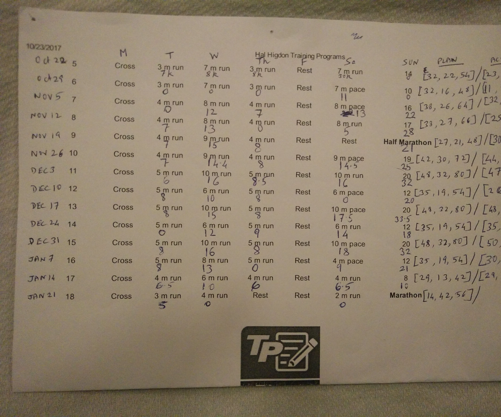
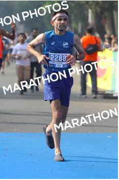

It’s written that while progress could be happening linearly, results come only in cycles.

The Bhagawat Geeta says one should act without thinking of results. Of course I buy this aphorism but internalizing it is only the first step. In the weeks leading to the race (as more and more things fell into place), my mind kept flashing *boring race report.. boring race report..*

What is a boring race report? Err.. something like [this](http://www.ulaar.com/2014/01/24/boring-race-report-jan-2014/).

I kept chiding myself but the infernal thought just wouldn’t go away.

There was no escaping thoughts of quadrants either. The world’s best finish their races in the 8th quadrant. Breaking into the 7th quadrant has captured the public imagination in a manner reminiscent of Bannister’s &amp; Landy’s pursuit of the sub-4 minute mile.

India’s better amateur marathoners are clustered in the 12th quadrant training feverishly to break into the exalted 11th (sub-3hour) quadrant.

What about late bloomers who took up marathon running in their 40’s? The 15th (sub-4hour) quadrant is their exalted target. I got there 4 years ago, following which I wrote this very [boring race report](http://www.ulaar.com/2014/01/24/boring-race-report-jan-2014/).

My target was to break into quadrant #14.

2013-14 was my season of results. It was a season where my pre-race form was running a *[marathon-every-month](http://www.ulaar.com/2016/08/13/breaking-a-streak-liberating/)* and completing most under 4:15. I ran the Kaveri Trail Marathon in 4:09 (bettering my PB by a whopping 17 minutes. Two months later, I ran 75k Bangalore Ultra in 8:38, a good 70min faster than the previous year. Two months later I was rubbing shoulders with the amateur elite at the starting line of SCMM and psyching myself with *“I’m going for it.. I’m going for it.”* Throwing caution to the wind, I sped away. The course got its revenge but not before I had eked out a 3:48 (a further 21min improvement).

The law of averages had to catch up. And it did. Tumultuous few years at the startup grind meant my running had reduced to “maintenance mode”, just sufficient to run either the KTM or the Bangalore Ultra. The 2016-17 season, while it provided a purgatory of sorts to my startup sacrifices, was all about an old friend (asthma) moving in and refusing to leave.

Things started to change from May 2017 when I began a *Ayurveda-Siddha* treatment for asthma. I signed up for the Malnad 80k, trained mightily and had an eminently satisfying race.

It was the first time I had managed to sustain a structured 5-day running plan. I wondered if it was the start of another *cycle*.

3.5 months to go for Mumbai Marathon. Hal Higdon’s advanced 5-day running plan was picked without any hesitation. It meant I’d miss out on our group’s Saturday long run and replace with (mostly) solitary Sunday long runs. But it felt like I *wanted* to do it.

In my enthusiasm to minimize plan deviations, I followed up Malnad 80k with two 30k ‘recovery’ runs next two weekends. My glutes, who’d been beating a low-intensity grumbling protest during my Malnad training, broke into a full-on mutiny.

A friend and running coach was consulted. After reproaching me, his advice was to avoid fast runs and runs-longer-than-one-hour until my glute strain fully went away or I could do 20-30 squats without discomfort. He probably meant *and* instead of *or* but hey.. sometimes you have to customize expert advice.

The glute strain never went away. Icing daily, sometimes 2-3 times daily but I’d be darned if I was going to diverge from the plan too much.

Playing a cat-and-mouse (run-ice-recover) game on a 5 runs per week regimen was a delicate affair but I pulled it off. Weekly mileage divergence was minimal (See left), Saturday pace runs were on target, some Sunday long runs were done faster than expected.

Two weeks to go and I did something I’ve never done before a race. Got a deep tissue lower body massage. An intense 45-minute session rhythmically punctuated by (ow-ow-ow.. ow-ow-ow..) left me feeling that all the knots and aches had been ironed away by the physio’s work (and my suffering).

That feeling lasted all of 2 hours. In any case, there’s no reason to believe the massage did me any harm.

My hydration strategy was unchanged from previous years: one Cocojal bottle before race start, second between 21 and 24k and water rest of the time.

Nutrition strategy? After years I decided to go with gels again. Unived (not Gu) gels. But I deliberated at length on the number and frequency of gel intake (I was *this* thorough during my first FM in 2002).

Three days before race day and my glute strain miraculously went away. I was thrilled of course. Yet another sign (I told myself) that the race would go my way.

There was a brief grim foreboding that this glutes business was a red herring and I might run into a completely different challenge. But I brushed it away. It was a time for positivity. And mental reinforcement.

It was also a time for visualization. Something I did with full earnest. Me with my game face. Ticking off the km’s, quaffing off gels at 2,8,14,20,26,32,38. I pictured myself decelerating on the inclines and accelerating on the downhills. I even visualized myself talking to my ‘inner tough’ on Peddar Road.

And yeah – I was using a borrowed Garmin for this race.

**The Race (finally)**

The plan was to start with the 5:10 target pace and make adjustments as needed. I meant to set the Garmin display to Average Pace but got mistakenly set to Current Pace. Fortunately the 1km lap pace popup bailed me out. In the first 5-6km, I was averaging close to 5:15 and it felt right.

Crossed the HM mark in 1:50 still feeling good. The glutes were behaving, the Unived liquid nutrition at planned intervals (alternating between Mandarin Orange &amp; Expresso) was working great, hydration on track. The *everything-going-per-plan* feeling lasted all the way till the early 30’s.

The timing site reminds me that my average pace (until 29k) was 5:16 – well within my target range. By the time I finished, the average dropped to 5:28. In the final 13.2k, my pace had slumped to 5:54.

As is widely known, what separates the boys from the men is how the final 10k are negotiated.

To tell you how I disintegrated in the last 10km, I must first tell you about [cramps in the final 10k](http://www.ulaar.com/2013/01/24/cramps-in-the-final-10k-of-a-marathon-what-gives/), my *jaani dushman* \[Hindi for arch enemy\].

A few years ago, after numerous experiments, I figured that my fool-proof formula for staving off cramps was 2 Cocojals and Endurolyte capsules every 7-10km (range accounts for humidity).

For some strange reason (which I’ll unpack shortly), I had 4 Endurolyte capsules with me but didn’t start ingesting them until it was too late.

In my pre-race planning, I had convinced myself that my body chemistry had ‘*evolved’* to the point where I didn’t require Cocojals *and* Endurolyte tablets. Cocojals were the recent addition so I had to keep those. Endurolyte capsules were deemed no longer essential and thus didn’t figure in my elaborate visualization ritual.

I’ve thought long and hard as to why I muted such an easy-to-execute insurance policy. I think I got complacent because of the 5-day running plan (something I had never been able to stick to previously). In my head (and based on crowd-sourced wisdom), high mileage along with &gt;3 runs per week equated to an effective cramps-avoidance strategy.

But I *did* carry 4 of those capsules in my pocket *just in case*.

Somewhere between 30 and 32k, my AEWC sensor threw up an early alert. I popped one capsule.. and since my stupidity quickly dawned on me, I popped a second a few km’s later.

The Peddar Road stretch was negotiated gingerly with a predicable drop in pace but no mishap occurred.

The first calves cramp hit me at 37k. Aggressive stretching for a minute fixed matters but I resumed in a *race preservation* mode. I consumed the remaining 2 salt tablets acutely aware that it was too late. At the 39k mark, I got a second bout of calf cramps and this time my foot also cramped. It took longer to stretch out of these cramps but I resumed after 2 minutes.

Quadrant #14 was safely out of reach but I wanted to get as close to my PB as possible. No more cramping but I couldn’t increase my pace in the final 3k and finished 2 minutes slower than 2014.

<figure aria-describedby="caption-attachment-3716" class="wp-caption alignleft" id="attachment_3716" style="width: 198px">

<figcaption class="wp-caption-text" id="caption-attachment-3716">Aquashoes: a Rs 499 shoe meant for snorkelers but we Indians have found another use</figcaption></figure>

Two SCMM races with shoes. The next two barefoot. This year I trained and ran with the Aquashoes (snug fit and makes for a softer landing than the huaraches).

However, last 10k my toes got really cramped and uncomfortable — a situation I anticipated and planned to just take off the Aquashoes and run barefoot. Sadly, my soles weren’t feeling particularly loved and up to the challenge (4mm’s are just that – 4 mm’s) so I decided against introducing a new problem.

Glad I did the experiment but I doubt I’ll return to TMM 2019 with Aquashoes.

