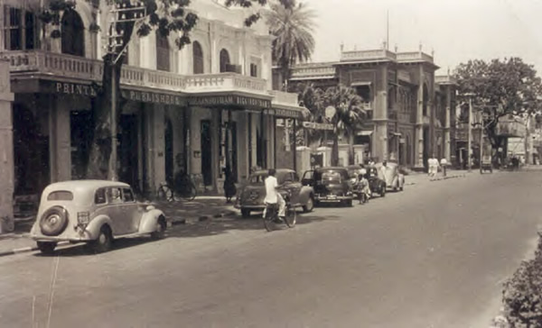
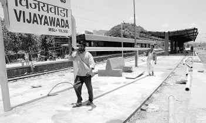

*\[Editor’s Note: My mother, a late adopter of the Internet, used to write the loveliest of letters to her children pre-Internet era. The letters stopped after I returned to India. In the past few years, after she got comfortable with Internet and gmail, the letters resumed as emails to her children. This is email #4 – a 3-part magnum opus covering her summer vacations in Madras, Vijayawada and Guntur. The earlier ones were* [A marriage in the winter of 1962](http://www.ulaar.com/2016/10/18/a-marriage-in-the-winter-of-1962/)*,* [Ravi Varma in a Vijayawada home](http://www.ulaar.com/2017/02/20/ravi-varma-vijayawada-home/)*, and* [Anatomy of a pilgrimage (Sringeri edition)](http://www.ulaar.com/2017/07/02/anatomy-of-a-pilgrimage-sringeri-edition/)*. This letter was written on May 13, 2017 so it has (unfortunately) taken nearly a year for the editor to do his job. The email has gone through a minor editing lens without changing my mom’s tone and voice. I’ve italicized the Telugu names and provided translations in “\[ \]”.\]*

**Part 1 (Madras)**

Dear ones,

Once again I want to bore you with my past memories. As I grow older my mind wanders more to the past. I want to share these with Vasanta, Sasi, and Kaza sisters – vichu will take care of the former and Udaka will take care of the later.

I will make this into 3 parts. In summer, people go to the *queen of hill stations* (Ooty) and we used to *leave Ooty* and go to Madras,Vijayawada, Guntur, Rajahmundry, and Kollur. The heat would make my nose bleed and Kakki used to get boils but still we enjoyed our summer vacations.

Our first halt would always be Madras before going to places in Andhra. Only rarely would our father accompany us, most of the time he would join later. My father would do journey planning one week in advance. He would say *“Suppose mavayya \[my mom’s uncle\] doesn’t come to the railway station, you leave the luggage in the left luggage, then take taxi and go to Shenoy Nagar. It is not at all difficult – just a straight road.”* I will nod foolishly. My mother will comment from behind *“my annayya \[elder brother\] will definitely come.”*

<figure aria-describedby="caption-attachment-3772" class="wp-caption alignleft" id="attachment_3772" style="width: 300px">

<figcaption class="wp-caption-text" id="caption-attachment-3772">Madras in 1950’s</figcaption></figure>

Nilgiri Express reached Madras Central exactly at 7 am. It was always a happy sight to see my *mavayya* waiting for us, always with his goggles on (I can’t imagine him without goggles). The next hard thing was our big trunk, packed with all our things. *Mavayya* would find it very difficult to fit into his car and I used to feel guilty. He was the only one among our relatives who owned a car in those days.

We were very happy to spend time with our cousins (Sirisha, Indu and Bharati). My *athayya* \[aunt\] was very affectionate and took care to cook our favorite items – brinjal for me and baby potatoes for Kakki. In those days their house seemed to me like a palace. *Mavayya* took us to the Marina beach or we would go to the park nearb. Being a doctor, he was very particular and careful and we didn’t go out much. Sirisha and Indu had very long hair, reaching down to their knees. Bharati’s hair was wavy and reached her hips. Sirisha was delicate and graceful (even today she is the same). My *Mavayya* never sent them to school by bus, he used to drop (and pick) them in his car.

My cousins used to learn dancing. It was a serious business, complete with proper dance dresses and performances too. We went along to one such program in a place called Tada (2-3 hours from madras). We went to Tada in *Mavayya’s* car, an overnight trip with *amma* \[my grandmother\] and *ammumma* \[my mom’s grandmother\] staying back in Madrasa. It was a LOT of fun – on the way we had food under pine trees and I felt very proud to watch my cousins’ performance the next day. My cousins then went to Amalapuram (their grandmother’s place) while we spent some more time with my *Ammumma* and *Mavayya* until my father joined us and took us to other places.

We spent a number of vacations with my *Mavayya’s* family including a Ganesh pooja where allrounder Bharati did everything. Those were unforgettable days. I will write about Vijayawada in my next episode.

**Part 2 (Vijayawada)**

Dear ones,

From Madras we proceeded to Vijayawada with my father. It was quite a busy place. I don’t think you have seen my Vimala Kakki. Six inches taller than *Ammumma,* she was fair with curly hair and wore a lot of jewellery including *kattevanki* \[gold band worn on upper arm\] and *oddannam* \[gold belt of immense proportion\]. She was always fully decked-up with ornaments, she looked like a beautiful queen with dazzling diamond ear studs and nose rings. She wore dark colours. We were a little bit afraid because of her strict and loud tone. Sarma kakka was a heavy man with a proud and sarcastic smile. They had 11 children (4 sons and 7 daughters). Eldest was Chandram *annayya* \[older brother\] and youngest was Santhi. So naturally house was full of *halchal* \[pandemonium in Hindi\].

Nobody can sleep beyond 5 am in Vijayawada summer.. even if somebody wanted to.. my Kakki would not allow. I remember the place where she sat with a bowl of coconut oil and a comb – she had to comb 6 girls’ heads (oldest girl Seeta was married by then) and make 12 *jadas* \[braids\]. It was a difficult task as everyone had curly hair. She would be constantly calling for the next one to be ready with her ribbons. Before nylon ribbons came into existence, we had to struggle with the task of straightening crumpled ones.

There were no dining tables in those days. All of us \[the kids\] would eat along with my uncle – the elders would eat later in the next batch. The big plates would be full with a variety of things. Vimala kakki made many types of pickles, *odiyalu* \[fried yummies\], *oorumirapakayalu* \[literally translates to town’s chillies\] and *kandi podi* \[roasted lentil powder\]. I used to wonder how she could do all this. Removing the plates and cleaning the floor was done by Vasumati and Rajyam \[the two older daughters\].

All of us would go to the gate to see my uncle leave for the bank where he worked. He would go in a cycle rickshaw but his face will be as if he was going in a chauffeur-driven Mercedes car!

Afternoon turned into a workshop. Uniforms of the school-going children and blouses were all made at home. Vimala kakki would cut the material and Vasumati would help her in stitching \[they had a leg-operated sewing machine\]. Our afternoon snack would be rice again but not in that elaborate way – only pickle rice.

The pre-sleeping duty of arranging beds (once again) fell to Vasumati and Rajyam. It was a tough job indeed – with a lot of arguments and yelling, all the *navar manchams* \[coir beds\] were kept outside in the courtyard, piles of beds, covers, and pillows were inside. Both (V and R) would make the beds for everybody including the guests. The next morning it was their job to stow them back.

The only entertainment in those days was movies. As it is Vijayawada people are very crazy about movies. The whole family would go to the movie in different batches – my kakki and kakka would be the last to go. During this entire period, everybody would discuss various scenes and pass comments. Viswam and Purushotham \[two of the sons\] would sing the movie songs throughout the day.. until they went to the next movie. Not a single day passed without guests trickling in.

Vimala kakki had a cook, a widow named Avvagaru. She stayed in their house along with her son Narayana. They were quite helpful to the family. Narayana was given basic education and my Kakka helped him get a decent job. He eventually got married and settled down in Ongole. Narayana’s children grew up to be model citizenry. Till today he attends all the functions of Tenjarla family \[family name of Vimala Kakki clan\]. I happened to meet him in one of those functions. He introduced his son who was working as a software engineer in Hitech City. I was touched. I have been told that he performs *taddinam* \[religious ceremony to commemorate progenitors\] for my Kakki and Kakka every year. How well he is expressing his gratitude.

Anyway Vimala kakki and kakka were a successful couple. After completing their responsibilities they passed away without much suffering – both within a 2 year gap.

**Part 3 (Guntur)**

<figure aria-describedby="caption-attachment-3773" class="wp-caption alignright" id="attachment_3773" style="width: 300px">

<figcaption class="wp-caption-text" id="caption-attachment-3773">Crazy coincidence: “Guntur” is an Indonesian film released in 1955</figcaption></figure>

Guntur was our last halt for that summer. My heart jumped with joy when we saw Guntur station. We spent a longer time here. I told you all many times about my *mamma* \[her father’s mother\] – if not for her we would not be here. If you can imagine a dark *tatayya* \[my tatayya – her father was a very fair man\], that’s what she looked like. She was as tall as *tatayya* and always wore a big *bottu* \[vermilion dot on forehead\].

There was a *gorintaku* \[mehendi/henna\] tree in their backyard. The very next day itself we would pluck the entire leaves and Ammumma \[her mother\] would grind it for us. My cousin (Koti Annayya) lived with them.

They had a buffalo, which would be milked by *mamma* herself. A small boy would take the buffalo out for grazing. Every morning *mamma* would make buttermilk.. just like Yashoda ma \[of Lord Krishna fame\] she would tie the rope to a pillar and churn it. She would keep the milk, butter, butter milk and curd carefully in a *kavidipette* \[covered wooden box\]. Since curd was special and available in small quantity, three of us would get in turns. She would give buttermilk generously to anyone who came home and asked for it. She would also make mango *pappu* \[lentil dal\] and *pulusu* \[a variant of the South Indian dish *sambar*\] in large quantity.

In the afternoon she would read Bhagavatam out loud. She knew how to read but couldn’t write (except her signature). Whenever my father sent 5 rupees Money Order, I would see that the money order receipt was signed as *Raghavamma* \[it was not uncommon to be oblivious of grandparents’ names\].

She (Raghavamma) didn’t expect any help from her daughter-in-law \[my grandmother – *ammumma*\] but, driven by her own nature, *Ammumma* helped to the extent possible (especially grinding and drawing water from the well). It was a great job because well water was the only source. Drinking water was brought by *mamma* from outside the compound wall in the evenings. My *tatayya* used to keep a mirror and *thilakam bottu* (black forehead dot made with banana flower) in front of his meals plate – pre-meal tradition to put on the *thilakam*.

There was a small room where my *tatayya* slept during day time. During nights everybody slept outside looking at the stars. He had bed with silk cotton and green pillow cover. He would hang a *vattvaru tadika* \[brown coir-based thingy\] on the door, and splash water on it periodically, creating an a/c room effect.

There was a shade giving *bogada* tree in front of the house with wide spread branches with sweet smelling very small flowers and fruits. There was also a neem tree. We used to play there. Neem and bogada fruits were our refreshments.

There were a pile of bricks and partly constructed portions in the premises. Tatayya had an ambition and long term plan to build houses for his 4 sons and 2 grandsons. He would do this work as and when he got enough funds. He used to get a pension of 15 Rs per month. He had fertile lands at Nallurpalem (near Tenali). Every harvest season he went there. He kept some paddy for his yearly family requirement and sold the rest. He continued construction work with that amount. He didn’t believe in contract labour. Instead, he got the job done using daily wage labourers. He was a tough master. I would see him wetting the bricks and cemented walls every morning. There was another small room \[pantry?\] where mangoes and vegetables like *kanda*, *pendalam* *chamadumpalu,* *dosakayalu* would be stored. His favourite mango variety was *imampasand*.

He rented out one portion of the house. He was very careful in collecting the rent. When we were leaving he bought 3 crepe silk blouse pieces on my mammas request. Mine was brown color. It was more valuable than a *pattu* sari.

Our Visweswaram *babai’s* \[uncle\] family was living in Arundalpeta (opposite Vishnubhotla’s house). We visited their house a number of times while in Guntur – sometimes we stayed overnight also. It was a very small house but who cares? Prasanna Akkayya and 6 boys were there – there was no end to playing. On top of it, they took us to movies. Though my babai’s job was not that great he got free movie passes. We watched movies from balcony seats. We enjoyed Guntur trip very much. Poor thing kakki was suffering with hot boils.

We finally returned home. It was thrilling when the train was nearing the destination. The driver would start the whistle from Fern Hill station. The Blue Mountain Express will reach Ooty at 1’o clock passing by the lake. We would take a taxi to come home. The blooming dahlias, roses, and chrysanthemums gave us a warm welcome. Our neighbour would keep food ready for us.

So that was our vacation when I was 12 years old.
