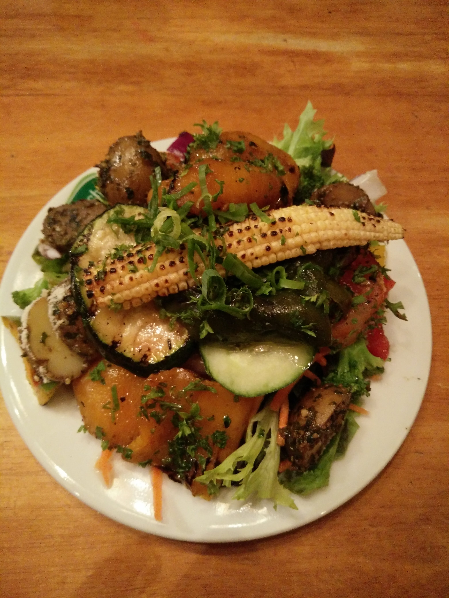

Mathematically speaking, a buffet function could be expressed thus:

Buffet f(x) = sigma (dish1(a1 -&gt;n1)) + sigma(dish2(a2-&gt;n2) +… + sigma(dish N(aN-&gt;nN)

*(Turns out there is a WordPress LaTeX plugin that’ll make the above equation more readable but I’m skipping it in the interest of early publishing)*

For the purpose of this blog post, I’d classify buffets as guided (dishes consumed in a pre-determined sequence) or unguided (random sequence of dishes).

The simplest buffet function is one involving a single dish/single taste.. e.g. hot dog, idli-sambar, or curd rice with pickle.

Every culture has it’s version of a complex buffet function, most of them are guided buffets I’d add. I’ll attempt to describe the one I grew up with – the Andhra vegetarian meal – an elaborate sequence of dishes ALL of which are consumed with a substrate of rice.  
1\. Get the gastric juices flowing prologue (*pacchadi*, *podi*, *avakai*, *magai*)  
3\. ‎Dry *sabji*  
4\. ‎Pappu (dal), lentils  
5\. ‎*Sambar* or *pulsu* or *majjiga pulsu* or *charu* (its Tamilian cousin *rasam*)  
6\. ‎Curd rice with pickle

For each of the numbered courses, the serving size is “one or more” when served at home with no supply constraints.

The minimal version (aka simple buffet function) is just #6 – curd rice with pickle.

Both versions are immensely satisfying although the texture of enjoyment, gluttony, and post-prandial regret can be quite different.

The neat thing about the minimal meal is obviously its simplicity – just one delicious taste. No distractions. No fuss. No fooling around. Just keep eating until you are full or stuffed because hey.. nobody in their right mind will ever eat *less than full*. So the post-prandial satisfaction quotient is high and the regret quotient is low.

Possibly the only wistful thought (if you stopped at full) might be: *“should have eaten more”*. On the other hand, if you had stuffed yourself to the gills (but within digestive limits), isn’t an extra coffee or reduced productivity on a work day afternoon worth the price of pure satisfaction?

Now let’s contrast this with the medley of thoughts after devouring a multi-course Andhra meal at 120% capacity.

The *sambar* was incredible! So was the *gongura pacchadi*.. I should have eaten less *pappu* so I could have tucked in more *sambar*.. and maybe I should have eaten less at breakfast and..

**Best-first or best-last?**

Let’s now move from the extremeties to the middle. In a typical family, a home cooked vegetarian meal is likely to feature at least two dishes, a dal and a sabji. Now let’s say that on a given day, you rated the dal 7/10 and the sabji 10/10. Which dish would you finish last? My answer is the latter. It’s always been this way.

But why? This question has been vexing me for the longest time. The only explanation I could come up with is that it’s my body &amp; mind’s innate need to *persist* the best sensation by making it the *last* taste on my tongue.

My younger son’s tactic is the exact opposite – he finishes the best dish *first*. I reckon my son’s tactic is consistent with his general living-in-the-moment modus operandi. I reckon he’s the outlier and not me.

What do I do when the dal and sabji are equally good? Keep taking alternate bites until the bittersweet end with my mind going *this is the best.. no no this* *<u>THIS</u>* *is the best*.

**College campuses &amp; pizza**

Is there anybody who’s NOT gone overboard eating pizza? Especially in their college years?

My U of H gang’s pizza gluttony modus operandi was as follows: work the night at the computer lab finishing whatever assignment needed to be done, return to the apartment for ablutions &amp; shower, a Spartan breakfast (if that), return to the university and be the first to hit the campus Pizza Hut for lunch buffet starting at 11:30am. Ignore salads &amp; garlic bread and just tuck in slice after slice after slice until you were really sure you could no longer tuck in that ‘one last one’. (We essentially broke down a complex buffet function into an elemental single dish “main course” value proposition – salad indefinitely deferred to our 30’s or 40’s.)

Eating pace would vary – I would go fast, my buddy Naveen would go slow and he would (more often than not) beat me by 1 or 2 slices. Promotional value of this buffet meal? A veritable steal at $2.99. The closing ceremony of this weekly ritual involved a laborious 10 minute walk to the apartment where a 5-6 hour comatose state awaited us. The expression *dead to the world* would be appropriate here.

Six months of this weekly ritual would come in handy. A friend innocuously agreed to order pizzas on his birthday. We both devoured one large pizza each (thick pan crust, not the wussy thin crust) leaving him shell-shocked and with no leftovers for next day breakfast.

**Deep dish pizzas &amp; football-sized burritos**

The move to Chicago got me acquainted with a new world – deep dish &amp; stuffed crust pizzas from Gino’s East and Giordano’s. I vividly recall my first encounter at Gino’s. My new colleagues ordered the *lunch special* – personal-size deep dish pizza + soda + 2 garlic sticks. At first blush the pizza felt woefully inadequate but it eventually felled me with its fullness. Density apparently matters.

Chicago was a great place for burritos too. My Mexican taste buds were trained at the venerable Hay Caramba!, a lovely authentic place in downtown Park Ridge that served the most delicious Burritos Suizos (melted cheese + generous guacamole + perfect salsa).

And then we discovered a hole-in-the-wall joint that served football size burritos. Thoughtfully, they offered two sizes – the Grande and the Junior. We cockily ordered the Grande on our first visit and were swiftly humbled. The best performance was put up by young Jim Tsai who demolished nearly 80% before calling it quits. The rest of us packed up at the 50-60% mark. That day, a new food unit was born. One Burrito Unit (aka 1B). Subsequently, we calibrated all other dishes in other restaurants as 0.6B, 0.75B, etc.

<figure aria-describedby="caption-attachment-3874" class="wp-caption alignleft" id="attachment_3874" style="width: 300px">

<figcaption class="wp-caption-text" id="caption-attachment-3874">A different kind of (Swiss) buffet restaurant – in Jakarta</figcaption></figure>

**Indian restaurants &amp; birth of the mega buffet**

For the longest time, Indian restaurants in US cities were rather unimaginative in the quantity of their buffet options. The late 90’s heralded a new era of the mega buffet. We got a glimpse of it in a few Chicago area restaurants but we first witnessed *buffet mega-ness* at a Bay Area restaurant. With a prime location on Lawrence Expressway (Santa Clara), Sneha was a magnet for desis and Americans alike was always packed (weekdays and weekends). The dizzying array of choices consumed in a largely random fashion would be somewhat satisfying but they were always followed by *did-I-really-do-justice* feelings. It forced me to look inwards.

There had to be a better way. A better way to maximize satisfaction and minimize regret.

I found that better way eventually – a set of ground rules and tactics honed over scores of sorties at numerous buffets. Here they are:

1. Acknowledge that a buffet is a *game* that you are playing. Buffets are like the casino. They always win… unless you have internalized the rules under which *you* are playing the game.
2. I’ve always been a ‘main course guy’ so maximizing the best of the main course dishes delivered the lion’s share of my satisfaction. Nailing this theory isn’t enough. Putting it into practice involves careful adherence to tactics 3 through 5.
3. First round is always a reconnaissance round. A slow robotic sweep of every dish on offer — ignore the obvious no-no’s and sample everything else. Even for the self-professed main course guy, *everything* should include desserts (if there’s a particularly wow dessert, one may need to re-balance main course gormandizing).
4. You’d think the reconnaissance round is simple but it’s not. A rookie mistake is to judge a dish by its appearance and take too much. Remember: first round is purely an evaluate and selection round for second round.
5. Second round is when you double-down on all dishes that made the cut from round one. This is a multi-stage round and focus is key here. Relish all the dishes of course but a constant ranking &amp; re-ranking after each bite (all sub-consciously of course) will make the end game interesting and fun.
6. There will be distractions in the form of aerated drinks and fruit juices. Avoid them.

<figure aria-describedby="caption-attachment-3875" class="wp-caption alignright" id="attachment_3875" style="width: 225px">

<figcaption class="wp-caption-text" id="caption-attachment-3875">Something I’d not give a second glance 20 years ago</figcaption></figure>

Disclaimer: above rules &amp; tactics were crafted and battle tested in a simpler world. A world where Indian buffets meant *Indian dishes only*. These days (at least in Bangalore), you have nasty places where you have Chinese, Thai and sometimes even Mexican dishes as part of the buffet ensemble. Would the aforementioned optimization hacks work on the multi-cuisine buffets? I don’t know because I’ve moved on to a different form of buffet optimization — it’s called buffet avoidance.

If my friend Shantanu reads this post, I know what he’ll write in the comments: *“Shut up and eat.”*
