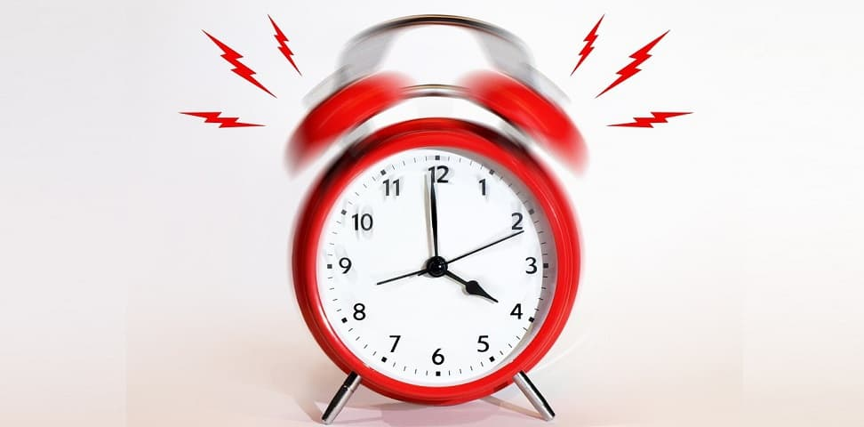

Decades ago, I went to bed with a raging headache. For the next 10 minutes, I performed a sequence somewhat like this – took my attention away from my forehead, imagined myself floating in the ether, then gently lowered myself into a bottomless void ever so slowly. As I floated down, a part of me was still ‘up there’ watching the rest of me making the descent. I felt incredibly light headed, calm and peaceful as I embraced this weird visualization that some adult (don’t recall who) had taught me. After sometime, I noticed that my headache had disappeared completely.

Whoa! I had unlocked a superpower.

“Not so fast, young ‘un!” the universe would tell me a dozen+ times later as I attempted to replicate the visualization before giving up in frustration. It was just a freak coincidence, beginner’s luck or maybe I was skipping a crucial element of the visualization.

Anyway, this post is about a different superpower.

\*\*\*\*\*\*\*\*\*\*\*\*\*\*\*

For as long as I can remember, I’ve never been a *morning person*. My mom always had to wake me up. In college, that crucial role was taken up by my close friends. Not that I didn’t use an alarm clock.

I’ve had a special relationship with alarm clocks. Everybody snoozes right? But I was a veritable grandmaster in *snooze-less snoozing*. Snoozing in 10 minute intervals can be effortlessly done by anyone who loves their zzz’s. Which is why when the fiendish *self-propel-itself-to-remote-corner-of-room* alarm clock hit the market, I took notice.

I never bought it. Maybe it was the prohibitively high cost or a realization that it was no match to my now legendary powers to resume sleeping even after being woken up.

In my Chicago years, I reached grandmaster level when I didn’t even need to snooze the damn alarm clock. It’s well-known that the *radio mode* is meant for light (or normal) sleepers — hearing your favorite music genre or some goofy chit-chat by the morning DJ is usually a cinch. The monotonous buzzing/beeping was meant for advanced sleepers like me.

It might have worked for a few weeks. And by *worked*, I mean after 4-5 snooze cycles I would eventually get annoyed by the beeping tone and get up.

Weekday mornings have certain demands while weekend mornings come with unfettered freedom. Weekend mornings are when I really honed my grandmaster skills — sleeping an extra hour or two as the Sony Dream Machine faithfully beeped away.

One Sunday morning, in my fifth floor apartment in Lincoln Park, Chicago, the doorbell rang (I would learn later that I had responded on the 6th ring). As I groggily rubbed my eyes and opened the door, imagine my surprise to glimpse a cute gal. But she didn’t look happy.

She was mad as a hatter. Plum Wodehouse would describe her as &lt;…&gt; She started castigating *“Do you realize that your alarm clock has been beeping for the past 90 minutes? And I can hear it from my 4th floor apartment!”*

The whole episode struck me as incredibly unfair. Here I was.. enjoying my beauty sleep in the privacy of my own bed, not playing loud music, or practicing any thumping dance movements, no wild revelry, and this gal has the gall to give me grief about the Dream Machine’s innocuous beeping tone.

I made my feelings known without an ounce of contrition. *“You’d just have to put up with it,”* I told the lass. *“Look!”* pointing her to the object of derision, *“how much racket can that mono 4″x4″x4″ alarm make?”*

She stomped her feet (Rumpelstiltskin like) and protested *“I’m studying for my Accounting exams and I just can’t concentrate!”*

I was still seething from the infringement of my dwelling rights but I started to see her point of view. Not enough to be contrite though.

I made no promises and coldly closed the door.

\*\*\*\*\*\*\*\*\*\*\*\*\*\*\*

The reader would be excused for thinking that I was a seasoned sloth in my Chicago years. The reality was quite the opposite. I used to work long hours, go for evening long runs alongside Lake Michigan, play racquetball, and also made valiant attempts at learning the flute at Old Town School of Folk Music.

*I just wasn’t a morning person*.

\*\*\*\*\*\*\*\*\*\*\*\*\*\*\*

*“There are only two things that can wake up this man in the morning – squash and running!”* my wife when talking about me.

L = Light sleeper, H = Heavy sleeper  
It must be a gift of the universe (and Donovan) that married couples invariably end up as type LH (the reader may infer that my wife is a light sleeper).

From that end-of-innocence Sunday morning in Chicago, I made major improvements to my alarm-clock-sensitivity. An LH marriage coupled with years of early morning squash/running does that to you.

The advent of the smartphone, with its myriad range of alarm tones, enabled me to experiment extensively before arriving at the magical compromise: *Spring*. It was far from the stentorian *Journey* (which scored very high on certitude) but it hit just the right level of *persistent cajole*. This has been my go-to wakeup melody for the better part of five years.

\*\*\*\*\*\*\*\*\*\*\*\*\*\*

Last year, in the early weeks of my training for the Malnad Ultra, a superpower dropped in for a visit.

A weekday morning and I was quietly awake at 5:05am (the alarm was set for 5:10). I had heard about this kind of phenomenon from my friend Bhasker. For as long as he’d been running (10+ years), he would always stir awake minutes before his alarm. If you know Bhasker, this wouldn’t surprise you.

But the fact that it happened to mere mortal *me*! Now *that* was note worthy.

Not when it happened the first time. Or the second. There is such a thing as a streak, a freaky purple patch if you may.

But it persisted for the entire duration of my Malnad training and even spilled over to my next race training months.

It didn’t matter whether I was sleeping 7 hours (my *target*) or 6 hours. I would uncannily stir awake 5-7 min before the alarm set time.

I had acquired a new superpower and, this time, it stayed with me for months.

\*\*\*\*\*\*\*\*\*\*\*\*\*\*

There had to be an explanation, right?

I’d been running regularly for about 10 years, training and racing seriously for about half that duration. What was different this time?

As far as I could tell, nothing overtly significant.

I had an amazing experience running [Malnad Ultra 2017](http://www.ulaar.com/2017/11/26/yin-yank-race/). No doubt that fueled the anticipation for the next year and an appetite for a more disciplined training regimen. There was definitely a period where I was focused and truly enjoying the journey (as in “every damn training run”) and not thinking about the result.

But I had been there before.. not for too long but still.

The only explanation is that old hackneyed one — I must have *really really really* wanted to stick to my training regimen this time.

You are probably thinking I had a great year of racing with PBs galore. The truth couldn’t be further from that. But that’s another story.

