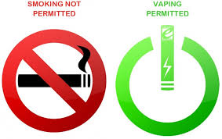

If vaping was a thing back in the early ’90’s, I seriously doubt I’d have quit smoking when I did.

Not that it was easy. It took a year of umpteen failed attempts with quit streaks ranging from days to months.

I still don’t know the precise reason why attempt #67 worked. Perhaps it was my *inner me* finally realizing that I (the *outer me*) really really wanted it and supplied the requisite dose of steely resolve for the “final standoff”.

I vividly recall the final standoff. Ganesh and I were at the balcony of his Glendale Heights apartment.

When I moved from Houston to Chicago, I had the option of staying the first few weeks with my Bokaro-&gt;Ranchi friend (veteran smoker) or my Vizag friend (non-smoker). I was playing offence so I chose the former.

So there we were at the end of our work days with one of us lighting up. Ganesh had a bemused look – the look that smokers reserve for friends who have just quit or claimed to have.

How did Neo finally know that he was The One at the precise moment when the suited Evil One let loose with his shooter? How the heck did he *figure* *out The Matrix* and stop the bullets? It was a beautiful plot and a delightfully satisfying climax but we will never *how* he did it.

So there I was at the other end of a lighted cigarette. With each flicker of the lit end followed by the waft of smoke coming my way. Each puff was a bullet that was teasing me, testing me, mocking me. Ganesh watched. He wore that familiar look of satisfaction that smokers have for their favorite smoke of the day. My favorite was the post prandial moment, his was decidedly the post-work moment.

The bullets flew by without hitting their mark. I was having a Neo moment. Forty-eight hours after my last smoke (in Shiv’s Celica) as he dropped me to the Houston Hobby Airport, I was staring down a lit cigarette without breaking a sweat.

It was no longer beginner’s luck. Some days, Ganesh would blow smoke into my face.. other days I would dare him to. Whether it was the balcony, the car, or after dining out, it continued to be an effortless warding off of temptation.

Days became weeks and it was time to move to my Arlington Heights apartment. I wondered if the solo habitation would trigger any insecurity driven temptation. It didn’t.

A year had passed. Ganesh and I (along with Vijay, another smoker) were at a Stanley Clarke concert at Navy Pier. We had had a few drinks and Ganesh/Vijay were lighting up for possibly the 5th time that evening. The precise trigger escapes my memory but it sorta went like this.

Vijay: “If you’ve *really* quit, you should be able to have an occasional smoke and remain a non-smoker.”

Me: “I’m up for the challenge.”

And I proceeded to smoke half a cigarette.

It was not an enjoyable experience. The same (sensible) defense mechanism that the body put up when I first attempted to acquire the habit was at play here. The taste in the mouth was unpleasant and the lungs were like “Dude! What the @#$&amp; are you doing? Didn’t we move on already? Let us repeat – we are NOT COOL WITH IT!!”

I had passed the “final + 1” test and it wasn’t even a close call. Kudos to my body – no steely resolve needed this time. I suppose residivism probability correlates directly with smoking years (as I’ve observed with some of my long tenured friends) but hey.. I was not complaining.

**If only smoking wasn’t harmful**

In my final year of thrashing.. and railing against the sheer injustice of having to give up something deeply pleasurable, this was a recurring refrain – “why weren’t scientists working on a non-harmful cigarette?”

Turns out, they were. It just took some time. Those devious scientists at Juul Labs and other companies swirling out vaping products will leave you dizzy with their cornucopia of flavors and combinations. I reckon folks are waiting for the inevitable integrations with Fitbit, MyFitnessPal, and Headspace because who doesn’t want to run A/B tests to determine the optimal puffs per day to maintain target weight and lung health without compromising *all-is-well* pleasure?

Me? I’m just so sooo glad that it took Juul &amp; their cohorts this long to invent vaping. If it was a thing back in the 90’s, I wouldn’t have gone through that year of travails, I’d just have *transitioned*. Just like millions of smokers who are transitioning as we speak.

It’s a pity though. Vaping is just old wine in a new bottle. Maybe less harmful (although some even question that) but it’s no less addictive. It’s a pity because it reduces the legions of smokers who might otherwise attempt the *cold turkey* quitting protocol.

Smoking holds just one redeeming quality to the habitual smoker. It holds the possibility that he might someday quit, and remain a quitter for good.

Because when he succeeds, his will power quotient reaches a massive crest. Speaking for myself, I still count quitting smoking as *the* top accomplishment in my life. Every other ‘accomplishment’ pales into a distant second place. It’s the ultimate magic potion of *self-confidence meets I-can-frikkin’-do anything*.

P.S. If you’ve been a smoker for years (maybe *decades*) you might think “What’s the point of quitting *now*?” The truth is that it’s never too late to quit. Don’t take my word for it. From [five common myths about smoking](https://www.firstpost.com/health/world-no-tobacco-day-2020-five-common-myths-about-smoking-8411601.html), I present a relevant extract.

> Multiple studies have shown that your body and lungs start to repair themselves as soon as you finish that last cigarette. The blood pressure levels go back to normal, carbon monoxide levels reduce drastically within 12 hours, nerve endings start growing back and lung function improves a week after quitting. A year of not smoking can reduce your risk of heart disease by half, and if you continue on that streak for 10-15 years, risks of all tobacco-related diseases reduce greatly.