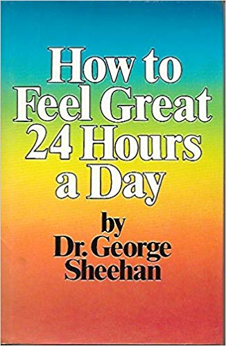

*“Racing is a true experience. Only the conditions are artificial. My entire self is engaged in a genuine struggle against time and distance and those around me. All my strengths, physical and emotional and moral, are called upon to decide the issue.”* – Dr. George Sheehan, How to feel great 24 hours a day.

I’ve been running regularly for 11 years. Recently , I’ve been struggling with this question “Do I really need to race in order to keep enjoying my running?”

The struggle is no doubt related to the *minimalist* impulse in me that I’ve been feeding assiduously. With the zenith of my [marathon racing](http://www.ulaar.com/2016/08/13/breaking-a-streak-liberating/) well and truly behind me, one FM + one ultra in a year seemed like a good dial-down formula. Then, at the start of last season, I announced my racing retirement (obviously to *myself* — because who else cares if a slow middle-aged amateur runner hangs up his racing boots?)

Malnad 2018 and Mumbai Marathon 2019 would be my final races, I told myself. My mind raced ahead and created a ‘retirement’ script:

- Ass-off training program for Malnad 80k ultra. Target: shave 45 min from [previous year](http://www.ulaar.com/2017/11/26/yin-yank-race/)‘s time
- Channel Malnad momentum into (another) ass-off training program for Mumbai FM. Target: shave 8 minutes from my current PB of 3:48

I bombed at both the races.

It wasn’t the first time (of course). Dealing with the failure took me way longer than usual. The level of moping and self-flagellation surprised my close friends, family and me. What was different this time?

Setting aggressive targets and missing them with low training volume — been there, done that. Missing them with high training volume and intensity — been there, done that as well. I have improved on my marathon timing only *four* times in 30+ attempts so it’s not like the running gods bestow any special favors to me. I had woven this *racing away into the sunset* fairy tale, I had failed *and* there was not going to be “one more” race.

When all is seemingly lost and I don’t know what to do with my running, I turn to George Sheehan. In his 1983 book How to feel great 24 hours a day, he delves into the subject of racing. There was still a gap between my perceived potential and race day reality. Sheehan reminded me why we amateur runners like/need to race, the connection between play and sport, and, most importantly, why the precise outcome should not define the post-race.

So I signed up for Bangalore Marathon, this time with NO proclamation that it will be my last. I’ve given the 16-week training plan my darndest effort and come race day, I’ll be giving my darndest effort.

Heads I win (PB achieved), tails I don’t feel miserable but experience the incredible peace that Sheehan writes about (extract below). Sheehan’s entire chapter on racing is “pure gold” but I’m reproducing the choicest and most relevant bit. This (see below) is how I want to feel on Oct 13.

*“What strikes me about this whole scene is how gentle everyone is,” said my friend who’s a playwright.*

*And as I looked into myself and looked at those around me , I realized my friend was right . Gentle was the way to describe it. Gentle and perhaps one more word. Peaceful. A poet friend of mine once told me, she had never, seen a face more filled with peace than mine after a race.*

*The peace is a positive quality. It is not merely the absence of stress or strife or conflict. It is a peace that has certainty. It is a peace that is active. A peace that is strong. It is a peace that has certainty. A peace that tells me that I am good and holy and complete.*

*It is also a peace that is rare. All other acts carry within them a counter reaction. There is the depression that follows exultation. The sadness that comes after ecstasy. Not so with the race and the peace that follows.. This peace is the fruit of the race. Something born of that suffering, that testing, that exhibition of character, that attainment of class.*

*And with it comes the relaxation, the elimination of desires, the end of craving, the death of ambition. For a time pettiness and the lesser appetites and all the meanness are wiped out. I have put on the new man.*