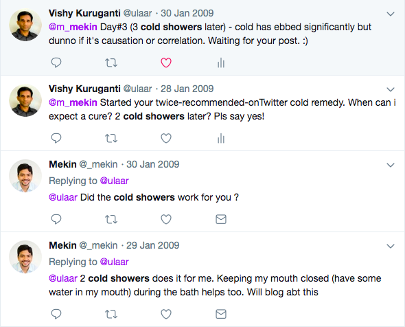

My friend [Mekin](https://twitter.com/_mekin) tweeted something interesting in Jan 2009. One of those things that makes you go “*hmm.. surely I can give that a try!*”

For someone perpetually teetering on the edge of catching a cold (or in the midst of one) for *most* of my life, I’m always on the lookout for life hacks.. Mekin’s tweet piqued my interest and massively appealed to my crazy bone.

Januaries in Bangalore can be quite cold so turning one’s back on warm baths is the equivalent of a smoker quitting cold turkey.

An impulsive *what-do-I-have-to-lose* experiment to naturally cure my frequent bouts of cold has turned into a 11-year old streak of taking cold showers. (Now which ML model could have predicted this?)

Quarterly business trips to San Francisco would test my resolve but I passed with flying colors. And then it became a habit.

Trips to Delhi, Chandigarh, Amritsar in the cool-cold months. No problem.

Cheat days also materialized in rare serendipitous ways. The first time I developed fever (a few years into my *cold showers era*) I felt the urge to take a warm shower. I gratefully succumbed. I’ve never felt more satisfied (while sick) than those 3 or 4 minutes under the warm shower.

There were six other times I’ve *rewarded* myself with a warm bath. It started with my [first 75k ultra](http://www.ulaar.com/2013/11/10/chappal-mein-pachattar-first-75k-ultra/) in 2012. You can guess how many more ultras I have since run.

On my one (or two) year anniversary, I put a bragging Facebook post on the lines of “x years since I started cold showers and I hardly ever fall sick.” I was promptly schooled by my data scientist friend “it’s correlation, not causation.”

Sometime later, a friend clued me in to hormetism – *application of progressive, intermittent stress to overcome challenges and grow stronger physically, mentally and emotionally*. Is it a [philosophy of life](http://www.ulaar.com/2013/04/11/hormetism-cold-showers-and-barefoot-running/) or a biological principle? I didn’t spend too much time deliberating because I was having too much fun with two applications of hormesis – barefoot running and cold showers.

So which one are you gonna try first? Cold showers or barefoot running?

Or you could go *rad* like me.. and start both.

As I searched for my customary image for this post, I found this gem – [12 benefits of taking cold showers every day](https://www.msn.com/en-us/health/health-news/12-benefits-of-taking-cold-showers-every-day/ar-BBUq4zD). It’s on MSN, not some fringe whacky philosophy site.

Still not convinced? How about if Jack Dorsey calls it [“better than coffee”](https://www.theaustralian.com.au/world/the-times/cold-showers-better-than-a-caffeine-hit-to-kickstart-body-and-mind-for-day/news-story/f22c30ca02b4b8f22b49daa09df61405)? Some juicy bits from the article:

> Runyon says doing it regularly makes you feel invincible, which presumably is why taking cold showers has taken off in the business world.  
>   
> And in a study last year involving more than 3000 volunteers, Dutch researchers reported that people who ended their showers with a 30-second hit of cold water were less likely to call in sick.