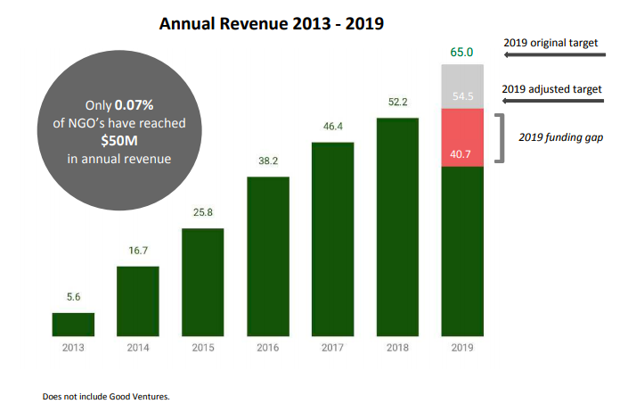

That’s the tag line for GiveDirectly, a 10-year old US-based non-profit making waves in 9 African countries. “Cash” for unconditional [cash transfers](http://www.techsangam.com/2019/12/05/unconditional-transfers-approaching-primetime/) and “you’ve got mail” for the m-Pesa notification for lucky recipients.

In a recently shared annual non-report, this visual caught my attention:

The $2.4 million grant from Google.org (2012) and a subsequent $25 million from Good Ventures (of Dustin Moskowitz fame) are not included which makes the ramp-up even more impressive.

GiveDirectly operating model spans across 4 steps:

1. **Target**: first locate extremely poor communities using publicly available data then send field staff door-to-door to digitally collect data on poverty and enroll recipients.
2. **Audit**: use a set of independent checks to verify that recipients are eligible and did not pay bribes, such as physical back-checks, image verification, and data consistency checks.
3. **Transfer**: transfer recipient households roughly $1,000, or around one year’s budget for a typical household; use electronic payment systems; typically, recipients receive an SMS alert and then collect cash from a mobile money agent in their village or nearest town.
4. **Monitor**: call each recipient to verify receipt of funds, flag issues; also staff a hotline for inbound calls and in some cases staff follow up in person.

The GiveDirectly [FAQ](https://www.givedirectly.org/faq/) does a very good job outlining their unique value proposition. Pasting the most evocative subset below:

#### How do you decide to whom to give cash transfers?

> We aim to find the poorest possible recipients while using criteria that are simple, fair, cost-effective, and difficult to game. Currently, our default is to locate extremely poor villages using poverty data from national surveys, and then enroll all households in the village. In the past we have also selected the poorer households within villages using simple criteria, e.g. enrolling families living in homes with thatched roofs and not those with metal roofs, and also experimented with a wide range of other targeting approaches including community-based methods, points-based systems such as the Progress out of Poverty Index (PPI) and the Multidimensional Poverty Index (MPI); subjective assessments; and various blends of these approaches.

#### How much do recipients get?

> For one-time transfers, we typically send each recipient household roughly US$1,000, which is around one year’s expenditure for the average household and around US$200 per family member for the average family of 5. There is nothing magical about this amount, but it reflects a few factors. First, it is fair in the sense that US$1,000 is the amount the average recipient household would need to invest in order to raise its income to the level of its ineligible neighbors. Second, it reflects existing evidence, in the sense that US$1,000 is in the ballpark of the total amounts delivered by other programs that have been studied extensively (with the main difference that these programs transfer money over longer time periods). To put US$1,000 in context, in a typical setting where we work this would buy you 5.5 years of secondary schooling, 5.2 years of basic food requirements for one adult, 1.2 acres of land, or metal roofs for 4 houses.

#### How do recipients use the transfers?

> By design, cash transfers let recipients use money for whatever is most important to them. Innovations for Poverty Action’s [evaluation](https://www.povertyactionlab.org/sites/default/files/publications/974%20Give%20Directly.pdf) of our transfers in Kenya found increases in expenditure across all categories measured, including food, medical and education expenses, durables, home improvement, and social events. It also found large increases in income and in asset holdings, in particular livestock, furniture, and iron roofs. In addition to this research on GiveDirectly’s transfers, there is [a large body of research](https://www.givedirectly.org/research-on-cash-transfers) from around the world documenting the impacts of cash transfers on low-income households. See [GDLive](https://live.givedirectly.org/) for a good idea of how cash is being spent in real time.

#### Is giving cash sustainable?

> Usually when the word “sustainable” is applied to charity, it means that a gift “keeps on giving” and that donors need not continue to make gifts to the same recipient. Since many GiveDirectly grant recipients use some or all of the money to invest in small enterprises, many of GiveDirectly’s grants are “sustainable.” Indeed, one study of unconditional cash transfers in Mexico found that household incomes increased by between 1.5 and 2.6 times the amount of the transfers due to the returns from increased investment (Sadoulet, Elisabeth and Alain de Janvry, and Benjamin Davis. “Cash Transfer Programs with Income Multipliers: PROCAMPO in Mexico.” World Development 29(6) pp. 1043-1056, 2001), suggesting that cash transfers are more than sustainable. Beyond short-run income changes, investments in adequate food, proper clothing, better health, or more education for children may be “sustainable” in the long run; even though it will require charity until that child is done with school, he or she will grow up much better off and in need of much less assistance than his or her parents.
> 
> Not all recipients will invest the money, however, and it will be gone once it is spent. Donors who prefer to give a gift that is guaranteed to be sustainable in the sense that it will provide a steady income stream to the poor can do so. One easy option is for the donor to invest a gift themselves and donate the annual interest, effectively creating an endowment.

#### Why not put conditions on what people have to do to get transfers?

> We choose to provide unconditional, rather than conditional, cash transfers for two reasons. First, empowering the poor to make their own decisions advances our core value of respect. Second, imposing conditions requires costly monitoring and enforcement structures be put in place. One detailed estimate put the administrative costs of a conditional cash transfer scheme as high as 63% of the transfers made over the first three years of the program (Caldes, Natalia, and John Maluccio. “The Costs of Conditional Cash Transfers.” Journal of International Development 17 pp. 151-168, 2005). Our read of the existing experimental evidence comparing the impact of conditional to unconditional transfers is that there is little evidence to suggest these added costs produce commensurate benefits.

In all my readings on their website, the only thing that surprised me is that their financial efficiency (how much of a donated dollar gets in recipients’ hands) is only 85%.