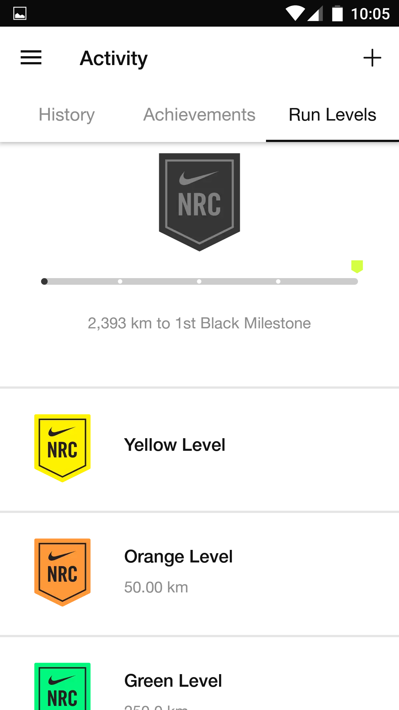

<figure class="wp-block-image size-large">

<figcaption>Literal translation: immersion; used most commonly in context of idols immersion</figcaption></figure>My last decade of running can be classified into 3 phases:

- Garmin Forerunner 310 with data being logged religiously on [RunningAHEAD](https://www.runningahead.com/), chosen for their non-social DNA
- Plain-old digital watch (borrowed Garmin for occasional races)
- Nike Running Club (NRC) app on my OnePlusX

When I turned to NRC, my motivations were at an all-time low. Run by run, badge by badge, level by level, the app played more than a bit role in regulating my running as it meandered its way from doldrum to doldrum punctuated by periods of improvement.

Ostensibly I was using the app as a crutch but I’d lie if I claimed to be unmoved by its gamification features. The Levels tab would beckon to me often — how close was I to the *3rd milestone in the purple level*? The streak badges would bring a smile and the Fastest &lt; &gt; badges would trigger nostalgia about that maniacal tearing down Nandi Hills escapade.

After I finished the season’s [only race](http://www.ulaar.com/2019/10/05/heads-i-win-tails-i-dont-lose/) the end of phase 3 seemed inevitable. I spent some time searching the Net for ways to export the NRC data. Nike’s walled garden approach ensured there was no easy way. It got me thinking why I wanted to keep the data anyway. Digital *visarjan* was the answer so here I am, laying the NRC phase to rest, with the epitaph as 4 screenshots.

And a new experiment has begun: can I maintain running continuity with no GPS aid?

