Lest we forget the numerous mountains still to be climbed in India, this Firstpost photo essay reminds us.

<figure class="wp-block-image size-large">

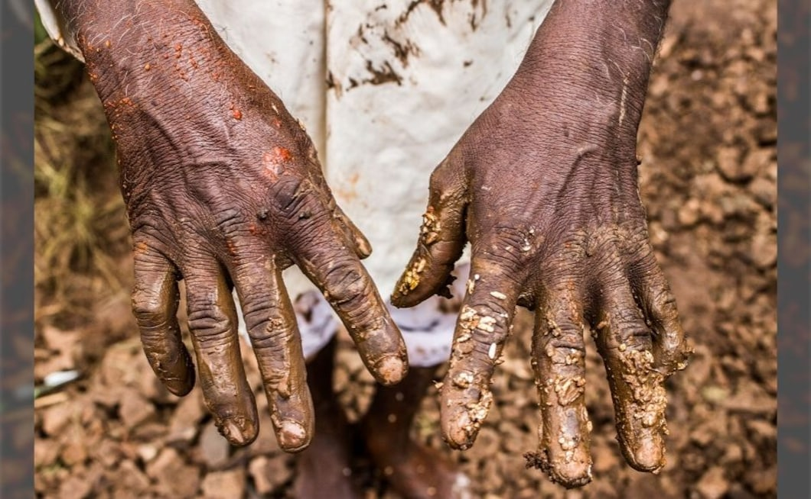
<figcaption>  

*After floodwater receded from the villages of western Maharashtra in 2019, the villages were still drowned in sewer water, mucky and slushy soil. Navilal Bahiruppi, 66, an agricultural labourer, while cleaning his house in Rajapurwadi village of Shirol taluka in Kolhapur said, “I lost everything and there will be no work in the fields for at least two months.”*

</figcaption></figure>

<figure class="wp-block-image size-large">

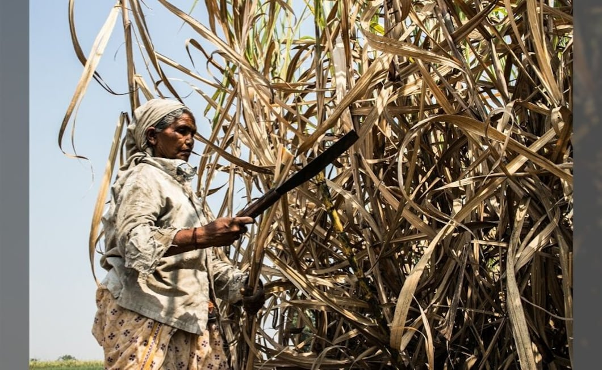<figcaption>  
*Khebabai, 68, from Godri village in Jamner taluka of Maharashtra’s Jalgaon district migrated 570 kilometre to Nandani village in Kolhapur district for cutting sugarcane. When I asked her for how long she has been cutting cane, she said, “I started when sugarcane was sold at Rs 300 per tonne.” Today, the rate has reached around Rs 2,700 per tonne.*</figcaption></figure><figure class="wp-block-image size-large">

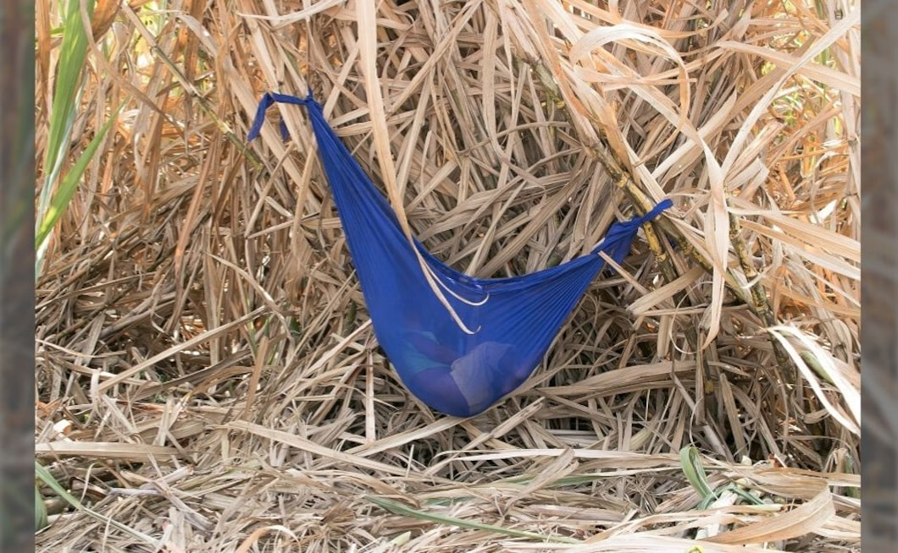<figcaption>  
*A hammock-like structure made using a saree in which a child of a migrant sugarcane-cutter is sleeping. Roomshad Tadvi, who belongs to the Bhil tribe community from Jalgaon district, says, “Look at our children. What’s their fault if they are born poor? This is how they have to live.”*</figcaption></figure><figure class="wp-block-image size-large">

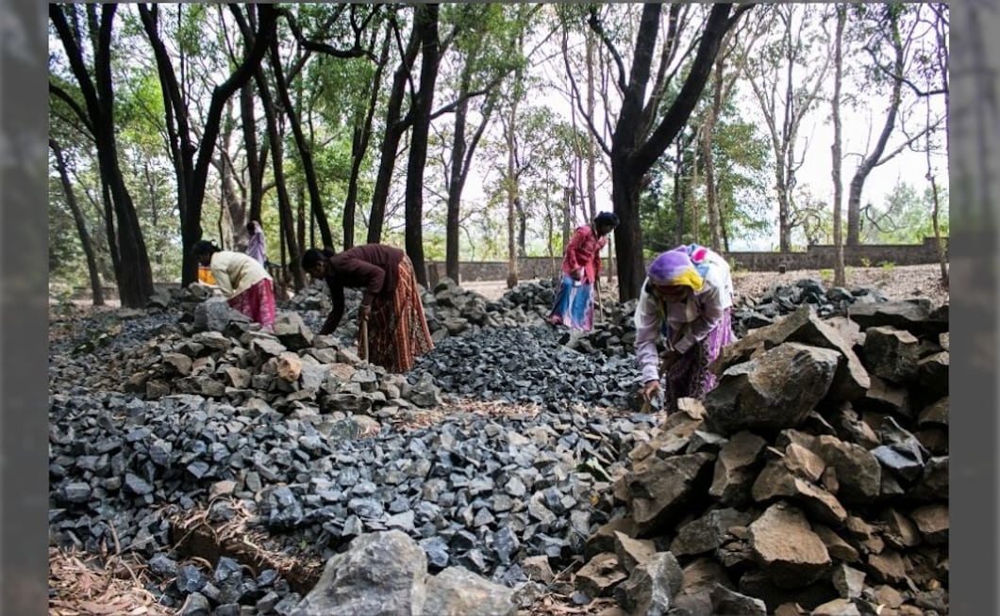<figcaption>  
*Landless labourers and migrant stone crushers from Sindgi (rural) in Karnataka’s Bijapur district. Every year, they migrate for six months to break stones. This photo was taken while they were working at the Kambalwadi village of Radhanagari tehsil in Kolhapur district. For crushing one brass (100 cubic feet) of stones, they are paid Rs 300.*</figcaption></figure><figure class="wp-block-image size-large">

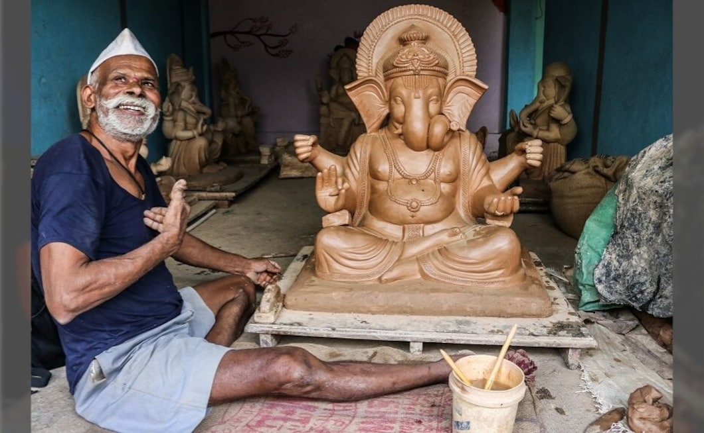<figcaption>  
*Of the 180 pottery artists in 1964, only four remain in the Kapashi village of Kagal taluka in Kolhapur now. Vishnu Kumbhar, now 73, belongs to the 13th generation of potters, and has taught pottery to his daughter-in-law, Sarita, in order to keep the art form alive. He also makes Ganapati idols every year.*</figcaption></figure><figure class="wp-block-image size-large">

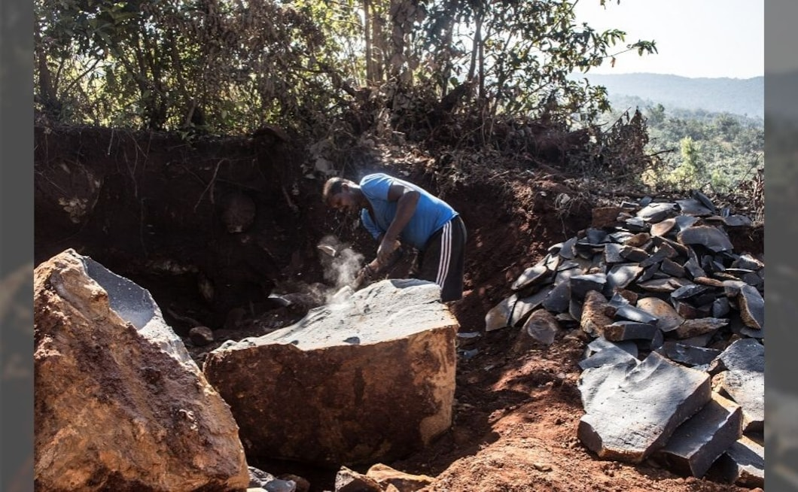<figcaption>  
*Fifty-year-old Dattatray Wadar belongs to the Gadi Wadar community listed as Nomadic Tribe. Wadars are traditional stone dressers, sculptors, stoneworkers, and stone transporters, and Gadi Wadars specialise in breaking heavy stones that weigh at least 3,000 kilograms. Dattatray talks of how there’s an everyday risk of scorpion stings, snake bites and muscle spasms in this profession.*</figcaption></figure><figure class="wp-block-image size-large">

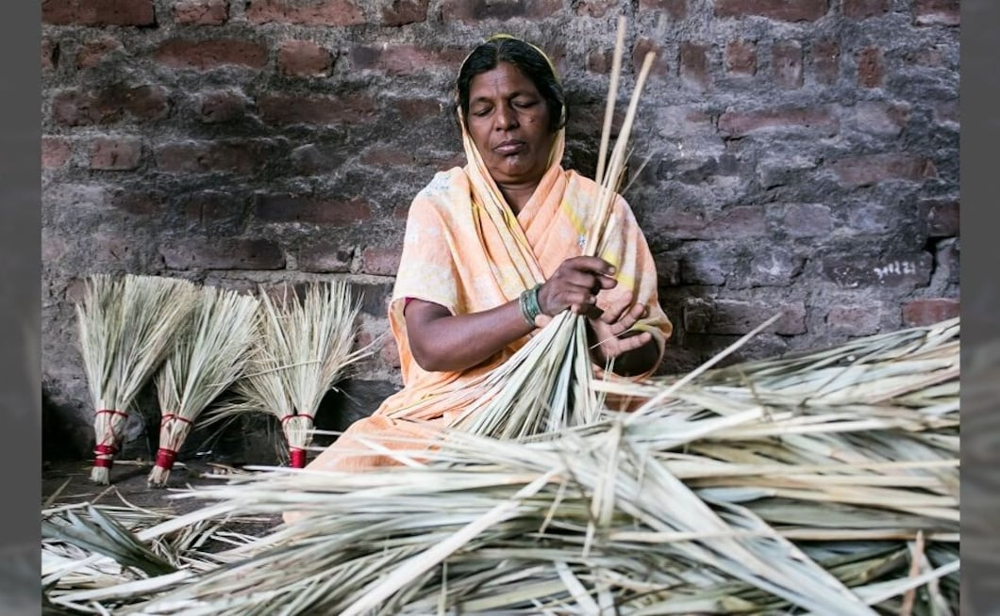<figcaption>  
*Sulabai Kamble, 57, from Ghosarwad village in Shirol taluka of Kolhapur has been handcrafting brooms for more than four decades now.*</figcaption></figure><figure class="wp-block-image size-large">

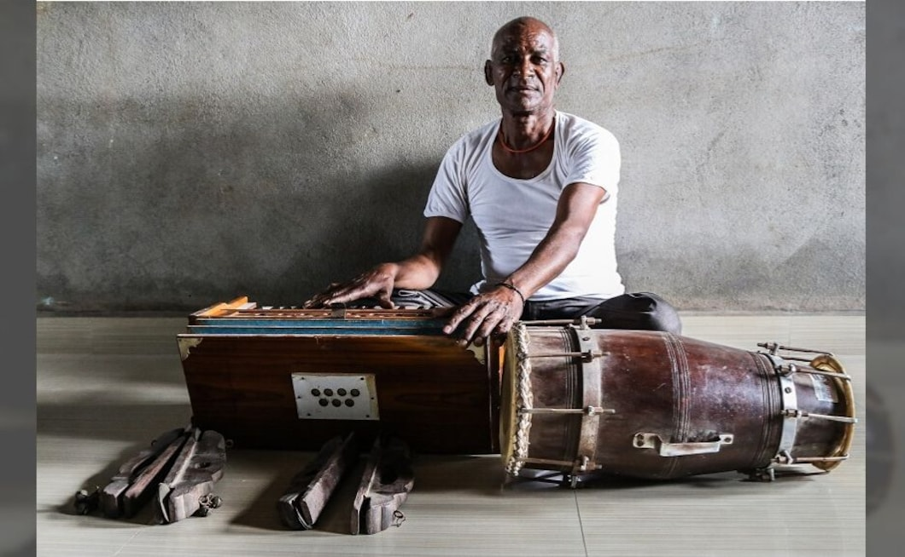<figcaption>  
*Eknath Dhanavade, 66, works as a mason from 9 am to 5 pm, and then resumes his passion for classical music. A musician from Morewadi village in Kolhapur district, he accompanies rural singers to several villages in Maharashtra and Karnataka. When I met him in 2017, he said, “There’s a lot of casteism in the world of music.”*</figcaption></figure><figure class="wp-block-image size-large">

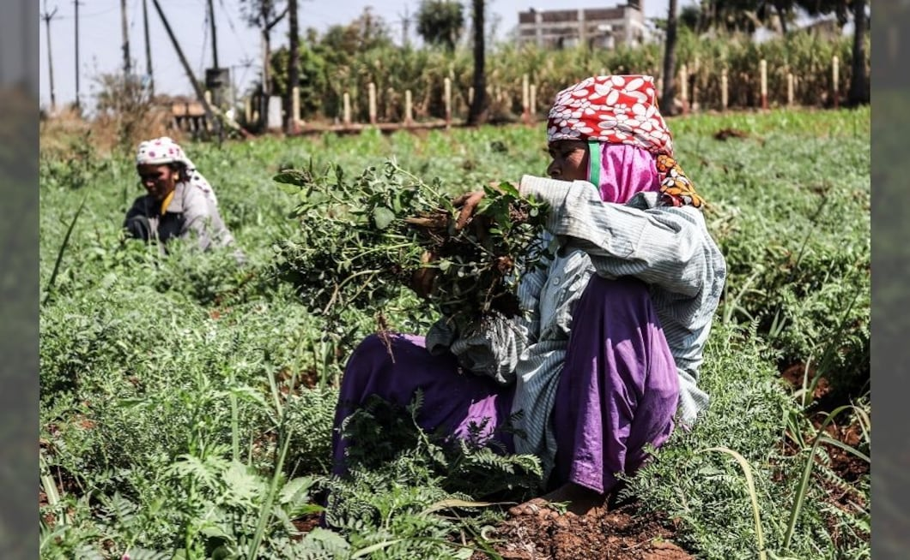<figcaption>  
*An agricultural labourer on the outskirts of Rangoli village in Kolhapur district. She was talking about how rampant alcoholism in her village has severely affected the lives of women and kids.*</figcaption></figure><figure class="wp-block-image size-large">

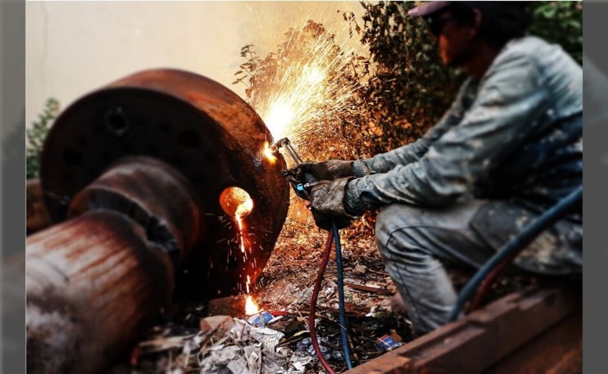<figcaption>  
*A worker welding the scrap in a local foundry at Ichalkaranji town of Maharashtra*</figcaption></figure><figure class="wp-block-image size-large">

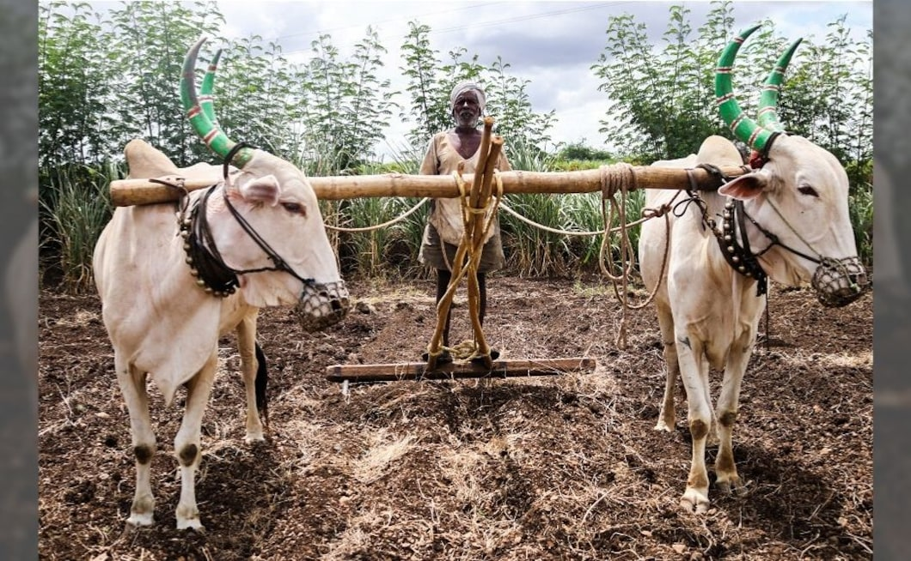<figcaption>  
*Shivaji Vandare, 80, from Manerajuri village in Tasgaon tehsil of Maharashtra’s Sangli district, works as a tenant farmer and agricultural labourer. He farms on four acres of land where he grows soybean, groundnut, and at times a species of jowar called ‘shalu’.*</figcaption></figure><figure class="wp-block-image size-large">

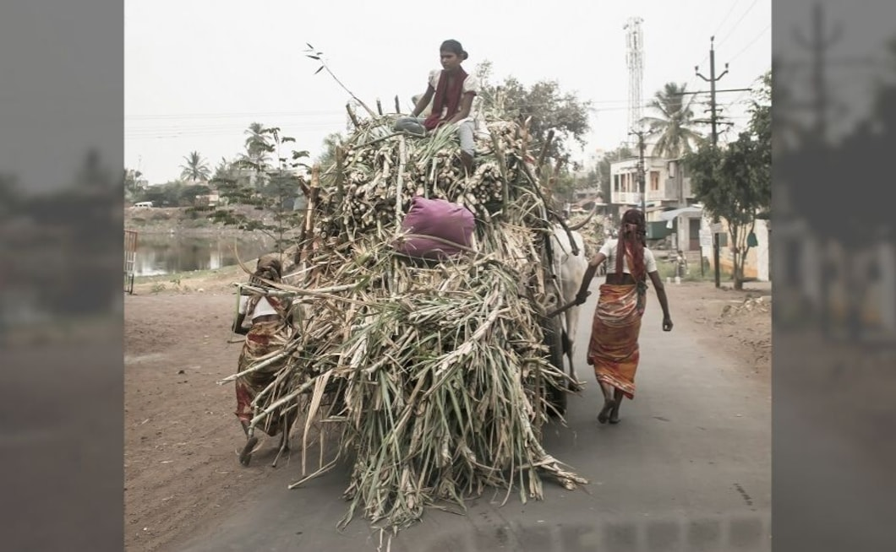<figcaption>  
*A woman farmer trying to slow down an accelerated cart (down a slope) by inserting a wooden stick in the cart’s axle. If not done properly, the force can even lead to fractures.*</figcaption></figure>