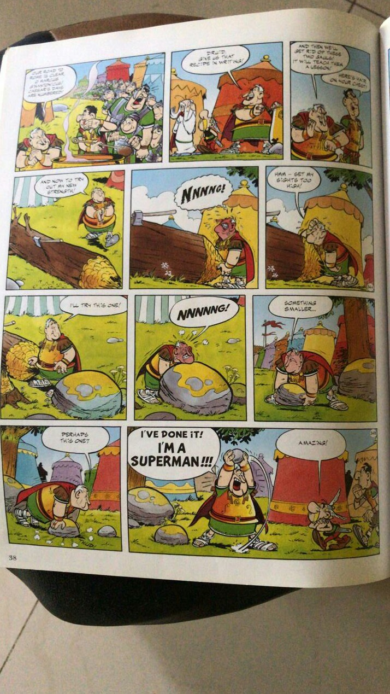

If you’ve not heard about Dr. BJ Fogg or Tiny Habits, let me suggest this 800-word [primer](http://www.ulaar.com/2014/08/14/experiments-in-tiny-habits/) on the habit guru’s key principles. If you are struggling with an unambiguous definition of *tiny*, the masters Goscinny and Uderzo (and if these are new names to you, I won’t judge you but will exhort you to read 10 of their masterpieces asap) illustrate it with humorous brilliance.

<figure class="wp-block-image size-large"><figcaption>*This scene is from Asterix the Gaul and the image is courtesy my friend &amp; renowned Asterixologist Rinaz*</figcaption></figure>So the prescription is pretty simple folks. Start with that tiny rock and work your way up to that large boulder. Sure – you’ll not yell “I’M A SUPERMAN” on day#1 but once the streak gets to 100 or even 200 days (and maybe you’ve reached a mid-size boulder), you’ll feel it. All the best!