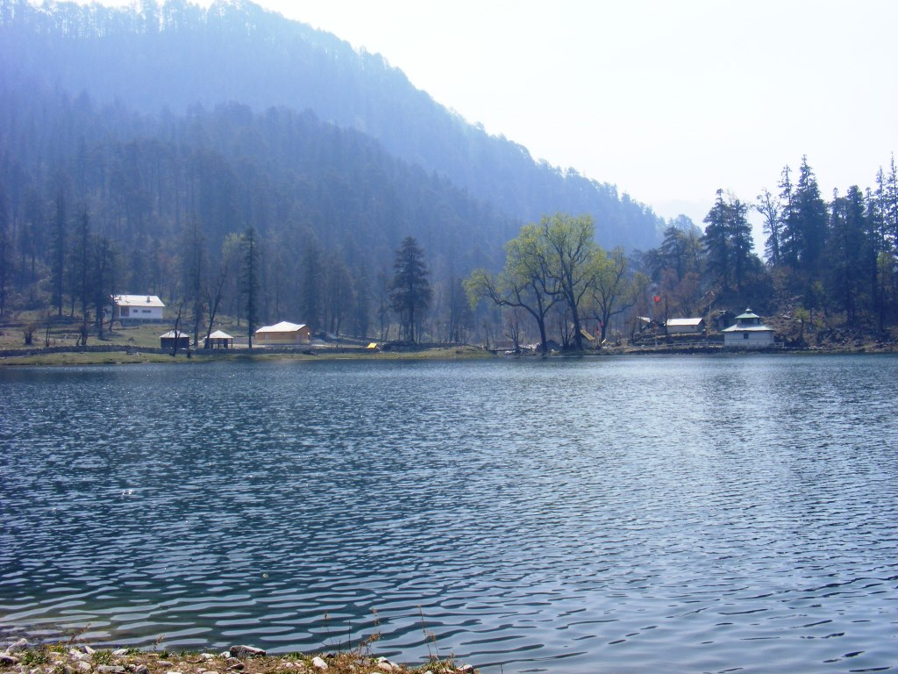

“Hey V, are you carrying your inhaler? R is having an asthma attack further up the trail.”

It was day #6 (of our 3-week trek from Uttarkashi to Yamunotri) and my first reminder that I was an asthmatic. I rummaged through my rucksack, found the inhaler and ran along with the messenger.

Ten minutes and a few puffs later, R’s breathing came back to normal and everybody heaved sighs of relief.

\*\*\*\*\*\*

Our seniors had scared us plenty about the rigors of Tata Steel’s 3-week trek (aka *Character building course)* which was mandatory for all trainees. The paranoia levels were high enough that most of the batch were seriously following a “get in shape” regimen months before D-day. My lungs had spent a lifetime playing “defense” so I needed to put in more than a pedestrian training volume to raise my game.

\*\*\*\*\*\*

It was as though the crystals of green kryptonite (lurking in my innards) were able to foil my attempts to become superhuman *in the plains*. But those very same crystals were neutralized by the crisp and pure mountain air! I could think of no other explanation why I felt *so* normal (*athletically speaking)*. Of course it helped that the legendary Ms. Bachendri Pal (of [Tata Steel Adventure Foundation](https://www.tsafindia.org/)) was leading our expedition, ably supported by Mr. RS Pal (her illustrious brother) and seasoned Everest campaigner Magan Bissa. If this was not inspiring enough, we also had a 5 year old (son of Everest summiteer Ang Dorji) perpetually in the lead pack with an effortless hurried gait that confounded us greatly in the initial days.

Another noteworthy episode (in the second week) went a bit like this. My pal Uttam and I had gone slightly ahead (‘strayed’ from our groups is more like it) and came upon a downhill stretch – not a treacherous incline but certainly not a bunny slope. We cast one look behind, exchanged a quick look and tore down the slope. Several intense minutes later and after negotiating some skids we reached the base panting like dogs at the head of a hunting pack. Don’t recall who won the race — not that it mattered (then or now).

Our final camping stop was in the town of Hanuman Chatti. The final leg (to Yamunotri) was really interesting because we we’d do it *without* our rucksacks. My recollection was that the one-way distance was 20km but per Google it’s more like 11km. After 3 weeks of trekking with a loaded rucksack, its absence made every one of us superhuman. It didn’t matter that the trail to Yamunotri was *up* and the return was *down* — we raced like pro athletes. The fun interlude at the top of the hill was soaking ourselves in a super hot thermal pond.

After we descended to Rishikesh, there would be a final memorable high. I chronicled the 5k race 5 years ago – [when finishing fourth became a game changer](http://www.ulaar.com/2015/08/11/when-finishing-fourth-became-a-game-changer/).

Two years after I’d become a barefoot runner, I wrote [a gift that keeps on giving](http://www.ulaar.com/2013/07/15/a-gift-that-keeps-on-giving/) – a paean to a recent Nandi Hills run. That was when I first realized how pivotal those 3 weeks in the Himalayas were for me. I wrote that (in third person),

> “In Uttarakashi lies the answer. That’s where he felt (almost) invincible for the first time in his life. He was trying to reproduce some of that magic today. As all of you are widely attesting to, he WAS feeling strong – he just wanted to attack the slopes with the same vigor a second time.”

**Happiness is only real when it’s shared**

Of late, I’ve come to the realization that I don’t write posts. The posts tell me when it’s time for them to be written. Two nights ago, I read [The tragic allure of Alaska’s Into the Wild bus](https://edition.cnn.com/travel/article/alaska-into-the-wild-bus-tourist-allure/index.html). Immortalized by Jon Krakauer, Chris McLandless is the modern day (tragic yet inspiring) embodiment of the allure of the great outdoors.

I shared the story on Whatsapp –&gt; a friend shared back the soundtrack of the airlifting video –&gt; which reminded me of Animal Collective’s Banshee Beat – background score in this climbing video [Grand Teton by Anton Krupicka and Kilian Jornet](https://www.youtube.com/watch?v=Z_Z1-smRsoU) (ascent in 2:05, descent in 1:18). As I was doing the dishes Friday night, I listened to it on loop. Then again on Saturday morning after I returned from a breezily satisfying 15k run. Then again Saturday night dishwashing time.

There are so many layers of awesomeness in the 8-min video that the trail runner, hiker and climber in you will be able to unpack. For me personally, I finally understood why those 3 weeks in the Himalayas were so pivotal to me.

Closing note: Our fearless guide Magan Bissa suffered an [accident in 2009](https://www.hindustantimes.com/other/mountain-rescuer-now-waiting-to-be-rescued/story-aSilnUXBbofUoqTHOXNWDP.html) which nearly took his life (our Tata Steel batch responded to the crowdfunding campaign). In this [2013 article](https://www.zdnet.com/article/amid-everest-climbs-60th-anniversary-indians-adopt-the-sport/), we learn that he survived, is still climbing and still harbors a dream to summit. In his own words,

> “It’s been an obsession with me since 1978,” he said. “My intestines are damaged now but I’m hoping that there will be some technology that can aid me.”
> 
> “You see, Everest is my Olympics and I still have to get the medal.”

<figure aria-describedby="caption-attachment-4260" class="wp-caption alignnone" id="attachment_4260" style="width: 300px">

<figcaption class="wp-caption-text" id="caption-attachment-4260">
    Dodital Lake, one of the beautiful scenes etched in our consciousness
</figcaption>
</figure>