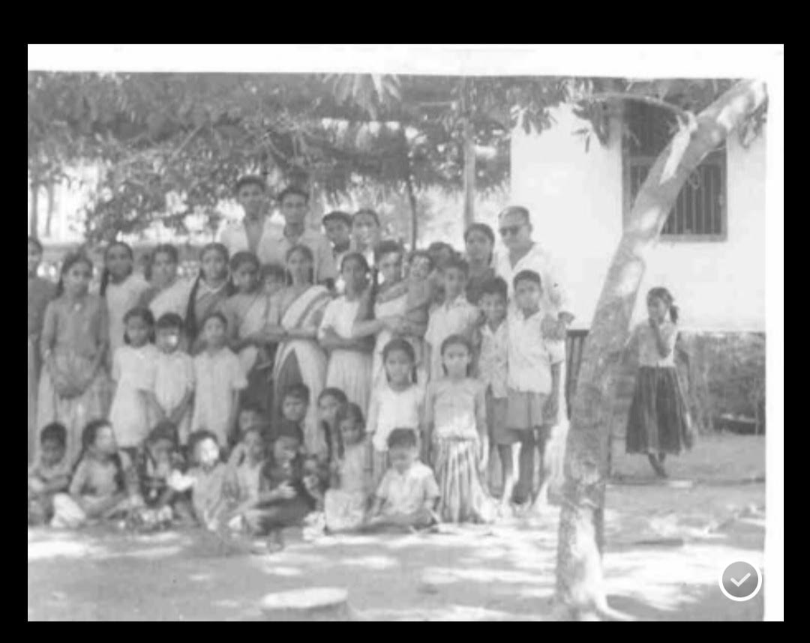
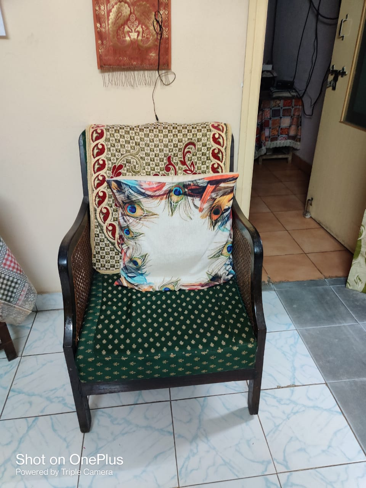

*\[Editor’s Note: My mother, a late adopter of the Internet, used to write the loveliest of letters to her children pre-Internet era. The letters stopped after I returned to India. In the past few years, after she got comfortable with Internet and gmail, the letters resumed as emails to her children. After an extended hiatus, this is the story of a wedding from 1959, triggered by a black and white group photo that one of her cousins discovered in a family album. Despite the blurriness, you can spot the writer easily - the only girl holding an infant. The email has gone through a minor editing lens without changing writer’s tone and voice. I’ve italicized the Telugu names and provided translations in “\[ \]”.\]*
 

Dear ones,

Today morning _Kakki_ [writer's younger sister] forwarded the group photo of 1959. Since morning I am in the past memories. I narrated so many times about Lalita's and Sirisha's marriages. Now that I got the photo I have some more material. Sirisha's marriage took place on 10th May 1959. After attending Sirish's marriage (at Tanuku) all of us proceeded to Rajahmundry to attend Lalita's marriage on 16th May. We reached on 12th itself.

32 cousins with parents attended from our side. Lot of fun! I am not able to place many in the photo. Rajahmundry house was a big mansion built by my maternal grandfather. He was an honest and noble judge. Unfortunately he could stay there in that house only for 2 years after building it. Neither did our _Mavayya_[uncle and father of May 10th bride] who lived in Samalakota and later in Madras.
     
It was a two-storey house with lot of garden space. Many fruit trees were bought from special nurseries and grown - mango, sapota, narinja, coconut, and badam I remember. Lemon and curry leaves shrubs and (of course) plenty of flowering plants like sampangi.

It was an irony that Sirisha, the daughter of the house owner got married in a remote small town (Tanuku) while her cousin (Lalita) got married here. After my grandfather's death, a portion of the house was let out. My _ammumma_ [writer's maternal grandmother] was staying in the main portion with _ammakkayya_ and her daughter. Guntur _tatayya's_ family lived in the rented portion for 2-3 years when he was posted there.

Coming to our present topic. In 1959 my Hema _kakki's_ family were living in the main portion as Lalita's father (a radio engineer) had been transferred to Rajahmundry.

After the marriage was over, my _Mavayya_ asked somebody to click a photo with all his nephews and nieces. The one who is in the right corner (with goggles) was our uncle. The window you see was the room where _Kakki_ and I (and most of our cousins) were born. I don't recognize any kid in the photo. It took some time to even locate _Kakki_. The infant I'm holding is Hema _Kakki's_ youngest child - Prasad.

Last point - I was crazy about wrist watch. Satyakkayya [older cousin sister] allowed me to wear hers for some time (without me even asking her). While standing for the picture my whole attention was on how to keep that watch visible! First time when I saw this photo I was looking for the wrist watch!! Even this morning!!! Very funny.

My watch story doesn't end here. Many times I asked my mother to buy me a wrist watch. She  used to keep quiet. Later I stopped asking. One evening when I returned from college,  at the doorstep itself with a smiling face told me "father has got you a watch through a friend from Ceylon." I ran inside and she showed me the tiny cute watch in a box... but without strap! 

That means I had to wait for some more time! So crazy of me. Small things give extreme happiness, right? 

Your loving Amma.

That's it for now.

*Closing Note: Fittingly, in a serendipidous way, the two cousins (Sirisha and my mother) now live within 500 meters of each other in Hyderabad. The universe also gave a hat tip to this post - the two met in person last week. A picture from their trip down memory lane is the 100 year old chair that once graced that majestic mansion in Rajahmundry.* 

 The 100 year old chair 

