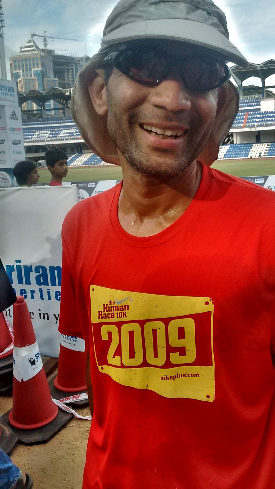
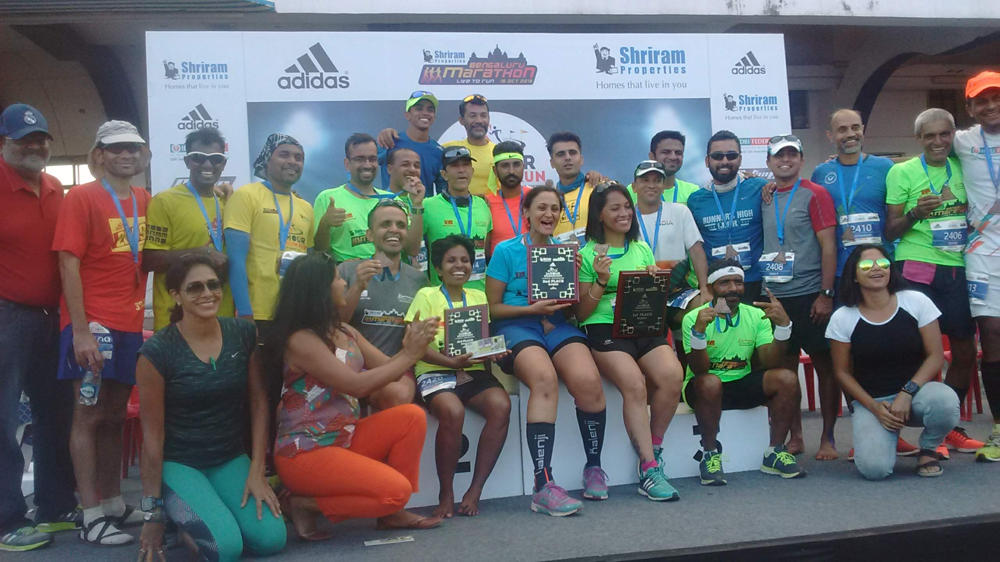
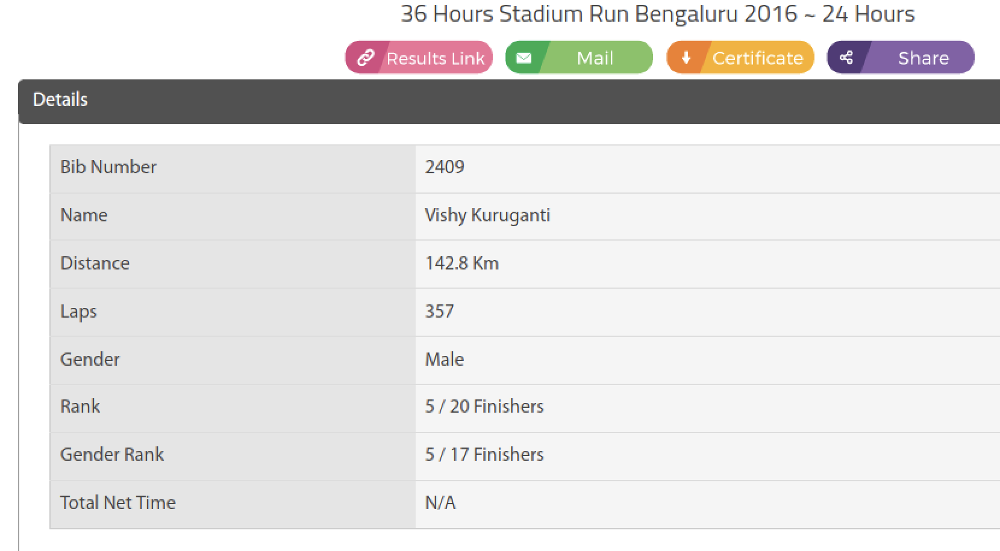

"I can understand you running 22 marathons in 22 months. I can even understand you running the 75K. But running for 24 hours -- I just don't get it, boss!" 

My childhood buddy Dheeraj reacting to my 'update' that I had run 143k in 24 hours... on a 400 meter synthetic track in a Bangalore stadium.

It’s been five years since I ran the longest distance of my life. I’ve made multiple attempts to finish this post but none succeeded because I could not answer why I did it and whether I would I do it again. 

I still don't have answers but I'm now reconciled to the fact that some things shall remain in the realm of the subconscious. 

2016 wasn’t the first year that Nagaraj Adiga (& NEB) organized the stadium run but it was the year when he raised the ante by adding a 36-hour category.

Like many crazy things that one voluntarily signs up for, a few contributing factors were at play. I had run a largely self-supported [12 hour run](https://www.ulaar.com/2016/03/06/for-a-few-hyperloops-more/) the previous year so the new hill to climb was to *just double* the duration. The genesis of that prerequisite 12 hour run was a protracted and lean pulmonary patch - daily puffs from a strong inhaler just to sustain the weekly running mileage can be a real dampener. An ultra in the heart of town, a mere 10k from home, could it get more convenient?

A fringe benefit of being part of [BHUKMP](https://www.ulaar.com/2014/02/24/the-cult-of-bhukmp/) is that there’s no dearth of pioneers (nay ‘lunatics’). There’s Navin, who puts in all-nighter runs on a whim and has raced the Nilgiris, Uttarakashi and Bhati Ultras (he came tantalizingly close to UTMB qualification). There’s Randeep, who had a frustrating debut DNF at Bhati Lakes and decided that winning it the next year was the best way to bury the ghosts. Then there’s Sunil, Bangalore’s ultra patriarch who conquered Comrades at a time when some of us thought that it was a Hash race in a Communist country. And there’s Jugy, the group’s Barnabas Sackett and trail discoverer par excellence who was running ultras when most of us were still wet behind our running ears. And finally there was Praveen Singh -- always a step ahead of me - running 75km when I was doing 50km and here he was -- targeting the 36 hour when I felt 24 was plenty daunting.

These lunatic runner friends, besides being a source of inspiration, serve an important role in preserving domestic peace. Conversation with the missus went something like this:

"Honey, I've signed up for the 24 hour ultra."

"You have WHAT???"

"Well.. you just run as many loops as you can around the Kanteerava Stadium track - from Sat 6pm to Sun 6pm. I can run, I can walk, I can run-walk. I can stop. There's even a tent with beds where I can snooze if I get very sleepy."

(She's processing it while shaking her head in that old familiar way)

"And you know what? Naveen, Randeep, and Praveen are so loco - they signed up for the 36 hour!!!"

And that's how I managed to normalize my craziness.

**Tips from the vets**

Praveen and I were newbies to this _time (not distance) is the currency_ model of running. No training plan was downloaded from the Internet but a rough construct was shared by the Village Elders. Details are a bit sketchy now but here are some important tenets that Navin shared (and I religiously followed):
- Cover all the timezones (i.e. multiple runs spanning the full 24 hour cycle)
- Snack every two hours and full meals every 4 hours 
- At least two weekends with a 12+6 hour running volume

**Memorable training runs**

- First order of business for Praveen and me was to demystify the all-night run. Choosing Navin & Randeep for company on the predictable inner loops of Brigade Gateway felt appropriate. It didn't disappoint. The most eventful thing on that Friday night run was a drizzle that lasted maybe 30 minutes.
- A few weeks later, Praveen and I did another 12 hour run starting at midnight, this time in the upscale Koramangala 3rd block streets. The first highlight of this run was running shirtless for 2-3 hours - tickled us to no end as we kept up the rectangular automaton beat. Breakfast was at a hole-in-the-wall joint on 80-foot road. In broad daylight, our theater of operations expanded somewhat and the final hilarious incident happened close to noon. As we were crossing the 8th Main/7th Cross junction for the 25th time, we heard a familiar voice in a passing car "You guys are STILL running?" (Rinaz and Shilpi heading for lunch - they had run the morning segment with us)
- The final long run began at 9pm on a Friday night. The 500 meter stretch of road in front of my apartment would be the stage for the first 7-8 hours. A well-lit street with houses on both sides, it was perfect for a solo monotonous toil. Up-and-down I would go maintaining the rhythm - run for 25 min, walk for 5 min. My running vest had adequate supplies for hydration and snacks. For my midnight and breakfast meals, I had sandwiches stowed in the car. After a few rounds of plodding it became evident to the neighborhood dogs that I posed no threat and they returned to their _stiff upper lip_. Sometime after midnight, I heard the drone of an approaching bike rapidly followed by a skidding screetch and the thud of a falling body. It was past midnight but the street wasn't deserted. As I turned and rushed towards the scene, a motley group of youngsters (who were hanging out on the 2nd floor of a nearby building) had reached before me. The male driver was largely unscathed but the female pillion rider had fallen unconscious in the middle of the road. One quick phone call and the inebriated couple's friends landed on the scene and quickly rushed the woman to the hospital (she 'seemed' out of danger). 

**Race day - Aug 7-8, 2016** 

The 36 hour race started at 6am on Saturday and the 24 hour race at 5pm, thoughtfully planned by the organizers to ensure that the two groups of finishers would have an undiluted non-overlapping celebratory time under the setting sun. I would normally write this section in prose but really.. who wants to read a boring chronological sequence of my <insert-adjective> 24 hours? However there are some memories that stubbornly insist on being shared. So here goes:
- Change of tees I've done in past ultras but this was the first time I needed to do a change of shorts as well (the rest area tent was really convenient). Meanwhile, the 36 hour winner Apurba pushed through the day-and-half with the same soaking yellow tee (true fauji I suppose!)
- The prospect of loo breaks is always a tricky one during ultras. Not in a stadium run format when a Portolet is always just half a loop away.
- Vaseline, usually a great defence against friction, stops working after 12 hours no matter how many times you re-apply
- Footwear strategy worked - barefoot for first 3-4 hours before switching to socked sandals until the end
- I was warned to stay warm during the night and I heeded the advice - my starting attire was tights+shorts and I donned a Windcheater around 8pm and I only changed to shorts at daybreak
- Planning/training with a clear run:walk ratio and having the discipline to stick to the plan for extended periods is key to maintaining rhythm and momentum. I started ambitiously (as expected) with 6:1, after a mere 2 hours realized I needed to downgrade to 5:1 - stuck to this for maybe 8-10 hours before 4:1 inevitably came calling. In the final 8 hours, I was probably oscillating between 3:1 and 2:1
- Changing directions (clockwise <--> anti-clockwise) every hour - or was it every two?
- Race Director Nagaraj is renowned for the personalized attention he showers on the participants and this time was no different. When he learned that the regular 8am filter coffee wouldn't work for me, he said "Just give me 15 min", and in short order I was sipping delicious black coffee - which turned out to be JUST the pick-me-up for the final daytime assault.
- Every 2 hours, the organizers would announce the mileage of every participant. I slipped into 5th place probably at the halfway mark and would stay there till the end. At hour 22, I got my second wind. This, combined with the realization that #4 (Nirav Patel) was a 'mere'  8km ahead,  made me push my pace to try and catch him. Turned out Nirav's second wind was stronger :) - he raced ahead in a bid to catch #3 (Abbas) and would eventually finish 10km ahead of me (and 6km behind Abbas). Chandigarh's Amit Kumar (189km) and Mumbai's Girish (183km) towered over the rest of us.
- My family arrived sometime after hour 22 - my spirits lifted so much that I stopped my walking segments entirely. As I finished lap #357, I was informed that it was just a minute to 5pm so my next lap wouldn't count - who wants to listen to reason when you can finish on a high? I ran the final lap at 5:00 pace feeling all smug.
- On the Uber drive home, my son asked "Dad, did you feel anything special?" I answered "Somewhere close to hour 20, I became overwhelmed with emotion. Like when you are watching a movie when an intensely emotional scene plays out and one gets a lump in the throat and tears threaten to well up." Except there were no spectacular thoughts going through my head at that time. Perhaps it was an intense feeling of gratitude? Gratitude for the entire experience -- my decision to sign up, the training regimen, and with the finish line a few hours away, I was possibly _beside myself_. I suppose. But who knows for sure?

<figure aria-describedby="caption-attachment-3558" class="wp-caption alignleft" id="attachment_3558" style="width: 800px">

<figcaption class="wp-caption-text" id="caption-attachment-3558">At the end</figcaption></figure>

<figure aria-describedby="caption-attachment-3558" class="wp-caption alignleft" id="attachment_3558" style="width: 800px">

<figcaption class="wp-caption-text" id="caption-attachment-3558">All the 24 hour finishers</figcaption></figure>

<figure aria-describedby="caption-attachment-3558" class="wp-caption alignleft" id="attachment_3558" style="width: 800px">

<figcaption class="wp-caption-text" id="caption-attachment-3558">My stats</figcaption></figure>

