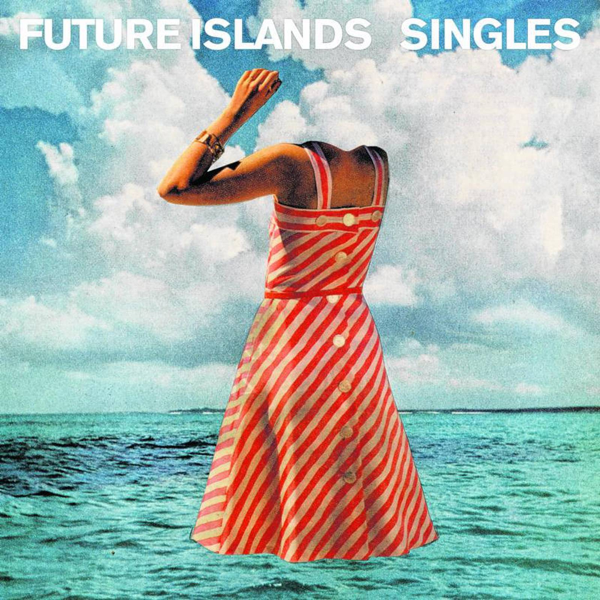

This thing called *work-life balance*. Is it really mythical? And is there only one kind? My answers are No and No. Allow me to explain.

But first..

Long-suffering readers of this blog will know that I don’t come to the point right away. I *need* to talk about the trigger for this post.

******************************************************************************************

After bingeing on [Beach House](https://www.ulaar.com/2022/01/23/mysticism-of-dream-pop/), it was natural for the YouTube algorithms to introduce me to other delightful sounds near the dream-pop spectrum. Enter **Future Islands** - a Maryland-based “synth-pop band/alt-rock/indie pop” with roots in North Carolina. It’s easy to get hooked to Samuel Herring’s voice, aptly described on Reddit as *“growly and screamy, kinda like a soul singer crossed with a metal growl, singing synth-pop”.* I’m yet to find a meh Future Islands track but the trigger for this post is Balance ([Video](https://www.youtube.com/watch?v=g0LJNEQz-E4), [Audio](https://music.youtube.com/watch?v=vSMWVKVfhME&feature=share)). Partial lyrics below: 

*You can clean around the wound*

*But if you want it to heal*

*It just takes time*

*And you can call up to the moon*

*But if you want something to change*

*You gotta change your life*

*And take your time*

*It just takes time*

*A little trust and your time*

*You can change your life*

*It just takes time*

*A little trust and your time*

******************************************************************************************

My friends have often joked that the best company to *retire to/within* - is Microsoft. The catch is that one should have already have put in a tenure of a few decades 🙂. Leaving aside the Microsoft jibe, the advantage of a protracted tenure at any company is that one is able to be productive without necessarily putting in insane working hours. I’ll admit that insane working hours usually correlate with high entropy which are associated with earlier stage (less mature) companies. As a reminder, I moved from a pre-IPO company to a Series C startup last year - [my mobility triple jump](https://www.ulaar.com/2022/04/20/mobility-triple-jump-rapido/).

Suffice to say that that my Rapido journey is an order of magnitude more intense than Gojek (which was no slouch, by any stretch). Yet, in a short span of 3 weeks in Aug, I had signed up for the Bengaluru Half Marathon - BHM (Oct 16), Kaveri Trail Marathon - KTM (Nov 27) and Tata Mumbai Marathon - TMM (Jan 15, ‘23). Yes - it was an impetuous decision in a manner reminiscent of *“Is it really a smart personal decision to start a company when you have recently become a parent?”* 

Yet it was a decision entirely in character with how I approach the interplay between my work and life. There are two kinds of *work-life balance* - the kind where your hobby (sports/art/whatever) is your catharsis and the other kind - which can be loosely described as *work-hard-play-hard*. For most of my working life, I’ve favoured the former but there’s a (special) time and (a special) place for the latter — and one just *knows* when it comes calling. 

Would I be able to follow a disciplined training schedule when my work demands that I chase  aggressive targets over a sustained period? 

The answer is a resounding yes because..

- When there’s no doubt about the primacy of work (over play), why would there be a clash in priorities?
- What I do *off* the field (“play”) is a virtuous cycle that feeds into what I do *on* the field (”work”) so..
- When I’m consistently performing in my running workouts, the joy carries over to my work as an additional fillip and, as a corollary,
- When I’m falling behind on my workouts (read “play time”), it reduces the joy I take to my work and thus serves as the proverbial guard rail - ensuring that I don’t fall behind too much.

> *God, grant me the serenity to accept the things I cannot change, courage to change the things I can, and wisdom to know the difference.*
> 

Three weeks before that first race (Half Marathon), I developed a bad case of plantar fasciitis. The initial assessment was that all my races were a wash! Fortunately I recovered in 2 weeks, laced up for the BHM, albeit with a resolve to not push myself. Finished in a respectable time of 1:53.

The key takeaway from the plantar episode was that this new training plan (with all 3 weekly runs being *intense*) was not for me - at least in 2022. I down-calibrated the long run time targets but retained the rest of the plan. The other adjustment was to add two weight training workouts to my week - something that should have been included in the original plan!

KTM, a high-humidity trail race with all kinds of nostalgic memories (from 7 consecutive years of running), beckoned but the Nov 27 date was far from optimal. The training plan I was following for TMM had a 32k run slated for Nov 27. I was far from ‘full marathon ready’ so my first thought was to downgrade my registration to a half and turn the event into a 32k training run. As it turned out, my registration downgrade didn’t get processed - this I took as the clearest sign that I should proceed with the FM as planned. I *needed* a recent visceral memory that’s the 35-42km stretch - after all, it *had* been 3+ years since my last marathon.

Race day vindicated my decision. The nutrition plan (powered by Leap [energy gels](https://leapstore.in/)) largely worked. I was reminded that Endurolytes insurance might yet be needed for TMM. I got the visceral memory I was seeking - cramps paying a few visits between 36k & 39k but I was able to ‘stamp them away’ (literally!) While my pace took an expected dip in the final 5k, it was not precipitous. I finished in 4:32. Considering only 2 of my KTM finishes were faster than this, I’m filing this under “good result”.

December capped 2 frenetic months of planning and goal-setting at work and my aforementioned tribulations around life/running  - enuf said about the latter, huh? 

The chase is well and truly on! The outcome of the first chase will be known in 2 weeks. The other one will play out for the better part of 2023 (raising a fingers-crossed toast while murmuring the serenity prayer).

******************************************************************************************

Closing with a very important announcement — I am fundraising for **AADI** (the frontrunner in creating service delivery models for people with multiple disabilities). How do I even know AADI? Well, this organisation inspired my childhood friend (Charulekha) to join them 30 years ago where she continues to “deliver on the mission” with the same zeal. Please give a careful consideration and [support my fundraising campaign for AADI](https://www.unitedwaymumbai.org/fundraiser/6974). Thanks!
