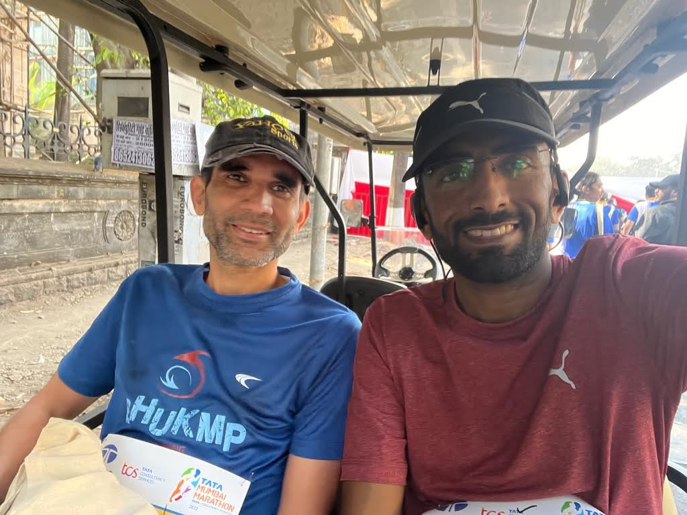
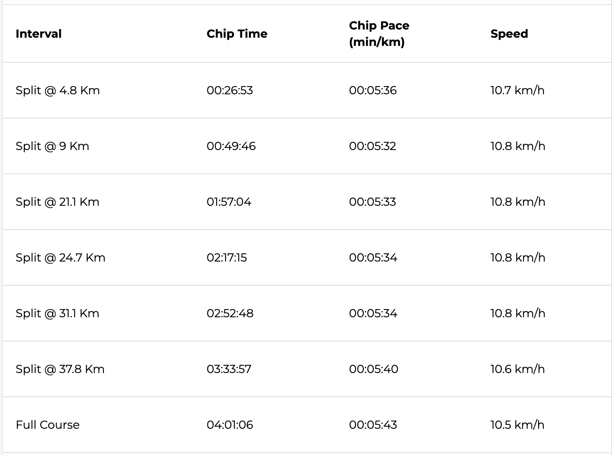
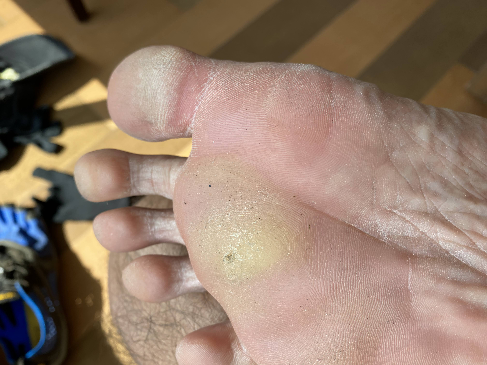

“This time it’s different.”

“He he he.. When did you get interested in stock markets?”

“I’m talking about his *state* of mind, you dunce!”

“Yeah, it’s certainly different this time. He has a sense of calm and satisfaction that I haven’t seen before.”

“He is always *determined* when he comes here but seems a lot more realistic this time.”

“You know this is bad news - he’ll make all of us suffer!”

“What do we do? What do we DO? What SHOULD we do???”

“Calm down, Donna! YOU of all people!”

“Silly Donna! That first year she thought triggering a fever 2 days before race day would work”

“Well, it *would* have.. if that useless doctor hadn’t egged him on…”

“<..> was hard, he waltzed in with unbridled positivity in a season where he could do no wrong. And it took that masterstroke from S to remind him of Bikila’s recidivism.” 

“Does anyone here feel bad that we are always so damn negative and so damn conservative — that it’s always *our* job to slow him down even though there is no real risk of him dying in these races he insists on running?”

(a protracted silence punctuated by “Ums” and “Errs”)

“Well, it IS our job after all - imprinted into our cellular structures from time immemorial.”

*******

Prateek and me waiting for Anjana post the TMM2023 carnival

If you are scratching your head, I need to tell you that I possess this super-power where I witness my body parts talking to each other through morse-code like muscle twitches which amazingly get decoded as multi-tonal voices in my head. The above conversation was witnessed a few hours before the start of Tata Mumbai Marathon 2023. (Previous episodes - [it’s all a vast upper body conspiracy](https://www.ulaar.com/2012/06/14/its-all-a-vast-upper-body-conspiracy/) and [a gift that keeps on giving](https://www.ulaar.com/2013/07/15/a-gift-that-keeps-on-giving/))

**The best-laid plans of mice and men often go awry** 

Nowhere does this ring true more consistently than in runners’ (in)ability to get quality sleep the night before important races. Which is why it’s a good idea to travel a few days earlier for out-of-town races - it ensures quality sleep at least for previous nights.

My roommate (PM) had booked us in the fancy Trident Hotel this time. That, coupled with early dinner dispensation meant that major todos had been checked on schedule. However, as history shows time and again, the mind had other plans. I was getting nowhere near to slumber — however hard I tried (and I tried every goddamn visualisation / counting-sheep trick in the book). Then I stopped trying and surrendered - reminding myself that I *am* capable of racing with zero hours of sleep - this didn’t work either. Oh how I wished I was Valentine Michael Smith for one night! By the time I had re-adjusted the thermostat for the 5th time and visited the loo a second time, I finally checked the time - it was past midnight! 

It was when I surrendered for the second time that I finally got the zzz’s I sorely craved. I woke up a few minutes before my alarm rang and by ‘woke up’ I mean *“my mind was awake but my body parts didn’t know that yet”* — a key prerequisite to these inner-body seance experiences I’m being blessed with ^^. 

**Race & the “pain cave”**

My terse race report: *“Finished in 4:01. Was shooting for 3:52 but callus in my right foot bothered me in the last 15k (with excruciating pain in several sessions). With the rebalance adjustments I had to make, risk of triggering left calf cramps was real. Fortunately I cramped at the post-race recovery tent. Kinda like your car tire going flat after a long road trip just as you pull in to your garage !”*

The tortuous beauty of the marathon is that putting in 100% training effort is still no guarantee for race day glory. The running gods may also need to smile! And what if your training effort is <100%? Well, be prepared for a world of pain and no matter how rigorous and pragmatic your target time setting was, it would still be imbued with trepidation and flickering optimism. And it’s those very same emotions that course through your being as you ebb and flow towards the finish line, constantly (re)assessing whether to slow down or speed up. Of course, after a point it’s just a fight between “how little” vs “how much” to slow down, i.e. after you enter the ***pain cave***. 

No ultramarathon elite has embraced the “pain cave” more wholeheartedly than [Courtney Dauwalter](https://www.nytimes.com/2023/08/31/sports/courtney-dauwalter-ultramarathon.html). At the peak of her powers and definitely in all G.O.A.T conversations, Dauwalter describes her first encounter with the pain cave as a place where she could no longer bear the suffering and would have to stop running. Once she realised she could work through it, she came up with a unique visualisation technique: *“envisioning herself in a hard hat, wielding a chisel and going-to-town, trying to make it a dust pile while I am in there. It feels like this is a special opportunity every time it arrives because we can’t summon it whenever we want. We have to be doing something hard, push ourselves, and then maybe we will get the chance to go in. And if we do, we should celebrate that we get to be there.”*

**Made men of the mafiosi runner’s body**

I figured out something important 10 years ago. Every major part of a runner’s lower body needed to go through a metamorphosis to be truly “race ready”. At the end, each muscle group in your body would have become a *made man* and you’d have earned the right to call yourself a *mafiosi runner*. The metamorphosis would (of course) involve a journey of pain and require multiple bouts of strengthening. Why *multiple bouts*? Because some runners think there is such a thing as ‘just enough’ strengthening — and they learn the hard way that unless the root cause of the problematic area(s) is emphatically addressed, that body part won't quit complaining. In my case, I carried a glute injury for over 3 seasons and it was only resolved after a serious scare (story for another day). 

**The final lesson**

Turns out, there was one blind spot from 10 years ago. This blind spot would teach me the final lesson on Jan 15, 2023.

I became a barefoot runner in 2012. Considering that the ball of the feet (aka the “sole”) is one of the most affected parties (when switching from shod to barefoot running), it’s ironic that a callus on the sole would be ignored for 10 long years. 

The first diagnosis from a barefoot physiotherapist: *“you are constantly switching between barefoot and 4mm huaraches. Stick to one and you’ll be fine.”* I stuck to the huaraches but it didn’t work. While Dr. Scholl’s solution was super-effective in painlessly removing the callus, it kept returning. After the cycle repeated a few times, I consulted an orthopedist who gave a more plausible diagnosis - my Morton’s Toe was likely contributing to the sub-optimal pressure & friction on my foot landing area. No high-confidence interventions were suggested.. other than switching to shoes with some orthotic inserts, a suggestion that I summarily rejected.

Meanwhile, the callus turned out to be that eccentric but mostly harmless “uncle”. The uncle would regularly make his presence felt in long runs, usually after 25k and the pain would largely be in the dull and subdued range. I pacified myself thus *“if the great Tendulkar kept batting for years while nursing an incurable tennis elbow, surely this callus is nothing”.* 

**Until it was NOT nothing** 

The first half was negotiated well - just 2 minutes off target. I continued through to 25k at the same pace. The race splits might suggest that callus distress started at 31k but it was closer to 28k. I have this practice of conversing with distressed body parts while racing. On that day, it went something like this… 

*“Hey… what is happening?”*

*<silence>*

*“I’m really REALLY sorry you are in pain. Aren’t the Vibrams working better than the Tribord Aquashoes?”*

*<pregnant silence>*

I *had* switched to the Vibrams just 3 weeks before race day. I was fully aware that a change of footwear at such a late stage is rarely a good idea but it was a deliberate “lesser of two evils” decision to give extra protection to a recovering big toe. As the pain got progressively worse, I silently cursed Donna but, in the very next moment, surrendered to the hurting sole:

*“I’m really really sorry for subjecting you to this. I took you for granted all these years and I understand today was the last straw. I promise that I will not return to a marathon until I address the root cause. Now could you please PLEASE be a trooper and help get us through to the finish without any further mishap?”*

Dauwalter’s *chiseling out of the pain cave* is a great metaphor for endurance runners but ultimately the individual has to figure out his own “how to chisel out” technique. In my case, it’s been these conversations and invocation of select mantras. 

Did it work that day? Considering my pace dropped from 5:34 (31k) to 5:40 (38k) and finally to 5:43 (full course), I’d say “yes it did”. As I took the final left from Marine Drive towards the finish line, the track playing in my head was [Song for Zula](https://www.youtube.com/watch?v=FcdOLKx2XG8). Someday in the future I WANT that track in my head to be [Beautiful day](https://www.youtube.com/watch?v=co6WMzDOh1o) because.. it *did* happen once before. 

 *If the callus could only cuss.. but I swear it was cussing.., albeit silently!*

**How many goals? Single or multiple sports?** 

If the previous two sections were on executing to a set plan, this one is about clarity & focus in goal setting.

In the middle of 2011, I had successfully transitioned to a barefoot runner which, among other things, saw me effect an orbit change from a 4:30’ish finisher to consistently flirting with the elusive sub-4:00 mark. Inspired as we are by our *peers with panache*, I started my personal madness streak - [Don’t be a mad runner, be a MAM (Marathon A Month) runner!](https://www.ulaar.com/2016/08/13/breaking-a-streak-liberating/) This streak had become my overarching goal. My wise friend Hari made this sharp observation at that time *“If you run a marathon a month, you’ll get good at "running a marathon a month", you won’t necessarily get faster.”* 

There is a reason why elite marathoners do not race more than a few times a year. My lesson from that era was that the MAM streak was compromising my perpetual goal (albeit secondary) of improving my PR. 

I found myself in a similar situation in the lead up to TMM2023. I had started yoga (as my second ‘sport’) in the middle of the pandemic and it was firmly ensconced in my life as morning slots on Mon, Wed & Fri. I was not willing to compromise on yoga so “no more than 3 running days”  became the constraint. I ended up picking the **RNRF** plan (**R**un **L**ess **R**un **F**aster) - a low volume high intensity plan that had worked for some people, had long held an appeal to me but it was, as I would find out, not a great fit for me. 

Sir Roger Bannister once had this advice for Dr. Sheehan *“You are avoiding the truth, George. Interval work is the only answer.”* In my case, the truth I was avoiding was more foundational - *running volume*. But it was a decision taken with my eyes wide open.

**“He has a sense of calm and satisfaction that I haven’t seen before”**

This part of the seance puzzle was easiest to figure out. I was fundraising for [AADI](https://aadi-india.org/) for the third time and I had picked a stretch target of raising 6 Lakhs INR. On race day eve, I had already received contributions crossing 75% of the target which meant (per previous trends) that I’d meet the fundraising target real soon.

Yes - I had come to Mumbai to run a race. But I had also signed up to raise money for a worthy charity - and this was the achievement that was generating the inner calm and satisfaction.
