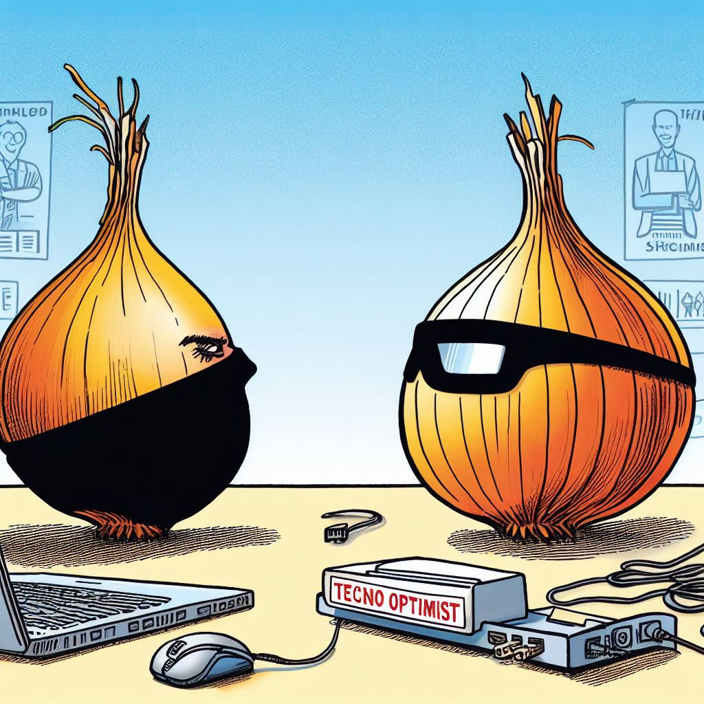

# "The Future is Basically Awesome, and We're Awesome Too”

*[Editor’s Note: The Onion doesn’t do tech satire. It’s easy to see why. But there comes a time when the juiciest of juicy stories hits (and divides).. and their editorial team are up in arms. “We MUST publish,” they say. Except they can’t. So they go looking for an obscure blogger, preferably one with absolutely no interest (or prospects) in fundraising for a hypothetical tech startup. And they found me. I guess I checked the boxes. Ladies and gentlemen, I present below The Onion’s response to Marc Andreessen’s [The Techno-Optimist Manifesto](https://a16z.com/the-techno-optimist-manifesto/).]*

---

In a recent manifesto that's been making the rounds, techno-optimists have emerged from their Silicon Valley bunkers to deliver a message to the masses: the future is so bright you might need shades, and they are the knights in shining armor here to save the day.

The manifesto, which reads like a cross between a motivational speaker's script and a corporate mission statement on steroids, is filled with grandiose claims about the transformative power of technology. These techno-optimists don't just believe in progress; they practically want to marry it.

**Lies vs. Truth:**

The manifesto begins by accusing everyone else of telling lies. Apparently, we've all been duped into believing that technology might have some downsides like job displacement, environmental issues, and societal degradation. Clearly, we've been living under a rock while these techno-saviors have been riding the rocket of progress to the stars.

**The Promised Land of Technology:**

According to the techno-optimists, technology is the be-all and end-all of human achievement. We can all become techno-superheroes and bask in the glory of a world where everything is cheap, abundant, and as hassle-free as borrowing a pencil. Who knew that technological innovation had the power to solve all our problems, from pandemics to poverty, with the precision of a superhero saving the day in a Marvel movie?

**Economic Enlightenment:**

For these techno-optimists, free markets are the holy grail, and capitalism is the path to salvation. They even throw in some Milton Friedman quotes to hammer the point home – because nothing says "I've got the answers to the world's problems" like quoting economists from the 20th century.

**Don't Blame Technology for Anything:**

One of the central tenets of this manifesto is the absolute rejection of any form of resentment. Apparently, being resentful is the root of all evil, and any problem, whether created by nature or technology, can be solved by... more technology. Starving? Green Revolution. Dark? Electric lighting. Cold? Indoor heating. The Earth's climate changing? More technology, please!

**No Conflict Between Capitalist Profits and Social Welfare:**

The techno-optimists believe there's no conflict between making a fortune and supporting social welfare programs. After all, the profits from rampant capitalism will pay for everything else society wants. Who knew that the 1% was just a misunderstood, benevolent Santa Claus figure?

**The Techno-Capital Machine:**

Combine technology and capitalism, and you get the "techno-capital machine" – a magical contraption that can create infinite wealth and solve all the world's problems. They should patent that machine and end world hunger once and for all.

**Intelligence and Energy:**

To these techno-optimists, intelligence and energy are the pillars of human progress. They want to make everyone smart and give them more energy, in a sort of real-life version of Popeye's spinach. They also believe that nuclear fusion is just around the corner, as if all the failed fusion projects from the past are mere footnotes in the history of progress.

**Abundance and the Ultimate Resource:**

Their vision for the future is a place where everything is cheap and abundant, thanks to technology. Pencils, once considered complex and hard to manufacture, are their gold standard for a successful future – who knew that office supplies were the barometer of human advancement?

**Not Utopia, But Close Enough:**

Despite their grandiose dreams, they insist they're not utopians. Instead, they're just striving for a world where everyone is rich, everything is cheap, and everything is abundant – because, you know, that's just a minor step down from utopia.

**The Meaning of Life:**

In their techno-optimist worldview, technology isn't just a means to an end; it's the source of meaning in life. Forget religion, philosophy, or personal values; meaning is found in the endless pursuit of technological progress and abundance. Who needs love, connection, or self-discovery when you can have a self-driving car?

**The Enemy Within:**

For these techno-optimists, their enemies are not other people but rather "bad ideas." They're on a mission to save us from ourselves, ridding the world of stagnation, socialism, bureaucracy, and any other thoughts that dare question the path of endless progress.

**The Future:**

Their vision for the future is a hyper-technological, capitalist paradise where we've conquered every problem, harnessed infinite energy, and achieved material abundance for all. Forget about balance, nature, or those pesky "limits of growth." In this world, progress will march on until we're all living in a utopian, materialistic wonderland.

If this techno-optimist manifesto sounds like a mix of Silicon Valley hubris and self-help jargon, that's because it is. It's a vision of the future where technology reigns supreme, and everyone is eternally happy, provided they embrace the ideology of boundless progress. Whether this manifesto is a harbinger of a utopian paradise or just another episode of technocratic overconfidence remains to be seen. But one thing's for sure – it's one heck of a read."

*[Closing Note: In my defence (and by the code of all that bloggers hold dear), I will confess that I used to be an Andreessen fanboy - [Exhibit A](https://www.techsangam.com/2014/02/24/twelve-things-about-bitcoin/) from my more obscure blog! Having got that out of the way, do you think I’ll get blocked once I tweet this post with a tag to [@pmarca](https://twitter.com/pmarca) and [@theonion](https://twitter.com/TheOnion)?]*
