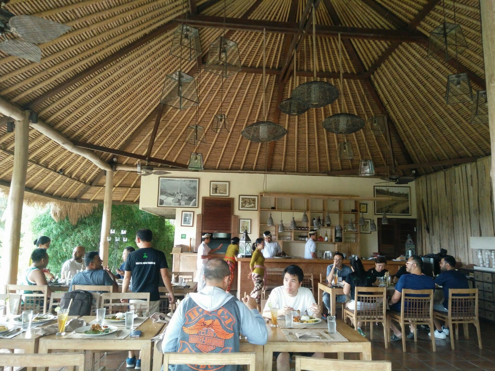
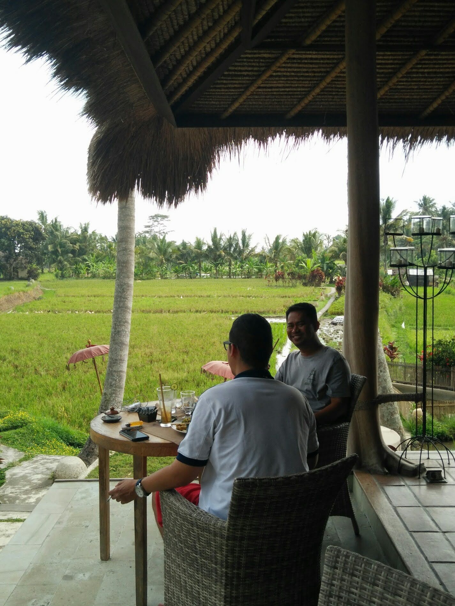
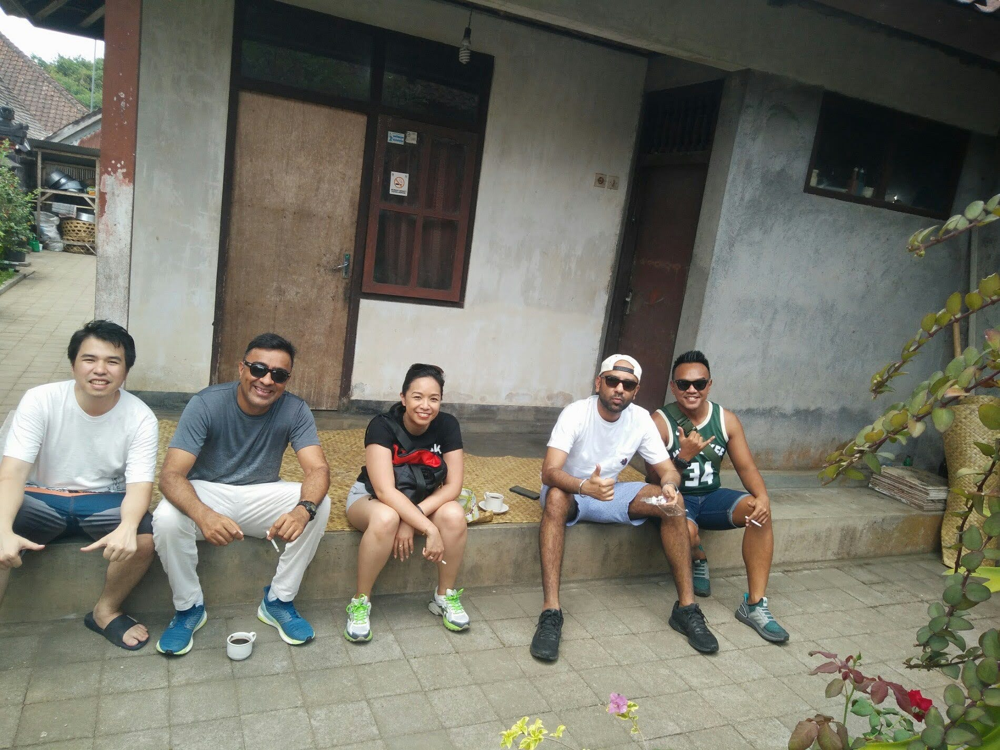
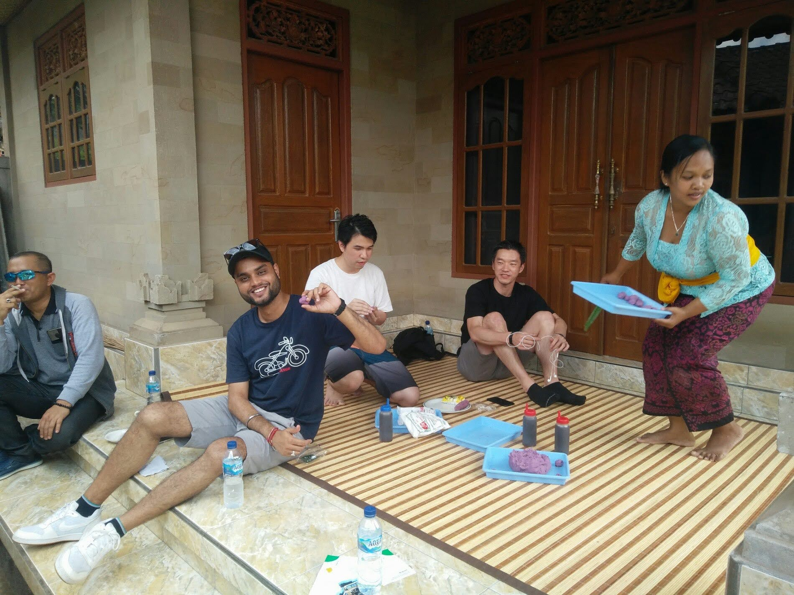
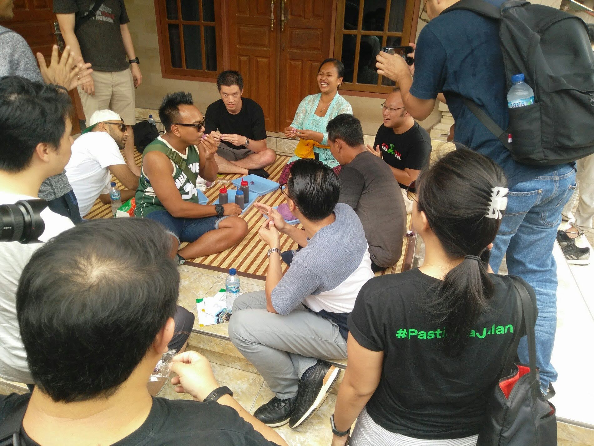

# Four years of Ekadasi fasting

> My mother fasts and prays. My sister meditates. I run.
> 

11 years ago, I began a post with this preamble. With a slight trepidation I can now update the 3rd sentence to *“I run and fast.*” Although my inner runner wishes the conjunction could well be superfluous!

It’s been a little over four years since I have been *keeping* the Ekadasi fast. I don’t have a precise date but the triangulation comes from pictures uncovered from a business trip to Bali (see at the end).

**About Ekadasi**

*Ekadasi* is the eleventh day from the start of the lunar cycles so there are 24 of them in a year. The fast is dedicated to Lord Vishnu. Each of the 24 Ekadasi fasts has a unique name & focus - the one that fascinates me the most is *Nirjal Ekadasi*. Nirjal means “without water”.

Counting from dinner completion on day [-1], you are expected to keep the fast for 24, 36 or 42 hours depending on whether you are a beginner, intermediate, or advanced (btw these sports-inspired monikers are all mine and, I daresay, the serious practitioner could well be offended)

- Beginner: 24 hours, can consume small quantities of milk, fruits during fast
- Intermediate: 24 hours, only water during fast, sanctioned cheaters are allowed 1 black coffee
- Advanced1: 36 hours, just water during fast, fast is broken on *dvadasi* (next day) morning
- Advanced2: 42 hours, just water during fast, last meal on day [-1] is lunch, fast broken on *dvadasi* (next day) morning

**The Trigger**

It was a Sadhguru video that was my trigger. The  pitch was classic Sadhguru (meaning the religious tradition was explained but it was secondary to the ‘why’). The body’s digestive system needs a break every once in a while.. the body does not “need food” every once in a while.. and that once-in-a-while period is 15 days. The Hindus believe that the heavenly bodies are aligned perfectly on the *Ekadasi* days for optimal periods of resting, contemplation & prayers. Voila! I was in!

**How it all played out** 

I wasn’t approaching this “cold turkey”. Keeping the annual *Karva Chauth* fast alongside my wife for a few decades, as I would learn, was great preparation. This gave me the confidence to start off at the intermediate level. 

In the first year, the main challenge was to overcome a few bouts of drowsiness (before and after my scheduled lunch time). On workdays, a cup of water masquerading as black coffee worked. On weekends, it was easier to embrace a power nap. By the second year, the anticipation-tinged-with-dread had reduced and I was also able to do my runs/workouts with less psychological baggage. 

Sometime in year #3, my mom offered this suggestion “why don’t you take *something* during the day, say a black coffee?” She’d realised that I was NOT cooling off from this new ritual and having seen some of my 26 hour escapades, she had to do *something*. I was receiving the perfect antidote for my weakness via a sacred sanction. I was sold before she even finished her sentence! Thanks mom!

**What next?**

As long as I continue with my regular pursuits of marathon running and squash, there is little danger of me upgrading to the advanced level. Converting one of the fasts into a *Nirjal (no water)* version is something I’d like to attempt next year. 

Four years is a decent timeframe to ‘declare’ a habit formation but I worry though. Klay Christiansen’s [words](https://hbswk.hbs.edu/item/clayton-christensens-how-will-you-measure-your-life) ring ominously true:

> If you give in to "just this once," based on a marginal-cost analysis, you'll regret where you end up. That's the lesson I learned: it's easier to hold to your principles 100 percent of the time than it is to hold to them 98 percent of the time. The boundary—your personal moral line—is powerful because you don't cross it; if you have justified doing it once, there's nothing to stop you doing it again.
> 

The black coffee hack so far hasn’t turned the slope slippery but there have been a few times (weekends usually) where I broke my fast at the 22 hour mark. 

**Pictures** (from Nov 22, 2019)

*Terracota Restaurant in Ubud, Bali*: 1st time at a restaurant where I’m not eating but everyone else is 🙂

Hip-hop singer/bandleader Ibek (left) and my soul brother Gede Manggala (right), paddy fields galore

From left: Kelvin, Sumit, Ndari, Kiran, Nanda (Panglipuran village in Bangli)

From left: Bambang, Amit, Kelvin, Medan RM (forgot his name), lady making *ragi mudde*

Crowd-sourced ragi mudde making (by the entire Gojek gang) orchestrated by the local lady

**Important note**: what I’m casually referring as *ragi mudde* is certainly NOT that. It was not as dense as ragi and it was sweet.

(will update this post with the correct name!)

