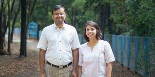

(For non-Hindi readers, *Naya Kya Hai* means “What’s New”)

Let me start by telling you what is NOT new. It’s ~~December-end~~ (early-Jan) and I’m ~~4~~ ~2 weeks away from racing yet another [Tata Mumbai Marathon](https://tatamumbaimarathon.procam.in/) (TMM). If you read this [Breaking Up](https://www.ulaar.com/2023/05/21/breaking-up/) post and concluded that I was hanging up my velvety Vibram boots, can’t blame you. Sorry 🙂

I emerged from that 4-month ‘sabbatical’ thoroughly energized and promptly registered for TMM. 

You know what else is NOT new? I’m kicking off a fundraising campaign in conjunction with the race.

******

Naya kya hai? The answer lies in this [42-second video](https://www.youtube.com/watch?v=fGBEteqN2es) - please give it a watch!

**Say hello to Rang De**

Ram and Smita (a husband-wife duo) created Rang De - India’s first peer-to-peer micro-lending platform way back in 2008. Inspired by Nobel Laureate Mohammad Yunus, Rang De was setup as a non-profit org and its crowdfunding platform enabled retail social investors to lend to a community of curated entrepreneurs and students from low-income households (overwhelmingly rural). When RBI introduced new guidelines for peer-to-peer lending (aka “P2P lending”) — a regulation aimed to bring more (for-profit) companies into the P2P lending ecosystem, it was time for Rang De to pivot — to a for-profit legal entity. [Rangde.org](http://Rangde.org) became [RangDe.in](http://RangDe.in) in Sep 2019 but their raison d’être remained unchanged. 

**[Create Impact + Earn Returns] = Rang De’s unique value proposition**

There are now over 20 startups dotting the Indian P2P lending landscape. Rang De is not yet the largest but it has a unique halo in the ecosystem. A visit to its [website](https://rangde.in/) will instantly clue you in, and a tag cloud generator would throw up the following:

- Invest in #bharat
- Invest in farmers, rural entrepreneurs, artisans
- Create sustainable livelihoods
- Invest in creditworthy Indians
- Dashboards
- **Create Impact + Earn Returns** = new asset class and the answer to the blog post’s question

This last bullet is really what sets Rang De apart from the other players. The focus is on attracting the archetype P2P investor that ***wants*** to invest in *#bharat entrepreneurs, farmers and artisans* while  getting a reasonable financial return (6%). If this archetype sounds like you, I’d urge you to give Rang De a serious consideration. 

I’ve been investing on the platform since 2020. As of now, my investments have reached 13 lives (8 of which were first-time borrowers) across 8 states generating 351 days of livelihood. The targeted borrowers include Akshayakalpa dairy farmers, farmers investing in farm ponds, and students enrolled in Physics Wallah’s 4-year UG program in CS/AI.

(Rang De founders: Ram and Smita)

**Special note to the usual suspects** (aka "my tenured supporters")

The first time I did fundraising alongside a race was in 2001 - a campaign I dubbed _"Running for India's Villages"_. Some of you might remember it? :) 
I was tempted to title this year's campaign as _"Running for Bharat's Farmers"_ which is _mostly_ what Rangde's target beneficiaries are (students from Tier 2/3 towns being the exception). I *know* that the top reason why many of you contributed in previous campaigns is because you *trust me* -- and for this I'm very grateful. 

Philanthropy is deeply personal and, while I appreciate your trust in my limited curation, I've always wanted to present multiple options. Finally, this is the year and Rang De is the platform that makes the choice-making happen. You can browse by Regions (basically a State filter of the beneficiaries on the platform), Funds (Community Tourism, Nilgiri Elephant, Akshayakalpa Dairy, etc), and Individuals (filter by Gender, First-time borrowers, etc). 

This time my campaign runs all the way till **March 31, 2024** and I need you folks to use the referral code **VISH8429** in the "Sign Up" flow as that will enable some seamless reporting.
What else is different this time? This is not a donation cheque you are writing.. it's an _investment_ (a _loan_ that can be perpetually recycled to the next borrower) while you also get a 6% financial return. So if your usual contribution amount was X, this time you might consider making it an integer multiple of X :) And please DO share your valuable feedback as you explore and transact on the platform. 

Thank you!
