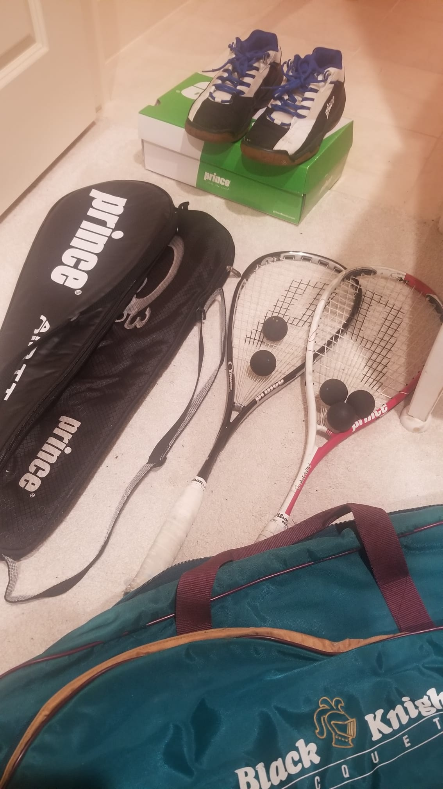

It’s a question that a player would invariably ask the other, after their first squash session. The questioner is usually the chap who lost because.. he’s hoping to hear that the other guy has been playing *longer* than him*.* Which is *usually* the case, but not always. 

Since I resumed playing squash last year, I’ve started getting this question and I have trouble answering it. You see.. when you can’t easily return a number and instead say *“It’s complicated”*, it requires an elaboration. This post is an attempt to elaborate. As always, I’ll be taking the scenic route because squash players are very interesting and I’ve been privileged to have crossed paths with many of them.

---

*Beldih Club (Jamshedpur)*

It all started in in the early 90’s in India’s oldest steel city. In our motley crew of 30+ ‘Systems trainees’, there were three who had played squash earlier - Uttam & JD (IIT BHU) and Vochak (BITS Pilani). Vochak and Uttam were champs from college and would duel most frequently. Watching them play is what triggered interest for the trio (Sanju, Shouvik, Rajan) and me. *It must have been a rabid kind of interest because Rajan took it upon himself to do the unthinkable - get an entire batch of trainees accelerated membership to Beldih Club — just so that **some of us** could start playing squash! It was pretty selfless too because Rajan was already a member of United Club (which had a squash court).* 

Vochak used a graphite racquet, had a very sound technique and efficient court coverage (he also had this  cool Mezan Hesham’esque backhand action). The games between Uttam and Vochak were always very closely contested, with V usually getting the better of U in the last game of a 5-setter. There were two remarkable things about U - he used a beat-up wooden racquet and (wait for it) was also a heavy smoker! on occasion, he would finish a smoke before getting on the court. I used to wonder how the contest would have been if he was *not* a smoker. JD’s skill level was perhaps one notch below V & U but he too possessed a great technique and was also a natural coach. The precious little I learnt about hitting the ball was all courtesy JD. If only his lady love (and her bestie) hadn’t monopolized his coaching time, my squash journey could have started on a higher base.

(Beldih Club, Jamshedpur)

*DeGuerre Courts (Stanford)*

The smart spouse landing a post-doc appointment at Stanford gave me a glorious opportunity to atone for living in sin. 
What sin, you ask? 
- A year of racquetball in Bally’s Club. The closest squash courts being in a fancy downtown club and I could ill afford it (time and money wise). Well, that’s my excuse and I’m sticking to it.

You’d think anything at Stanford would be world class, right? In the mid-to-late 90’s, the 5 squash courts in the DeGuerre building bore testimony to the fact that they were the solitary exception. Courts 1 and 2 were just about “ok” but the other 3 were a *chunks-of-wall-missing* disaster. 

However, the spirit of Stanford was very much present and two standout seniors (Mark Goldenson and Mike Greenfield) were unwilling to accept the status quo. They established the men’s and women’s club teams and even managed to hire a local Pakistani coach with what little budget they had available. I’d describe my 2 years at Deguerre as equal part pain and awe. Pain because my game sucked big time. A year of racquetball had lulled me into a *I-have-some-intrinsic-ability* zone and boy did I get a wakeup call? Awe because I got to watch some amazing games between Jaime and Shankar and a recently relocated Egyptian (married to a Stanford student). Awe because playing the young bucks (Mark & Mike) was a constant reminder that, while my lungs were in better shape, there was a massive gulf between my stamina and theirs. 

I don’t think I won a single game during those years.

*Decathlon Club (Santa Clara, CA)*

One of the perks of working at Yahoo’s Santa Clara campus was discounted membership to the hip Decathlon Club (since rebranded as Bay Club, Santa Clara). The club was literally next door to office and had 5 courts. 

Decathlon (along with Bay Club, Redwood Shores) were two prominent squash venues in the Bay Area and it showed in the diversity (and number) of players I’d encounter in my two years there. Jon Perry (an incredible player/coach) was the resident squash pro who had just taken charge following Richard Elliot’s move to Redwood Shores. A fellow club member described Jon thus “he runs to the serving box so he can serve quickly and then walks around to hit all his shots.” The game would be over in no time, even if he was playing the top amateurs in the club. The only time he was made to look pedestrian was when [Sarah Fitz-gerald visited our club](https://www.ulaar.com/2012/03/27/the-day-sarah-fitz-gerald-visited-our-squash-club/).

Decathlon is the place where I stopped “sucking” and became a middling player. And it was not because I made a smart decision. The smart thing would have been to take lessons from Jon but.. who’s got time for coaching when you can play games until you are blue-in-the-face, sore-in-the-back and red-on-the-knee? My regular sparring partners were Namit, Joel, Mike, Susheel and Nick, all with their unique quirks. Joel (Shaps) injected a really good habit into our sessions — play the last few games behind the service line. I’ve found this to be a reliable antidote to the beginner’s proclivity for drop shots.

*Supreme Court (Sunnyvale, CA)*

With Yahoo HQ’s move to Sunnyvale and my increased ‘work’ workload, it finally came time to part ways with Decathlon. Next stop was Supreme Court, a utilitarian fitness club with 2 courts (they also had racquetball courts but I didn’t hold it against them). The location was perfect - a few miles from work and right on my [home→work] flight path. Fortunately, one of my regular partners (Namit Sikka) also made the move to this club. That, coupled with challenge evenings (on Tuesdays) ensured minimal levels of squash enjoyment — in what would be my final year of squashing in US. 

Not that I didn’t attempt to upgrade my playing venue. Exhibit A - my conversation with Stanford coach Mark Talbott.

> Hi Mark,
> I recently met one of your active club players (Mike Greenfield) and he was updating me on the exciting new (to me) developments around Stanford Squash (7 brand new courts, your joining last year, etc.). I last played at the old DeGuerre courts in '98-'99 when my wife was attending Stanford. I just checked out the URL below and learnt that club membership might be open to folks like me (i.e. I currently don't have any active Stanford affiliations).
> Could you please confirm if I can join? IF yes, I'd love to get the process rolling.
> 

Mark promptly responds with:

> Vishy,
> You are welcome to join and all membership fees go towards our program, thanks, look forward to meeting you,
> Mark
> 

He’s the [legendary Mark Talbott](https://squashmagazine.com/2008/07/mark-talbott-a-very-good-friend/) so obviously I had more q’s:

> I really look forward to meeting you. I've read so much great things about you. May I ask when you started playing squash? And when you started training? (My older son is 3 yrs old and I'm wondering when I should get him into a squash court :) )
> 

His reply:

> I grew up with a court in my house but seriously started playing when I was about 12, thanks,
> 

The timing of this conversation turned out to be all wrong. I would start a sabbatical, then return briefly to Yahoo, then start a venture, then exit it, and return to India. In that blur of continuum, I never got around to visiting the famed [Arrilaga Center for Sports & Recreation](https://gostanford.com/facilities/arrillaga-center-for-sports-recreation/1).

---

*Prestige Pinewood (Bangalore)*

My most recent stint with squash started last May, after I decided to take a [break from running](https://www.ulaar.com/2023/05/21/breaking-up/). After 18 years, I was playing squash regularly again and loving it.. with a vengeance. A few months ago, I was in for another surprise. In my 16 Rip-Van-Winkle Bangalore years, squash had apparently blossomed — to the point that there are nearly 400 squash players on a *single Whatsapp group* and I’m personally aware of the existence of nearly 50 courts. Wow!

The scenic journey has come to an end and it’s time to answer the “how long” question.

Cumulatively, around 6-7 years. 

Yes - I’m fully aware that my game doesn’t reflect the 6+ years and I’m working on it. As a runner, I’ve been a late bloomer. Why should squash be any different?

---

**Epilogue** (about some of the characters mentioned above)

- *Mark Talbott*: as head coach at Stanford, continues to rack up oodles of achievements, as his [bio](https://gostanford.com/sports/womens-squash/roster/coaches/mark-talbott/4643) eloquently lists.
- *Richard Elliot*: started Squash Zone - an exclusive squash facility (with 8 courts & 4 pro coaches) in Redwood Shores
- *Jon Perry*: still *the* pro at Bay Club Santa Clara
- *Mark Greenfield*: by a strange coincidence, he too has returned to squash last year (plays at Squash Zone).
- *Vochak*: both his daughters played collegiate level tennis for University of Dallas. After his kids got serious on tennis, there was no time for squash so he became a “tennis dad”. He won a tournament in Minneapolis (mid ‘90’s) and last played 14 years ago. However… this squash love-fest post seems to have triggered something as he’s brought out his gear and is talking about getting back on the court soon - yay!
- *Uttam*: 20 yrs ago he was still a smoker, hasn’t touched a squash racquet in years
- *JD*: funded a squash facility at a university in Tampa which, among other things, gives him playing privileges and an endless supply of playing partners :) you go JD!
- *Shouvik*: plays weekly in Atlanta. He shared this fun fact *“the world master over 80 y.o - yes 80 is from our club in Atlanta - read about him - he still plays regularly and kicks most of our butts - get inspired folks”* . ([About Michael Gough](https://ussquash.org/2022/08/team-usas-gough-wins-world-masters-80-title/) - 75+ World Masters title in 2014 and 80+ title in 2022 - wow!)
- *Sanju*: his daughter played collegiate level tennis for Princeton. Awaiting a squash update.
- *Rajan*: the architect of getting us into Beldih Club (detailed story can only be verbalized, not written). His squash update *“last played at ClubSport San Ramon probably about 6 yrs ago..always loved the cardio it offered and was playing regularly in winter months but it just got too popular with all the desis moving into the area with only two courts vs 12 tennis courts. My preference has always been for outdoor sports so tennis remains the primary sport for me. Still have a few squash rackets laying around just in case…”*

(Vochak has brought out his gear - watch out Dallas people!)

